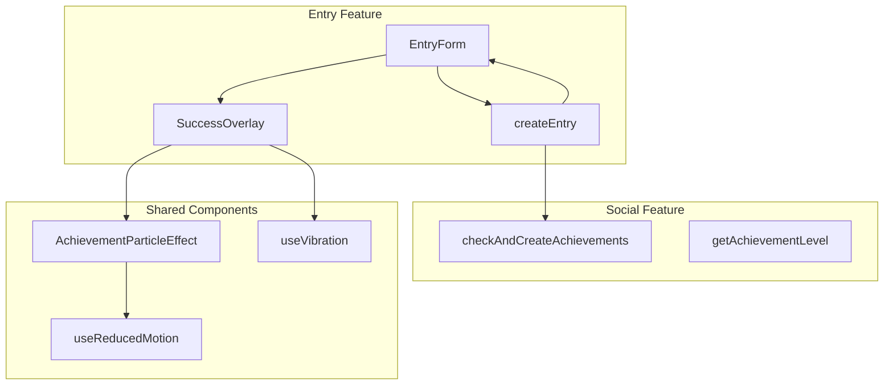
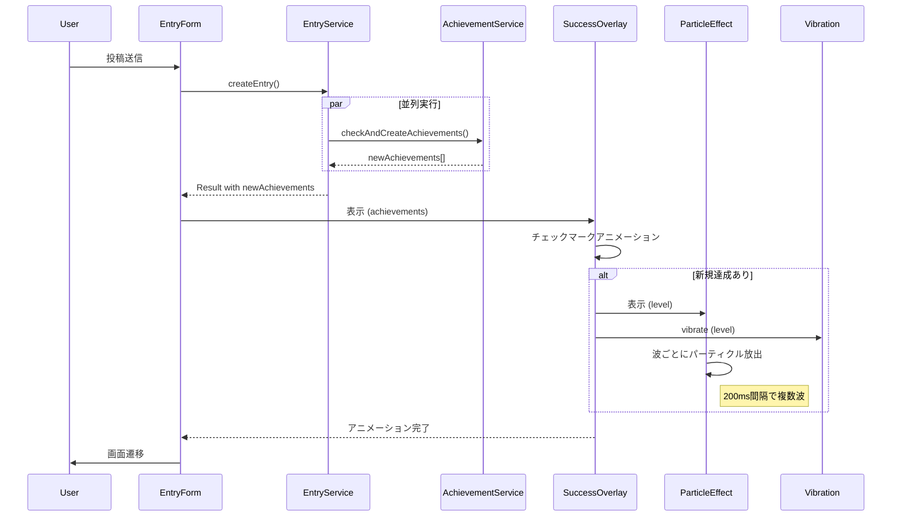
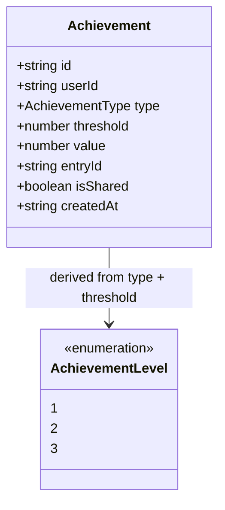

# Design Document

## Overview

**Purpose**: アチーブメント達成時の視覚的・触覚的フィードバック機能を提供し、継続への報酬体験を強化する。

**Users**: ヒビオルのユーザーが投稿時にアチーブメントを達成した際、パーティクルエフェクトとバイブレーションによる演出を受ける。

**Impact**: 既存の `createEntry()` 戻り値を拡張し、`SuccessOverlay` コンポーネントに達成演出を統合する。

### Goals

- 投稿成功時に新規達成したアチーブメントを検出し、クライアントに返却する
- 達成レベル（1-3）に応じたパーティクルエフェクトを表示する（Level 1: 12個/1波、Level 2: 16個/2波、Level 3: 24個/3波）
- Vibration APIによる触覚フィードバックを提供する
- 60FPSのスムーズなアニメーションを維持する
- prefers-reduced-motion設定を尊重する

### Non-Goals

- 達成履歴画面の実装（既存のソーシャル機能で対応済み）
- サウンドエフェクト（将来のフェーズで検討）
- 達成レベルの新規カラム追加（既存データから導出）
- 達成通知のプッシュ通知連携（別機能として検討）

## Architecture

### Existing Architecture Analysis

#### 現在のアーキテクチャパターン

- **Features-based Architecture**: `src/features/entry/` と `src/features/social/` に分離
- **Server Actions**: `createEntry()` は `'use server'` で実装
- **Zustand Store**: `entry-form-store` でフォーム状態管理
- **framer-motion**: 既存のパーティクルアニメーション（`celebrate-button.tsx`）で使用

#### 既存のドメイン境界

| ドメイン | 責務 |
|----------|------|
| `entry` | エントリ作成・編集・削除、SuccessOverlay |
| `social` | 達成検出・作成（`checkAndCreateAchievements`）、パーティクル設定 |

#### 維持すべき統合ポイント

1. `createEntry()` → `checkAndCreateAchievements()` の並列実行
2. `SuccessOverlay` の既存チェックマークアニメーション
3. `celebrate-button.tsx` のパーティクルパターン

### Architecture Pattern & Boundary Map



**Architecture Integration**:
- **Selected pattern**: 既存のFeatures-based Architectureを維持、共通エフェクトコンポーネントを `entry` フィーチャー内に配置
- **Domain boundaries**: `entry` が演出責務を持ち、`social` からレベル判定ユーティリティを利用
- **Existing patterns preserved**: Server Actions、Zustand Store、framer-motion variants
- **New components rationale**:
  - `AchievementParticleEffect`: レベル別パーティクル設定のカプセル化
  - `useVibration`: Vibration APIの安全なラッパー
- **Steering compliance**: 報酬は「継続」に対してのみ、ADHD当事者にストレスを与えない設計

### Technology Stack

| Layer | Choice / Version | Role in Feature | Notes |
|-------|------------------|-----------------|-------|
| Frontend | framer-motion 12.x | パーティクルアニメーション、GPU最適化 | 既存利用、transform/opacityのみ使用 |
| Frontend | Vibration API | 触覚フィードバック | W3C標準、Androidのみ対応 |
| Frontend | useReducedMotion (framer-motion) | アクセシビリティ対応 | 組み込みフック使用 |
| Backend | Server Actions | createEntry戻り値拡張 | 既存パターン維持 |

## System Flows

### 達成演出フロー



**Key Decisions**:
- チェックマーク完了後（約400ms）にパーティクル開始
- 複数達成時は最高レベルのエフェクトを採用
- アニメーション完了まで画面遷移を待機

## Requirements Traceability

| Requirement | Summary | Components | Interfaces | Flows |
|-------------|---------|------------|------------|-------|
| 1.1, 1.2, 1.3, 1.4 | 達成検出と戻り値拡張 | EntryService | CreateEntryResult | 達成演出フロー |
| 2.1, 2.2, 2.3, 2.4, 2.5 | パーティクルエフェクト設定 | AchievementParticleEffect | ParticleConfig | 達成演出フロー |
| 3.1, 3.2, 3.3, 3.4 | バイブレーションフィードバック | useVibration | VibrationPattern | 達成演出フロー |
| 4.1, 4.2, 4.3, 4.4, 4.5 | SuccessOverlayへの統合 | SuccessOverlay | SuccessOverlayProps | 達成演出フロー |
| 5.1, 5.2, 5.3, 5.4, 5.5 | パフォーマンスとアクセシビリティ | ParticleEffect, useVibration | - | - |
| 6.1, 6.2, 6.3, 6.4 | 達成レベル定義 | getAchievementLevel | AchievementLevel | - |

## Components and Interfaces

### Summary

| Component | Domain/Layer | Intent | Req Coverage | Key Dependencies | Contracts |
|-----------|--------------|--------|--------------|------------------|-----------|
| EntryService (拡張) | entry/api | createEntry戻り値に達成情報追加 | 1.1-1.4 | checkAndCreateAchievements (P0) | Service |
| SuccessOverlay (拡張) | entry/components | 達成演出の統合表示 | 4.1-4.5, 5.4 | AchievementParticleEffect (P0), useVibration (P1) | Props |
| AchievementParticleEffect | entry/components | レベル別パーティクル表示 | 2.1-2.5, 5.1-5.3, 5.5 | framer-motion (P0), useReducedMotion (P0) | Props |
| useVibration | entry/hooks | Vibration API安全ラッパー | 3.1-3.4 | Vibration API (P1) | Hook |
| getAchievementLevel | social/utils | 達成タイプ・閾値からレベル導出 | 6.1-6.4 | ACHIEVEMENT_THRESHOLDS (P0) | Util |

### Entry Feature

#### EntryService (拡張)

| Field | Detail |
|-------|--------|
| Intent | createEntry()の戻り値を拡張し、新規達成情報を含める |
| Requirements | 1.1, 1.2, 1.3, 1.4 |

**Responsibilities & Constraints**
- `checkAndCreateAchievements` の結果を戻り値に含める
- 達成チェック失敗時もエントリ作成成功を返却（graceful degradation）
- 達成情報取得の遅延がエントリ作成のUXに影響しない

**Dependencies**
- Inbound: EntryForm (P0)
- Outbound: checkAndCreateAchievements (P0)

**Contracts**: Service [x]

##### Service Interface

```typescript
interface NewAchievementInfo {
  type: AchievementType
  threshold: number
  level: AchievementLevel
}

interface CreateEntryResultWithAchievements {
  entry: Entry
  newAchievements: NewAchievementInfo[] | null  // null = 取得失敗
}

// 拡張後のcreateEntry戻り値
type CreateEntryResult = Result<CreateEntryResultWithAchievements, EntryError>
```

- Preconditions: 認証済みユーザー、有効なcontent
- Postconditions: エントリ作成成功時、newAchievementsを付与（失敗時はnull）
- Invariants: エントリ作成成功はnewAchievements取得失敗に影響されない

**Implementation Notes**
- Integration: 既存の `Promise.allSettled` パターンを維持し、達成結果を戻り値に含める
- Validation: 達成チェック失敗時は `newAchievements: null` として返却
- Risks: 達成チェックの遅延が画面遷移に影響する可能性（現在も並列実行のため軽微）

---

#### SuccessOverlay (拡張)

| Field | Detail |
|-------|--------|
| Intent | 投稿成功時のオーバーレイに達成演出を統合 |
| Requirements | 4.1, 4.2, 4.3, 4.4, 4.5, 5.4 |

**Responsibilities & Constraints**
- チェックマーク完了後にパーティクルエフェクト表示
- 複数達成時は最高レベルを採用
- 達成メッセージをaria-live="polite"で通知
- エフェクト完了までonComplete呼び出しを待機

**Dependencies**
- Inbound: EntryForm (P0)
- Outbound: AchievementParticleEffect (P0), useVibration (P1)

**Contracts**: Props [x]

##### Props Interface

```typescript
interface SuccessOverlayProps {
  message?: string
  achievements?: NewAchievementInfo[] | null
  onComplete?: () => void
}
```

**Implementation Notes**
- Integration: チェックマーク pathLength アニメーション完了（400ms）後にパーティクル開始
- Validation: achievements が空配列またはnullの場合は従来動作
- Risks: 長いエフェクト時間によるUX遅延（最大Level 3で約800ms追加）

---

#### AchievementParticleEffect

| Field | Detail |
|-------|--------|
| Intent | 達成レベルに応じたパーティクルエフェクト表示 |
| Requirements | 2.1, 2.2, 2.3, 2.4, 2.5, 5.1, 5.2, 5.3, 5.5 |

**Responsibilities & Constraints**
- Level 1: 12個/1波、Level 2: 16個/2波、Level 3: 24個/3波
- 各波の間隔: 200ms
- GPUアクセラレーション使用（transform/opacityのみ）
- prefers-reduced-motion対応

**Dependencies**
- Inbound: SuccessOverlay (P0)
- External: framer-motion useReducedMotion (P0)

**Contracts**: Props [x]

##### Props Interface

```typescript
type AchievementLevel = 1 | 2 | 3

interface ParticleConfig {
  count: number      // パーティクル数
  waves: number      // 波数
  waveInterval: number  // 波の間隔(ms)
}

const PARTICLE_CONFIGS: Record<AchievementLevel, ParticleConfig> = {
  1: { count: 12, waves: 1, waveInterval: 0 },
  2: { count: 16, waves: 2, waveInterval: 200 },
  3: { count: 24, waves: 3, waveInterval: 200 },
}

interface AchievementParticleEffectProps {
  level: AchievementLevel
  onComplete?: () => void
}
```

**Implementation Notes**
- Integration: 既存 `celebrate-button.tsx` のパーティクルvariantsを拡張
- Validation: shouldReduceMotion時は即座にonComplete呼び出し
- Risks: 多数のDOM要素によるパフォーマンス低下（最大72個 = 24 x 3波）

---

#### useVibration

| Field | Detail |
|-------|--------|
| Intent | Vibration APIの安全なラッパーフック |
| Requirements | 3.1, 3.2, 3.3, 3.4 |

**Responsibilities & Constraints**
- デバイスサポート確認
- レベル別振動パターン実行
- サポート外デバイスでサイレント失敗

**Dependencies**
- External: Vibration API (P1)

**Contracts**: Hook [x]

##### Hook Interface

```typescript
type VibrationPattern = number | number[]

const VIBRATION_PATTERNS: Record<AchievementLevel, VibrationPattern> = {
  1: 100,                           // 短い振動 100ms
  2: [100, 50, 100],               // 中程度 100-50-100
  3: [100, 50, 100, 50, 100, 50],  // 長い 100-50 x 3回
}

interface UseVibrationReturn {
  isSupported: boolean
  vibrate: (level: AchievementLevel) => void
}

function useVibration(): UseVibrationReturn
```

**Implementation Notes**
- Integration: `navigator.vibrate` の存在チェック
- Validation: Document visibility stateが visible の場合のみ実行
- Risks: iOS Safari未サポート（フォールバックでサイレント失敗）

---

### Social Feature

#### getAchievementLevel

| Field | Detail |
|-------|--------|
| Intent | 達成タイプと閾値からレベルを導出 |
| Requirements | 6.1, 6.2, 6.3, 6.4 |

**Responsibilities & Constraints**
- streak_days閾値に基づくレベル判定
- 既存のAchievementTypeとAchievement閾値定数を使用

**Dependencies**
- Inbound: EntryService (P0)
- Outbound: ACHIEVEMENT_THRESHOLDS (P0)

**Contracts**: Util [x]

##### Utility Interface

```typescript
type AchievementLevel = 1 | 2 | 3

// レベル判定ルール
const LEVEL_THRESHOLDS: Record<AchievementType, Record<AchievementLevel, number[]>> = {
  streak_days: {
    1: [3],           // 初投稿、継続3日
    2: [7, 14, 21],   // 継続7日、14日、21日
    3: [30, 60, 90, 365],  // 継続30日以上
  },
  daily_posts: {
    1: [20],
    2: [30, 40],
    3: [50],
  },
  total_posts: {
    1: [10, 30],
    2: [50, 100, 150, 200, 250],
    3: [300, 400, 500], // 以降
  },
  shared_entry: {
    1: [1],  // 共有投稿はLevel 1固定
    2: [],
    3: [],
  },
}

function getAchievementLevel(type: AchievementType, threshold: number): AchievementLevel
```

**Implementation Notes**
- Integration: `social/constants.ts` または `social/utils.ts` に配置
- Validation: 未定義の閾値はデフォルトでLevel 1を返却
- Risks: 将来の閾値追加時にレベル判定の更新が必要

## Data Models

### Domain Model

本機能では既存のデータモデルを変更しない。達成レベルは既存の `achievements` テーブルの `type` と `threshold` から導出する。



### Logical Data Model

- 達成レベルは `getAchievementLevel(type, threshold)` で実行時に導出
- 新規カラム追加不要（Requirements 6.4準拠）

### Data Contracts & Integration

**API Data Transfer**

```typescript
// createEntry 戻り値拡張
interface CreateEntryResultWithAchievements {
  entry: Entry
  newAchievements: NewAchievementInfo[] | null
}

interface NewAchievementInfo {
  type: AchievementType        // 'streak_days' | 'daily_posts' | 'total_posts' | 'shared_entry'
  threshold: number            // 達成した閾値
  level: AchievementLevel      // 1 | 2 | 3
}
```

## Error Handling

### Error Strategy

達成演出はエントリ作成の成功を妨げない（graceful degradation）。

### Error Categories and Responses

| Category | Scenario | Response |
|----------|----------|----------|
| 達成チェック失敗 | DB接続エラー、タイムアウト | `newAchievements: null` として返却、エントリ作成は成功 |
| Vibration API未サポート | iOS Safari、デスクトップ | サイレント失敗、パーティクルのみ表示 |
| Document非表示 | バックグラウンドタブ | 振動スキップ |
| reduced-motion有効 | アクセシビリティ設定 | パーティクル無効化、メッセージのみ表示 |

### Monitoring

- 達成チェック失敗率のログ出力（既存パターン維持）
- Vibration API呼び出し失敗は記録しない（期待される動作）

## Testing Strategy

### Unit Tests

| 対象 | テスト内容 |
|------|-----------|
| `getAchievementLevel` | 各タイプ・閾値に対する正しいレベル返却 |
| `useVibration` | サポート確認、パターン実行、未サポート時のフォールバック |
| `PARTICLE_CONFIGS` | 各レベルの設定値確認 |
| `VIBRATION_PATTERNS` | 各レベルのパターン確認 |

### Integration Tests

| 対象 | テスト内容 |
|------|-----------|
| `createEntry` with achievements | 戻り値に `newAchievements` が含まれる |
| `createEntry` achievement failure | 達成チェック失敗時も `ok: true` |
| `SuccessOverlay` with achievements | パーティクル表示、メッセージ表示 |

### E2E Tests

| 対象 | テスト内容 |
|------|-----------|
| 達成時の演出表示 | 投稿成功後にパーティクルが表示される |
| 複数達成時の挙動 | 最高レベルのエフェクトが適用される |
| reduced-motion時の挙動 | パーティクルが表示されない |

## Performance & Scalability

### Target Metrics

| Metric | Target | Measurement |
|--------|--------|-------------|
| Frame Rate | 60 FPS | Chrome DevTools Performance |
| DOM Elements | max 72 (24 x 3波) | React DevTools |
| Animation Duration | max 1.4s (Level 3) | Manual timing |

### Optimization Techniques

1. **GPU Acceleration**: transform/opacity のみ使用、will-change 適用
2. **Staggered Cleanup**: 各波完了後にDOM要素削除
3. **AnimatePresence**: 終了アニメーション後の確実なクリーンアップ
4. **useReducedMotion**: 必要時のアニメーション無効化

## Supporting References

### 達成レベル定義の詳細マッピング

```typescript
// Requirements 6.1-6.4 の実装詳細

// Level 1: 初期達成
const LEVEL_1_ACHIEVEMENTS = {
  streak_days: [3],           // 継続3日
  daily_posts: [20],          // 1日20投稿
  total_posts: [10, 30],      // 累計10/30投稿
  shared_entry: [1],          // 共有投稿
}

// Level 2: 中間達成
const LEVEL_2_ACHIEVEMENTS = {
  streak_days: [7, 14, 21],   // 継続7/14/21日
  daily_posts: [30, 40],      // 1日30/40投稿
  total_posts: [50, 100, 150, 200, 250],  // 累計50-250投稿
  shared_entry: [],           // 共有投稿にLevel 2はなし
}

// Level 3: 大きな達成
const LEVEL_3_ACHIEVEMENTS = {
  streak_days: [30, 60, 90, 120, 150, 180, 240, 365, ...],  // 継続30日以上
  daily_posts: [50],          // 1日50投稿
  total_posts: [300, 400, 500, ...],  // 累計300投稿以上
  shared_entry: [],           // 共有投稿にLevel 3はなし
}
```

### パーティクルアニメーション詳細

```typescript
// 波ごとのアニメーションタイミング
const WAVE_TIMELINE: Record<AchievementLevel, number[]> = {
  1: [0],                     // 即座に1波
  2: [0, 200],               // 0ms, 200msで2波
  3: [0, 200, 400],          // 0ms, 200ms, 400msで3波
}

// 総アニメーション時間
const TOTAL_DURATION: Record<AchievementLevel, number> = {
  1: 600,   // 1波 x 500ms + 100ms余裕
  2: 900,   // 2波 x 500ms + 200ms間隔 - 300ms重複 + 100ms余裕
  3: 1200,  // 3波 x 500ms + 400ms間隔 - 600ms重複 + 100ms余裕
}
```

### 外部API参照

- [MDN: Navigator.vibrate()](https://developer.mozilla.org/en-US/docs/Web/API/Navigator/vibrate)
- [Motion: Performance Guide](https://motion.dev/docs/performance)
- [Josh W. Comeau: prefers-reduced-motion](https://www.joshwcomeau.com/react/prefers-reduced-motion/)
