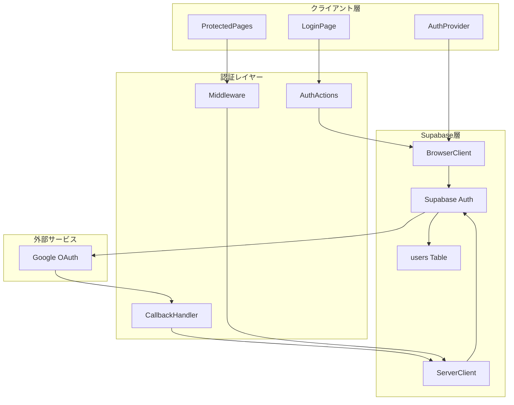
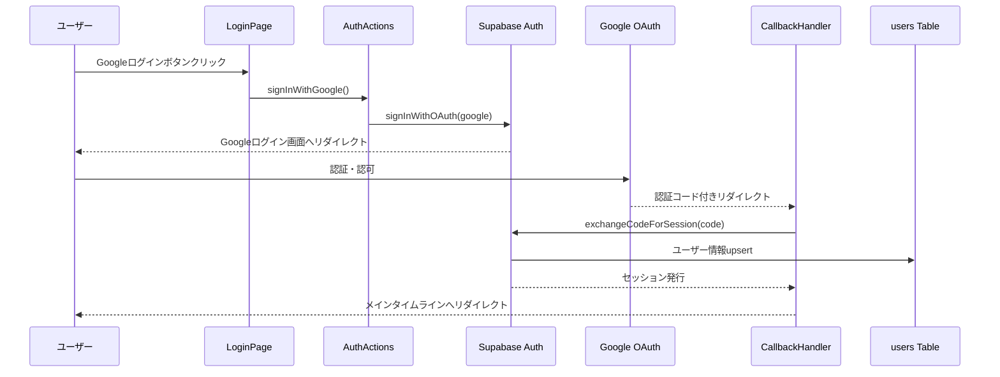
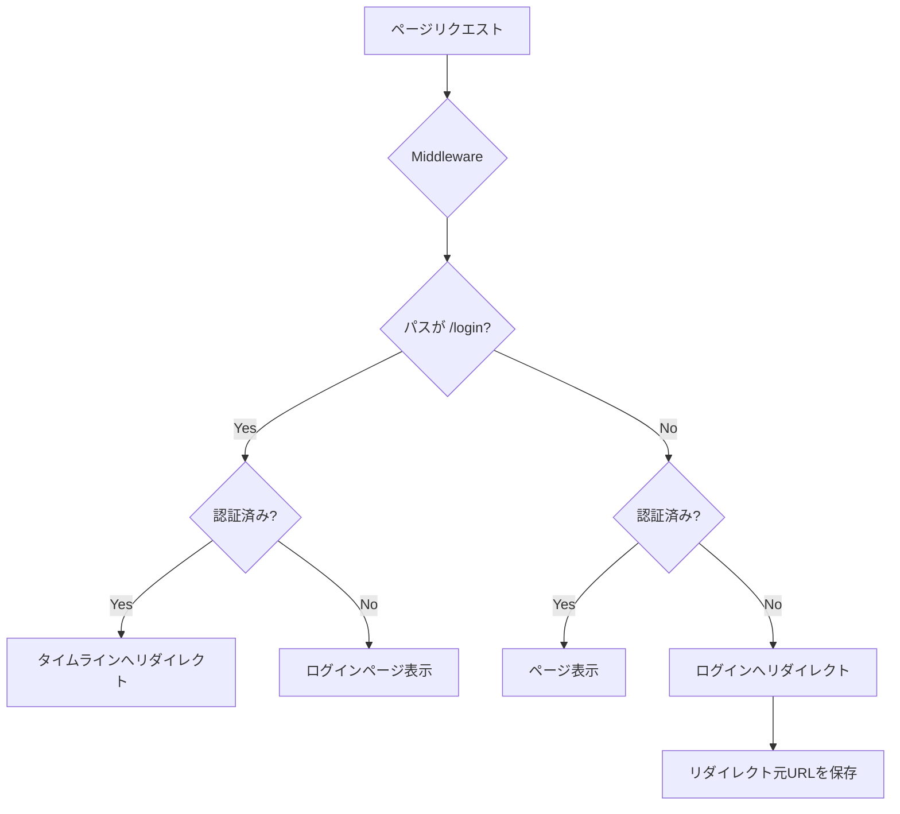
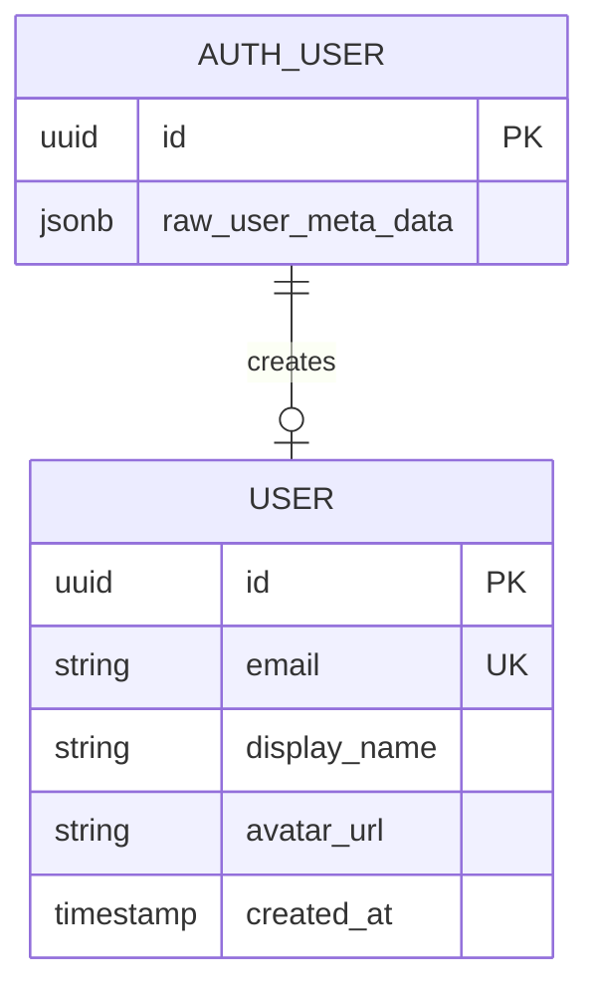
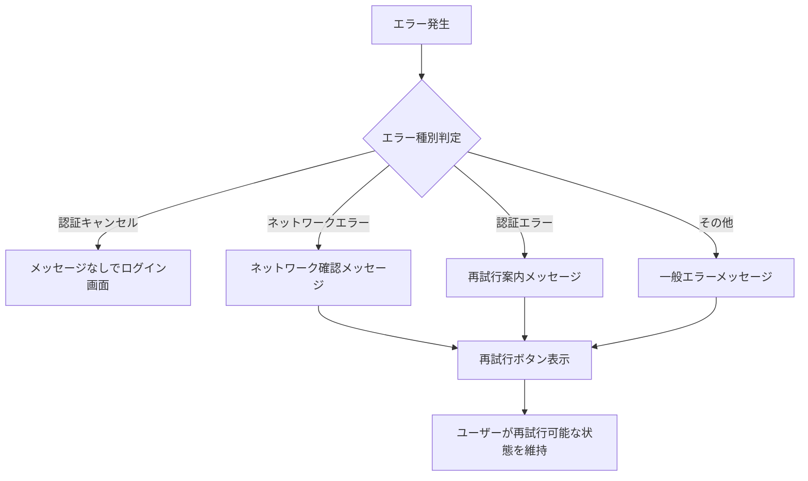

# 技術設計書: Google OAuth認証機能

## Overview

本機能は、ヒビオル（hibioru）アプリケーションにおけるGoogle OAuth認証システムを提供する。Supabase Authを活用し、ADHD当事者にとってストレスフリーな2タップ認証体験を実現する。

**Purpose**: ユーザーがGoogleアカウントを使用して、最小限の操作で安全にサービスにアクセスできる認証基盤を構築する。

**Users**: ヒビオルを利用するすべてのユーザー。特にADHD当事者を想定し、認知負荷を最小化した認証フローを提供する。

**Impact**: 新規機能として認証レイヤーを追加し、すべての保護されたページへのアクセス制御を実現する。

### Goals

- Googleアカウントによるシームレスなログイン体験の提供
- PKCEフローによるセキュアなサーバーサイド認証の実装
- 認証状態のセッション管理とルート保護の確立
- ユーザーフレンドリーなエラーハンドリングの実現

### Non-Goals

- Google以外のソーシャルログイン（Apple、Twitter等）の実装
- メールアドレス/パスワード認証の提供
- 多要素認証（MFA）の導入
- ユーザープロフィール編集機能（Phase 2以降）

## Architecture

### Architecture Pattern & Boundary Map



**Architecture Integration**:
- **Selected pattern**: レイヤードアーキテクチャ + Server/Client分離。Next.js App Routerの規約に従い、Server ComponentsとClient Componentsを適切に分離
- **Domain boundaries**: 認証ドメインは `/lib/supabase/` と `/app/auth/` に集約し、UIコンポーネントは `/components/auth/` に配置
- **Existing patterns preserved**: structure.mdで定義されたFeature-Firstパターン、コンポーネント命名規則
- **New components rationale**: Supabaseクライアントファクトリ、認証Middleware、AuthProviderが必要
- **Steering compliance**: ADHDユーザーへの配慮（最小認知負荷）、TypeScript厳格モード、Supabase Auth活用

### Technology Stack

| Layer | Choice / Version | Role in Feature | Notes |
|-------|------------------|-----------------|-------|
| Frontend | Next.js 14+ (App Router) | ログインUI、ルート保護 | Server Componentsデフォルト |
| Auth SDK | @supabase/ssr ^0.5.x | SSR対応認証クライアント | createBrowserClient/createServerClient使用 |
| Auth Backend | Supabase Auth | OAuth処理、セッション管理 | PKCEフロー採用 |
| Data | PostgreSQL (Supabase) | ユーザー情報永続化 | usersテーブル |
| Styling | Tailwind CSS | ログイン画面スタイリング | 既存スタック準拠 |

## System Flows

### Google OAuth認証フロー



**Key Decisions**:
- PKCEフローを採用し、認証コードをサーバーサイドでセッションに交換
- 認証コードは5分間有効、1回限り使用可能
- セッションはCookieベースで管理（localStorageは使用しない）

### ルート保護フロー



**Key Decisions**:
- Middlewareで `supabase.auth.getUser()` を使用してトークンを検証（`getSession()` は信頼しない）
- 認証後は元のアクセス先ページにリダイレクト
- `/login` のみ公開、他すべてのルートは認証必須

## Requirements Traceability

| Requirement | Summary | Components | Interfaces | Flows |
|-------------|---------|------------|------------|-------|
| 1.1 | Googleログインボタンクリック時のリダイレクト | LoginPage, AuthActions | signInWithGoogle | OAuth認証フロー |
| 1.2 | 認証完了後のタイムラインリダイレクト | CallbackHandler | handleAuthCallback | OAuth認証フロー |
| 1.3 | 初回ログイン時の新規ユーザー作成 | Supabase Auth, Database Trigger | - | OAuth認証フロー |
| 1.4 | 既存ユーザーとの紐付け | Supabase Auth | - | OAuth認証フロー |
| 1.5 | 認証キャンセル時のログイン画面戻り | CallbackHandler | handleAuthCallback | OAuth認証フロー |
| 2.1 | Googleログインボタンのみ表示 | LoginPage | - | - |
| 2.2 | サービス名とキャッチコピー表示 | LoginPage | - | - |
| 2.3 | 2タップ以内でログイン完了 | LoginPage, AuthActions | signInWithGoogle | OAuth認証フロー |
| 2.4 | ローディング状態表示 | LoginPage | - | - |
| 3.1 | ユーザー情報の保存 | users Table, Database Trigger | User型 | OAuth認証フロー |
| 3.2 | emailの取得・保存 | Database Trigger | - | OAuth認証フロー |
| 3.3 | display_nameの初期設定 | Database Trigger | - | OAuth認証フロー |
| 3.4 | avatar_urlの設定 | Database Trigger | - | OAuth認証フロー |
| 3.5 | created_atの自動設定 | users Table | - | - |
| 4.1 | 認証セッション維持 | Middleware, AuthProvider | getUser | ルート保護フロー |
| 4.2 | 保護ページへのアクセス許可 | Middleware | - | ルート保護フロー |
| 4.3 | 無効セッション時のリダイレクト | Middleware | - | ルート保護フロー |
| 4.4 | セッショントークン管理 | @supabase/ssr | - | - |
| 5.1 | セッション終了 | AuthActions | signOut | - |
| 5.2 | ログアウト後のリダイレクト | AuthActions | signOut | - |
| 5.3 | ローカル認証情報クリア | @supabase/ssr | signOut | - |
| 6.1 | 予期せぬエラー時のメッセージ表示 | LoginPage, CallbackHandler | AuthError型 | - |
| 6.2 | ネットワークエラー時の再試行案内 | LoginPage | - | - |
| 6.3 | グレースフルなエラー処理 | Error Boundary | - | - |
| 6.4 | エラー後の再試行可能状態維持 | LoginPage | - | - |
| 7.1 | 未認証アクセス時のリダイレクト | Middleware | - | ルート保護フロー |
| 7.2 | /login以外の認証必須化 | Middleware | - | ルート保護フロー |
| 7.3 | 認証後の元ページへのリダイレクト | Middleware, CallbackHandler | - | ルート保護フロー |

## Components and Interfaces

| Component | Domain/Layer | Intent | Req Coverage | Key Dependencies | Contracts |
|-----------|--------------|--------|--------------|------------------|-----------|
| LoginPage | UI | Googleログインボタンを表示し認証フローを開始 | 2.1, 2.2, 2.3, 2.4, 6.1, 6.2, 6.4 | AuthActions (P0), GoogleButton (P1) | State |
| GoogleButton | UI | Googleログインボタンコンポーネント | 2.1, 2.3 | AuthActions (P0) | - |
| AuthProvider | UI/State | クライアントサイドの認証状態管理 | 4.1 | BrowserClient (P0) | State |
| AuthActions | Logic | 認証アクションのサーバーアクション | 1.1, 5.1, 5.2, 5.3 | BrowserClient (P0) | Service |
| CallbackHandler | API | OAuth認証コードをセッションに交換 | 1.2, 1.5, 6.1 | ServerClient (P0) | API |
| Middleware | Infra | ルート保護とセッションリフレッシュ | 4.1, 4.2, 4.3, 7.1, 7.2, 7.3 | ServerClient (P0) | - |
| BrowserClient | Infra | クライアントサイドSupabaseクライアント | 4.4 | @supabase/ssr (P0) | Service |
| ServerClient | Infra | サーバーサイドSupabaseクライアント | 4.4 | @supabase/ssr (P0) | Service |
| users Table | Data | ユーザー情報の永続化 | 3.1, 3.2, 3.3, 3.4, 3.5 | Supabase (P0) | - |

### UI Layer

#### LoginPage

| Field | Detail |
|-------|--------|
| Intent | ユーザー認証の開始点となるログイン画面を提供する |
| Requirements | 2.1, 2.2, 2.3, 2.4, 6.1, 6.2, 6.4 |

**Responsibilities & Constraints**
- Googleログインボタンの表示とクリックイベント処理
- サービス名「ヒビオル」とキャッチコピーの表示
- ローディング状態とエラー状態の管理
- Client Componentとして実装（'use client'）

**Dependencies**
- Inbound: none
- Outbound: AuthActions - ログイン処理実行 (P0)
- External: none

**Contracts**: State [x]

##### State Management

```typescript
interface LoginPageState {
  isLoading: boolean;
  error: AuthError | null;
}

type AuthError = {
  type: 'network' | 'auth' | 'unknown';
  message: string;
  retryable: boolean;
};
```

- State model: useStateによるローカル状態管理
- Persistence: なし（一時的な状態のみ）
- Concurrency: シングルユーザー操作、ローディング中は再クリック防止

**Implementation Notes**
- Integration: 認証完了後は自動的にCallbackHandlerにリダイレクトされるため、成功状態の管理は不要
- Validation: ボタン連打防止のためisLoading中はdisabled
- Risks: Googleポップアップがブロックされる可能性 -> リダイレクトモードを使用

#### GoogleButton

| Field | Detail |
|-------|--------|
| Intent | 視認性の高いGoogleログインボタンを提供する |
| Requirements | 2.1, 2.3 |

**Responsibilities & Constraints**
- Googleブランドガイドラインに準拠したボタンデザイン
- ローディング状態の視覚的フィードバック
- アクセシビリティ対応（aria-label、focus state）

**Implementation Notes**
- Googleロゴ + "Googleでログイン" テキストのシンプルなデザイン
- Tailwind CSSでスタイリング、外部ライブラリは使用しない

#### AuthProvider

| Field | Detail |
|-------|--------|
| Intent | アプリケーション全体で認証状態を共有する |
| Requirements | 4.1 |

**Responsibilities & Constraints**
- 認証状態変更のリスニング（onAuthStateChange）
- 認証済みユーザー情報のContext提供
- セッション更新のハンドリング

**Dependencies**
- Inbound: App全体からuseAuthフック経由でアクセス
- Outbound: BrowserClient - 認証状態監視 (P0)
- External: none

**Contracts**: State [x]

##### State Management

```typescript
interface AuthState {
  user: User | null;
  isLoading: boolean;
}

interface User {
  id: string;
  email: string;
  displayName: string;
  avatarUrl: string | null;
}

// Zustand storeとして実装
interface AuthStore {
  user: User | null;
  isLoading: boolean;
  setUser: (user: User | null) => void;
  setLoading: (isLoading: boolean) => void;
}
```

- State model: Zustandによるグローバル状態管理（React Contextではなくストア）
- Persistence: Supabaseセッション（Cookie）に同期
- Concurrency: onAuthStateChangeによるリアクティブ更新

> **設計変更メモ**: 当初はReact Context + useStateの設計だったが、実装ではZustandストアを採用。Props Drillingを避け、よりシンプルな状態管理を実現。

**Implementation Notes**
- Integration: 各コンポーネントで`useAuthStore()`フックを直接呼び出す（Context Providerでラップ不要）
- Validation: ユーザー情報はSupabaseから取得した値をそのまま使用
- Risks: SSRとCSRの状態不整合 -> 初期ロード時はisLoading=trueで対応

### Logic Layer

#### AuthActions

| Field | Detail |
|-------|--------|
| Intent | 認証関連のサーバーアクションを提供する |
| Requirements | 1.1, 5.1, 5.2, 5.3 |

**Responsibilities & Constraints**
- Google OAuth認証フローの開始
- ログアウト処理の実行
- リダイレクトURLの動的生成

**Dependencies**
- Inbound: LoginPage, AuthProvider
- Outbound: BrowserClient - OAuth開始、サインアウト (P0)
- External: none

**Contracts**: Service [x]

##### Service Interface

```typescript
// クライアントサイドで直接実装（Server Actionではない）
async function signInWithGoogle(): Promise<void>;
async function signOut(): Promise<void>;
```

> **設計変更メモ**: 当初はServer Actionとして設計していたが、OAuth開始処理はブラウザからのリダイレクトが必要なため、クライアントサイドで直接`supabase.auth.signInWithOAuth()`を呼び出す方式を採用。

- Preconditions: signInWithGoogle - 未認証状態、signOut - 認証済み状態
- Postconditions: signInWithGoogle - Googleログイン画面へリダイレクト、signOut - /loginへリダイレクト
- Invariants: 処理中のエラーはLoginPageで表示

**Implementation Notes**
- Integration: signInWithOAuthのredirectToオプションでコールバックURLを指定
- Validation: 特になし（Supabase側で処理）
- Risks: リダイレクトURL設定ミス -> 環境変数で管理

### API Layer

#### CallbackHandler

| Field | Detail |
|-------|--------|
| Intent | OAuth認証コードをセッションに交換しリダイレクトを処理する |
| Requirements | 1.2, 1.5, 6.1 |

**Responsibilities & Constraints**
- 認証コード（code）の受け取りと検証
- exchangeCodeForSession()によるセッション確立
- 成功時のタイムラインへのリダイレクト
- エラー時のログイン画面へのリダイレクト

**Dependencies**
- Inbound: Google OAuth redirect
- Outbound: ServerClient - セッション交換 (P0)
- External: Supabase Auth - PKCE検証

**Contracts**: API [x]

##### API Contract

| Method | Endpoint | Request | Response | Errors |
|--------|----------|---------|----------|--------|
| GET | /auth/callback | code (query param) | Redirect | error, error_description (query params) |

**Implementation Notes**
- Integration: Route Handler (`/app/auth/callback/route.ts`) として実装
- Validation: codeパラメータの存在確認、認証コードは5分で失効
- Risks: 認証コードの再利用攻撃 -> PKCEにより防止

### Infrastructure Layer

#### Middleware

| Field | Detail |
|-------|--------|
| Intent | すべてのリクエストに対して認証状態を検証しルートを保護する |
| Requirements | 4.1, 4.2, 4.3, 7.1, 7.2, 7.3 |

**Responsibilities & Constraints**
- 認証トークンのリフレッシュ（getUser()呼び出し）
- リフレッシュされたトークンのCookieへの設定
- 未認証ユーザーの/loginへのリダイレクト
- 認証済みユーザーの/loginアクセス時のタイムラインへのリダイレクト
- リダイレクト元URLの保存と復元

**Dependencies**
- Inbound: すべてのHTTPリクエスト
- Outbound: ServerClient - ユーザー認証検証 (P0)
- External: none

**Implementation Notes**
- Integration: `/middleware.ts`としてプロジェクトルートに配置
- Validation: getUser()でトークン検証（getSession()は使用しない）
- Risks: ミドルウェアのパフォーマンス影響 -> matcherで対象パスを限定

#### BrowserClient

| Field | Detail |
|-------|--------|
| Intent | クライアントサイドでのSupabase操作を提供する |
| Requirements | 4.4 |

**Responsibilities & Constraints**
- @supabase/ssrのcreateBrowserClient使用
- 環境変数からの設定読み込み
- シングルトンパターンでのインスタンス管理

**Dependencies**
- Inbound: AuthProvider, AuthActions, Client Components
- Outbound: none
- External: @supabase/ssr - クライアント作成 (P0), Supabase Auth API

**Contracts**: Service [x]

##### Service Interface

```typescript
// /lib/supabase/client.ts
import { createBrowserClient } from '@supabase/ssr';
import type { Database } from '@/lib/types/database';

function createClient(): SupabaseClient<Database>;
```

**Implementation Notes**
- Integration: 環境変数 NEXT_PUBLIC_SUPABASE_URL, NEXT_PUBLIC_SUPABASE_ANON_KEY を使用
- Validation: 環境変数の存在確認は起動時に実施
- Risks: 環境変数未設定 -> 開発時に明確なエラーメッセージを表示

#### ServerClient

| Field | Detail |
|-------|--------|
| Intent | サーバーサイドでのSupabase操作をCookie対応で提供する |
| Requirements | 4.4 |

**Responsibilities & Constraints**
- @supabase/ssrのcreateServerClient使用
- Cookieの読み書きハンドリング
- Server Components、Route Handlers、Server Actions、Middlewareでの使用

**Dependencies**
- Inbound: CallbackHandler, Middleware, Server Components
- Outbound: none
- External: @supabase/ssr - サーバークライアント作成 (P0), Supabase Auth API

**Contracts**: Service [x]

##### Service Interface

```typescript
// /lib/supabase/server.ts
import { createServerClient } from '@supabase/ssr';
import { cookies } from 'next/headers';
import type { Database } from '@/lib/types/database';

async function createClient(): Promise<SupabaseClient<Database>>;
```

**Implementation Notes**
- Integration: cookies()関数を使用してCookieを操作
- Validation: Cookie操作のエラーハンドリング
- Risks: cookies()はServer Componentsでのみ動作 -> 呼び出し元を明確に文書化

## Data Models

### Domain Model



**Aggregates**:
- User: ユーザードメインの集約ルート
- auth.users: Supabase Auth管理の認証ユーザー（システム管理）

**Business Rules & Invariants**:
- emailはユニーク
- display_nameはnull不可（Googleアカウント名で初期化）
- avatar_urlはnull許可（Googleアカウントに画像がない場合）
- created_atは作成時に自動設定、更新不可

### Physical Data Model

**For PostgreSQL (Supabase)**:

```sql
-- usersテーブル定義
CREATE TABLE public.users (
    id UUID PRIMARY KEY REFERENCES auth.users(id) ON DELETE CASCADE,
    email TEXT NOT NULL UNIQUE,
    display_name TEXT NOT NULL,
    avatar_url TEXT,
    created_at TIMESTAMP WITH TIME ZONE DEFAULT NOW() NOT NULL
);

-- Row Level Security
ALTER TABLE public.users ENABLE ROW LEVEL SECURITY;

-- ユーザーは自分のデータのみ読み取り可能
CREATE POLICY "Users can read own data"
    ON public.users
    FOR SELECT
    USING (auth.uid() = id);

-- 新規ユーザー作成時の自動挿入トリガー
CREATE OR REPLACE FUNCTION public.handle_new_user()
RETURNS TRIGGER AS $$
BEGIN
    INSERT INTO public.users (id, email, display_name, avatar_url)
    VALUES (
        NEW.id,
        NEW.email,
        COALESCE(NEW.raw_user_meta_data->>'full_name', NEW.email),
        NEW.raw_user_meta_data->>'avatar_url'
    );
    RETURN NEW;
END;
$$ LANGUAGE plpgsql SECURITY DEFINER;

CREATE TRIGGER on_auth_user_created
    AFTER INSERT ON auth.users
    FOR EACH ROW EXECUTE FUNCTION public.handle_new_user();
```

**Indexes**:
- PRIMARY KEY on id（自動）
- UNIQUE on email（自動）

**RLS Policies**:
- SELECT: 自分のデータのみ
- INSERT/UPDATE: トリガー経由のみ（SECURITY DEFINER）
- DELETE: カスケード削除（auth.users連動）

### Data Contracts & Integration

**TypeScript Type Definitions**:

```typescript
// /lib/types/database.ts
export interface Database {
  public: {
    Tables: {
      users: {
        Row: {
          id: string;
          email: string;
          display_name: string;
          avatar_url: string | null;
          created_at: string;
        };
        Insert: {
          id: string;
          email: string;
          display_name: string;
          avatar_url?: string | null;
          created_at?: string;
        };
        Update: {
          email?: string;
          display_name?: string;
          avatar_url?: string | null;
        };
      };
    };
  };
}

// /lib/types/auth.ts
export interface User {
  id: string;
  email: string;
  displayName: string;
  avatarUrl: string | null;
}

export interface AuthError {
  type: 'network' | 'auth' | 'unknown';
  message: string;
  retryable: boolean;
}
```

## Error Handling

### Error Strategy

認証エラーはユーザーにストレスを与えないよう、明確かつ穏やかなメッセージで表示する。ADHD当事者への配慮として、エラーメッセージは簡潔にし、次のアクションを明示する。

### Error Categories and Responses

| Category | Error Type | User Message | Recovery Action |
|----------|------------|--------------|-----------------|
| User Error | 認証キャンセル | (表示しない) | ログイン画面に戻る |
| Network Error | 接続失敗 | "ネットワークに接続できませんでした。接続を確認して、もう一度お試しください。" | 再試行ボタン表示 |
| Auth Error | OAuth失敗 | "ログインできませんでした。もう一度お試しください。" | 再試行ボタン表示 |
| System Error | 予期せぬエラー | "問題が発生しました。しばらくしてからお試しください。" | 再試行ボタン表示 |

### Error Flow



### Monitoring

- エラーはコンソールにログ出力（開発環境）
- 本番環境では将来的にエラー追跡サービス（Sentry等）を検討
- 認証失敗率のモニタリング（Supabase Dashboard）

## Testing Strategy

### Unit Tests

- `createClient()`: 環境変数からのクライアント生成
- `signInWithGoogle()`: OAuth開始処理の呼び出し確認
- `signOut()`: サインアウト処理とリダイレクト
- User型変換関数: Supabaseデータからドメインオブジェクトへの変換
- エラー判定ロジック: エラー種別の正確な分類

### Integration Tests

- OAuth認証フロー: ログインボタンからコールバックまでの一連の流れ
- セッション管理: ログイン後のセッション維持確認
- ルート保護: 未認証アクセス時のリダイレクト動作
- ログアウトフロー: セッションクリアとリダイレクト

### E2E Tests

- ログイン画面表示: UI要素の正常表示確認
- Googleログインフロー: 実際のGoogle認証（テストアカウント使用）
- ログアウト後の動作: セッションクリアと再認証要求
- 認証後リダイレクト: 元のページへの復帰

## Security Considerations

### Authentication Security

- **PKCEフロー**: 認証コードインターセプト攻撃を防止
- **サーバーサイドセッション交換**: クライアントサイドでのトークン露出を最小化
- **Cookie管理**: @supabase/ssrによるセキュアなCookie設定

### Data Protection

- **Row Level Security**: ユーザーは自分のデータのみアクセス可能
- **SECURITY DEFINER**: トリガー関数による安全なデータ挿入
- **環境変数管理**: 認証情報はサーバーサイドで管理、クライアントにはAnon Keyのみ公開

### Session Security

- **Middlewareでの検証**: `getUser()`による毎リクエストのトークン検証
- **自動リフレッシュ**: 有効期限切れトークンの自動更新
- **セッション固定攻撃対策**: ログイン時のセッション再生成（Supabase側で処理）

## Supporting References

### Environment Variables

```bash
# .env.local
NEXT_PUBLIC_SUPABASE_URL=https://your-project.supabase.co
NEXT_PUBLIC_SUPABASE_ANON_KEY=your-anon-key
```

### Supabase Dashboard Configuration

1. **Authentication > Providers > Google**:
   - Enabled: true
   - Client ID: Google Cloud ConsoleのOAuth 2.0クライアントID
   - Client Secret: Google Cloud ConsoleのOAuth 2.0クライアントシークレット

2. **Authentication > URL Configuration**:
   - Site URL: https://your-domain.com
   - Redirect URLs:
     - http://localhost:3000/**
     - https://your-domain.com/**

3. **Google Cloud Console**:
   - OAuth 2.0 Client ID (Web application)
   - Authorized JavaScript origins: https://your-domain.com, http://localhost:3000
   - Authorized redirect URIs: https://your-project.supabase.co/auth/v1/callback
