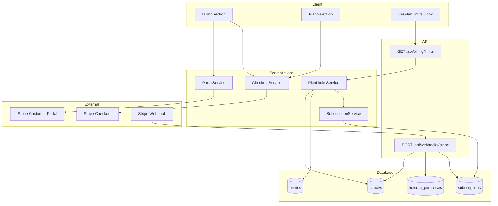
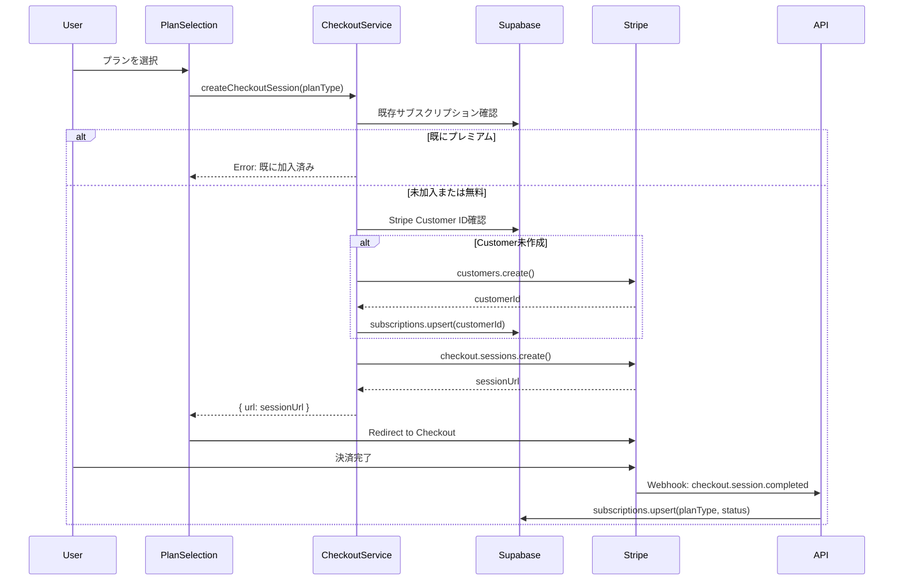
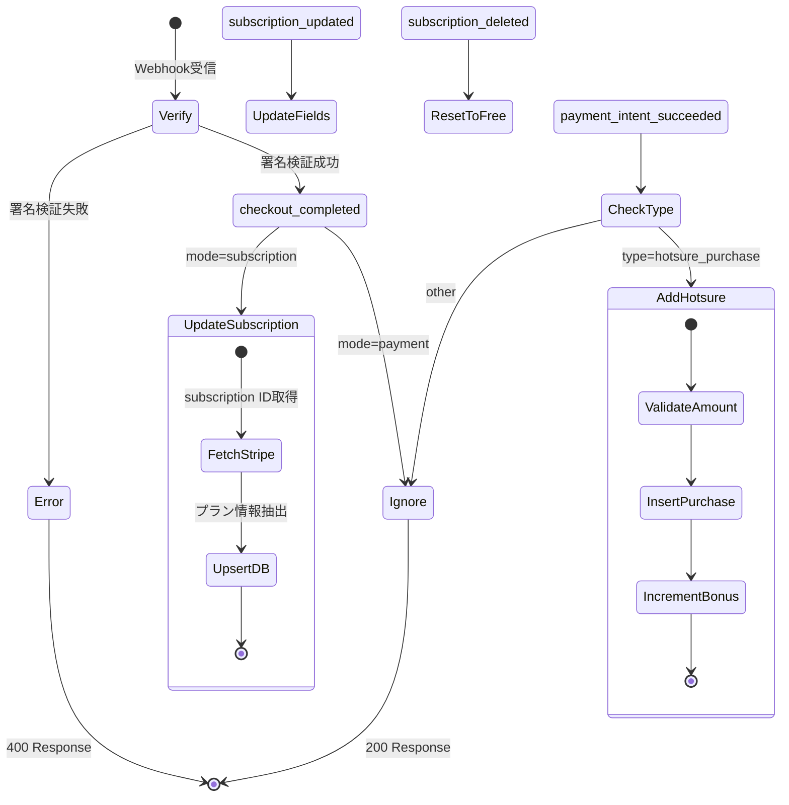
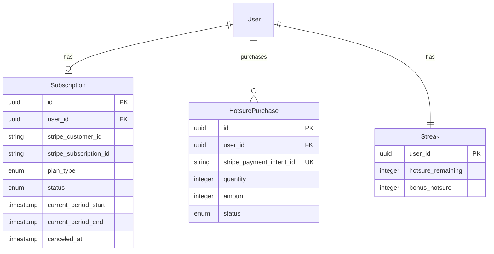

# Billing Feature Design Document

## Overview

本機能は、ヒビオルにおけるサブスクリプション課金とほつれパック単発購入を実現する。Stripe統合により、安全で信頼性の高い決済処理を提供し、プラン別の使用制限管理を行う。

**Purpose**: 無料プランとプレミアムプラン（月額480円/年額4,200円）の提供、1日15投稿・月5画像の無料制限管理、ほつれパック（120円/1回分）の追加購入を可能にする。

**Users**: 全ユーザーがプラン確認・アップグレードを行い、プレミアムユーザーはサブスクリプション管理を利用する。

**Impact**: 既存のstreaksテーブルにbonus_hotsureカラムを追加し、新規にsubscriptionsとhotsure_purchasesテーブルを作成する。

### Goals

- Stripe Checkout/Customer Portalによる安全な決済フロー
- Webhookによるサブスクリプション状態の自動同期
- プラン別使用制限のリアルタイム判定
- ほつれパック購入の競合状態対策

### Non-Goals

- 複数通貨対応（日本円のみ）
- クーポン・割引コード機能
- 請求書PDFダウンロード
- サブスクリプション一時停止機能

## Architecture

### Architecture Pattern & Boundary Map



**Architecture Integration**:

- **Selected pattern**: Featuresベースアーキテクチャ + Server Actions。Stripe統合はサーバーサイドのみで実行し、APIキーをクライアントに露出しない。
- **Domain boundaries**: billing機能は独立したfeatureモジュールとして実装。他featureからの依存はアプリケーション層（app/）で統合。
- **Existing patterns preserved**: Result型によるエラーハンドリング、authActionClientによる認証チェック、TanStack Queryによるデータフェッチ。
- **Steering compliance**: ADHD配慮設計として「課金圧を強くしない」原則を維持。無料プランで十分な機能を提供。

### Technology Stack

| Layer | Choice / Version | Role in Feature | Notes |
|-------|------------------|-----------------|-------|
| Frontend | Next.js 16 + React 19 | プラン表示・Checkout遷移 | Server Components優先 |
| Backend | Server Actions + next-safe-action | 決済処理・制限チェック | 認証ミドルウェア統合 |
| External API | Stripe API v2025-12-15.clover | Checkout/Portal/Webhook | TypeScript SDK使用 |
| Data | Supabase PostgreSQL | サブスクリプション・購入履歴 | RLS有効 |
| State | TanStack Query v5 | 制限情報キャッシュ | 5分staleTime |

## System Flows

### Checkout Flow（サブスクリプション購入）



**Key Decisions**:
- Stripe Customer IDはCheckout時に作成し、subscriptionsテーブルに保存
- 既存プレミアムユーザーの重複購入を防止
- WebhookでDB更新を行い、クライアント側の同期遅延を許容

### Webhook Event Handling



## Requirements Traceability

| Requirement | Summary | Components | Interfaces | Flows |
|-------------|---------|------------|------------|-------|
| 1.1 | プランタイプ表示 | BillingSection | usePlanLimits | - |
| 1.2 | 無料プラン投稿残数表示 | BillingSection | LimitStatus | - |
| 1.3 | 無料プラン画像残数表示 | BillingSection | LimitStatus | - |
| 1.4 | プレミアム無制限表示 | BillingSection | LimitStatus | - |
| 1.5 | キャンセル済み期限表示 | BillingSection | LimitsResponse | - |
| 2.1-2.7 | プラン選択ページ | PlanSelection, PlanCard | createCheckoutSession | Checkout Flow |
| 3.1-3.6 | Stripe Checkout統合 | CheckoutService | CheckoutResult | Checkout Flow |
| 4.1-4.4 | Customer Portal | PortalService | createPortalSession | - |
| 5.1-5.7 | Webhook処理 | WebhookHandler | Stripe Events | Webhook Flow |
| 6.1-6.7 | 使用制限管理 | PlanLimitsService | LimitStatus | - |
| 7.1-7.8 | ほつれパック購入 | CheckoutService, WebhookHandler | HotsurePurchase | Hotsure Flow |
| 8.1-8.7 | エラー・セキュリティ | ErrorHandler, AuthMiddleware | BillingError | - |

## Components and Interfaces

| Component | Domain/Layer | Intent | Req Coverage | Key Dependencies | Contracts |
|-----------|--------------|--------|--------------|------------------|-----------|
| CheckoutService | API | Stripe Checkoutセッション作成 | 3.1-3.6, 7.1-7.2 | Stripe (P0), Supabase (P0) | Service |
| PortalService | API | Customer Portalセッション作成 | 4.1-4.4 | Stripe (P0), Supabase (P0) | Service |
| SubscriptionService | API | サブスクリプション情報取得 | 1.1, 3.2 | Supabase (P0) | Service |
| PlanLimitsService | API | 使用制限チェック | 6.1-6.7 | Supabase (P0) | Service, API |
| WebhookHandler | API | Stripeイベント処理 | 5.1-5.7, 7.3-7.4 | Stripe (P0), Supabase (P0) | API |
| BillingSection | UI | 設定画面の課金セクション | 1.1-1.5, 7.8 | usePlanLimits (P0) | State |
| PlanSelection | UI | プラン選択ページ | 2.1-2.7 | CheckoutService (P0) | - |
| usePlanLimits | Hook | 制限情報フェッチ | 1.2-1.4 | TanStack Query (P0) | State |

### API Layer

#### CheckoutService

| Field | Detail |
|-------|--------|
| Intent | サブスクリプションおよびほつれパック購入のStripe Checkoutセッションを作成 |
| Requirements | 3.1-3.6, 7.1-7.2 |

**Responsibilities & Constraints**
- Stripe Checkoutセッションの作成とURL返却
- 既存プレミアムユーザーの重複購入防止
- Stripe CustomerがなければCheckout時に新規作成
- ほつれ購入時はRPC関数で排他制御

**Dependencies**
- External: Stripe SDK - Checkout/Customer操作 (P0)
- Outbound: Supabase - subscriptions/streaksテーブル操作 (P0)

**Contracts**: Service [x] / API [ ] / Event [ ] / Batch [ ] / State [ ]

##### Service Interface

```typescript
// 入力スキーマ（zod）
const checkoutSchema = z.object({
  planType: z.enum(['premium_monthly', 'premium_yearly']),
})

// サブスクリプション用Checkout
export const createCheckoutSession = authActionClient
  .inputSchema(checkoutSchema)
  .action(async ({ parsedInput, ctx }): Promise<CheckoutResult> => {
    // ...
  })

// ほつれ購入用Checkout（単発決済）
export const createHotsureCheckoutSession = authActionClient
  .action(async ({ ctx }): Promise<CheckoutResult> => {
    // ...
  })

interface CheckoutResult {
  url: string
}
```

- Preconditions: 認証済みユーザー、未プレミアム（サブスク用）、ほつれ残高2未満（ほつれ用）
- Postconditions: Stripe Checkoutセッション作成、customerIdがDBに保存
- Invariants: APIキーはサーバーサイドでのみ使用

**Implementation Notes**
- Integration: next-safe-actionのauthActionClientでラップ
- Validation: zodによる入力バリデーション、既存サブスクリプション確認
- Risks: Stripeサービス障害時はエラー返却、ユーザーにリトライを促す

---

#### PortalService

| Field | Detail |
|-------|--------|
| Intent | Stripe Customer Portalセッションを作成 |
| Requirements | 4.1-4.4 |

**Responsibilities & Constraints**
- Customer Portal URLの生成
- 顧客情報が存在しない場合はエラー

**Dependencies**
- External: Stripe SDK - billingPortal操作 (P0)
- Outbound: Supabase - subscriptionsテーブル参照 (P0)

**Contracts**: Service [x] / API [ ] / Event [ ] / Batch [ ] / State [ ]

##### Service Interface

```typescript
export const createPortalSession = authActionClient
  .action(async ({ ctx }): Promise<CheckoutResult> => {
    // ...
  })
```

- Preconditions: 認証済みユーザー、stripe_customer_idが存在
- Postconditions: Portal URLを返却
- Invariants: return_urlはアプリのsocialページ

---

#### PlanLimitsService

| Field | Detail |
|-------|--------|
| Intent | ユーザーのプラン情報と使用制限を取得 |
| Requirements | 6.1-6.7 |

**Responsibilities & Constraints**
- 日次投稿数・月次画像数のカウント
- JST基準での日次/月次境界判定
- プレミアムは無制限として判定

**Dependencies**
- Outbound: Supabase - entries/streaks/subscriptionsテーブル参照 (P0)
- Inbound: SubscriptionService - プランタイプ取得 (P0)

**Contracts**: Service [x] / API [x] / Event [ ] / Batch [ ] / State [ ]

##### Service Interface

```typescript
export async function checkEntryLimit(userId: string): Promise<BillingResult<LimitStatus>>
export async function checkImageLimit(userId: string): Promise<BillingResult<LimitStatus>>
export async function getPlanLimits(userId: string): Promise<BillingResult<LimitsResponse>>

interface LimitStatus {
  allowed: boolean
  current: number
  limit: number | null  // null = 無制限
  remaining: number | null
  planType: PlanType
}

interface LimitsResponse {
  planType: PlanType
  entryLimit: LimitStatus | null
  imageLimit: LimitStatus | null
  canceledAt: string | null
  currentPeriodEnd: string | null
  hotsureRemaining: number
  bonusHotsure: number
}
```

##### API Contract

| Method | Endpoint | Request | Response | Errors |
|--------|----------|---------|----------|--------|
| GET | /api/billing/limits | - | LimitsResponse | 401, 500 |

---

#### WebhookHandler

| Field | Detail |
|-------|--------|
| Intent | StripeからのWebhookイベントを処理しDBを同期 |
| Requirements | 5.1-5.7, 7.3-7.4 |

**Responsibilities & Constraints**
- 署名検証による不正リクエスト拒否
- イベントタイプ別のハンドラー分岐
- ほつれ購入のUNIQUE制約による冪等性保証
- AdminClientによるRLSバイパス

**Dependencies**
- External: Stripe Webhook - イベント受信 (P0)
- Outbound: Supabase AdminClient - 全テーブル操作 (P0)

**Contracts**: Service [ ] / API [x] / Event [x] / Batch [ ] / State [ ]

##### API Contract

| Method | Endpoint | Request | Response | Errors |
|--------|----------|---------|----------|--------|
| POST | /api/webhooks/stripe | Stripe Event (raw body) | { received: true } | 400, 500 |

##### Event Contract

**Subscribed events**:

| Event Type | Handler | Description |
|------------|---------|-------------|
| checkout.session.completed | handleCheckoutComplete | サブスクリプション作成 |
| customer.subscription.updated | handleSubscriptionUpdate | ステータス・期間更新 |
| customer.subscription.deleted | handleSubscriptionDeleted | 無料プランへ戻す |
| invoice.payment_failed | handlePaymentFailed | 支払い失敗ログ |
| payment_intent.succeeded | handleHotsurePurchase | ほつれ加算（type=hotsure_purchase時） |

**Ordering / delivery guarantees**: Stripeの再送機能に依存。UNIQUE制約で冪等性を保証。

---

#### SubscriptionService

| Field | Detail |
|-------|--------|
| Intent | サブスクリプション情報の取得と初期化 |
| Requirements | 3.2, 1.1 |

**Responsibilities & Constraints**
- ユーザーIDによるサブスクリプション取得
- キャンセル済みでも期間内なら有効と判定

**Dependencies**
- Outbound: Supabase - subscriptionsテーブル (P0)

**Contracts**: Service [x] / API [ ] / Event [ ] / Batch [ ] / State [ ]

##### Service Interface

```typescript
export async function getSubscription(userId: string): Promise<BillingResult<Subscription | null>>
export async function getUserPlanType(userId: string): Promise<PlanType>
export async function createInitialSubscription(
  userId: string,
  stripeCustomerId?: string
): Promise<BillingResult<Subscription>>

type PlanType = 'free' | 'premium_monthly' | 'premium_yearly'
type SubscriptionStatus = 'active' | 'canceled' | 'past_due' | 'trialing' | 'incomplete'

interface Subscription {
  id: string
  userId: string
  stripeCustomerId: string | null
  stripeSubscriptionId: string | null
  stripePriceId: string | null
  planType: PlanType
  status: SubscriptionStatus
  currentPeriodStart: Date | null
  currentPeriodEnd: Date | null
  canceledAt: Date | null
  createdAt: Date
  updatedAt: Date
}
```

### UI Layer

#### BillingSection

| Field | Detail |
|-------|--------|
| Intent | 設定画面に課金情報と操作ボタンを表示 |
| Requirements | 1.1-1.5, 7.8 |

**Responsibilities & Constraints**
- 現在のプランと使用制限の表示
- キャンセル済み期限の視覚的表示
- ほつれ購入ボタンの有効/無効制御

**Dependencies**
- Inbound: usePlanLimits - 制限情報 (P0)
- Outbound: CheckoutService, PortalService - 決済操作 (P0)

**Contracts**: Service [ ] / API [ ] / Event [ ] / Batch [ ] / State [x]

##### State Management

```typescript
// ローカル状態
const [isLoading, setIsLoading] = useState(false)
const [error, setError] = useState<string | null>(null)

// usePlanLimitsからの状態
const {
  planType,
  entryLimit,
  imageLimit,
  canceledAt,
  currentPeriodEnd,
  totalHotsure,
  canPurchaseHotsure,
  isLoading: isLimitsLoading,
} = usePlanLimits()
```

**Implementation Notes**
- Integration: Card/Button/Badgeコンポーネントで構成
- Validation: canPurchaseHotsureでほつれ購入ボタンを制御
- Risks: API遅延時はスケルトン表示

---

#### PlanSelection

| Field | Detail |
|-------|--------|
| Intent | プラン比較と選択UI |
| Requirements | 2.1-2.7 |

**Responsibilities & Constraints**
- 月額/年額プランカードの表示
- 年額に「おすすめ」バッジ
- Checkout遷移中のローディング状態管理

**Dependencies**
- Outbound: CheckoutService - Checkout遷移 (P0)
- Component: PlanCard - プランカード表示 (P1)

**Implementation Notes**
- Integration: `/social/plans`ページで使用
- Validation: disabled状態で重複クリック防止

---

#### usePlanLimits Hook

| Field | Detail |
|-------|--------|
| Intent | 制限情報のフェッチとキャッシュ |
| Requirements | 1.2-1.4 |

**Contracts**: Service [ ] / API [ ] / Event [ ] / Batch [ ] / State [x]

##### State Management

```typescript
interface UsePlanLimitsResult {
  entryLimit: LimitStatus | null
  imageLimit: LimitStatus | null
  planType: PlanType
  canceledAt: Date | null
  currentPeriodEnd: Date | null
  hotsureRemaining: number
  bonusHotsure: number
  totalHotsure: number
  canPurchaseHotsure: boolean
  isLoading: boolean
  error: Error | null
  refetch: () => void
}
```

- Persistence: TanStack Query（staleTime: 5分、gcTime: 10分）
- Concurrency: 自動バックグラウンド再フェッチ

## Data Models

### Domain Model



**Aggregates**:
- Subscription: ユーザーごとに1レコード。Stripe連携情報とプラン状態を管理。
- HotsurePurchase: 購入履歴。payment_intent_idのUNIQUE制約で冪等性保証。
- Streak: 既存テーブルにbonus_hotsureを追加。

**Business Rules**:
- ほつれ合計（hotsure_remaining + bonus_hotsure）は2以下
- キャンセル済みでもcurrent_period_end以前はプレミアム有効
- 無料プラン: 1日15投稿、月5画像

### Physical Data Model

#### subscriptions

```sql
CREATE TABLE public.subscriptions (
  id UUID PRIMARY KEY DEFAULT gen_random_uuid(),
  user_id UUID NOT NULL UNIQUE REFERENCES public.users(id) ON DELETE CASCADE,
  stripe_customer_id TEXT UNIQUE,
  stripe_subscription_id TEXT UNIQUE,
  stripe_price_id TEXT,
  plan_type TEXT NOT NULL DEFAULT 'free'
    CHECK (plan_type IN ('free', 'premium_monthly', 'premium_yearly')),
  status TEXT NOT NULL DEFAULT 'active'
    CHECK (status IN ('active', 'canceled', 'past_due', 'trialing', 'incomplete')),
  current_period_start TIMESTAMPTZ,
  current_period_end TIMESTAMPTZ,
  canceled_at TIMESTAMPTZ,
  created_at TIMESTAMPTZ NOT NULL DEFAULT NOW(),
  updated_at TIMESTAMPTZ NOT NULL DEFAULT NOW()
);

CREATE INDEX idx_subscriptions_user_id ON public.subscriptions(user_id);
CREATE INDEX idx_subscriptions_stripe_customer_id ON public.subscriptions(stripe_customer_id);
```

#### hotsure_purchases

```sql
CREATE TABLE public.hotsure_purchases (
  id UUID PRIMARY KEY DEFAULT gen_random_uuid(),
  user_id UUID NOT NULL REFERENCES public.users(id) ON DELETE CASCADE,
  stripe_payment_intent_id TEXT UNIQUE NOT NULL,
  quantity INTEGER NOT NULL DEFAULT 1,
  amount INTEGER NOT NULL,
  status TEXT NOT NULL DEFAULT 'pending'
    CHECK (status IN ('pending', 'completed', 'failed', 'refunded')),
  created_at TIMESTAMPTZ NOT NULL DEFAULT NOW()
);

CREATE INDEX idx_hotsure_purchases_user_id ON public.hotsure_purchases(user_id);
```

#### streaks（追加カラム）

```sql
ALTER TABLE public.streaks
ADD COLUMN IF NOT EXISTS bonus_hotsure INTEGER NOT NULL DEFAULT 0;
```

### RLS Policies

```sql
-- subscriptions
CREATE POLICY "Users can view own subscription"
  ON public.subscriptions FOR SELECT
  USING (auth.uid() = user_id);

CREATE POLICY "Users can insert own subscription"
  ON public.subscriptions FOR INSERT
  WITH CHECK (auth.uid() = user_id);

CREATE POLICY "Service role can manage subscriptions"
  ON public.subscriptions FOR ALL TO service_role
  USING (true)
  WITH CHECK (true);

-- hotsure_purchases
CREATE POLICY "Users can view own purchases"
  ON public.hotsure_purchases FOR SELECT
  USING (auth.uid() = user_id);

CREATE POLICY "Service role can manage purchases"
  ON public.hotsure_purchases FOR ALL TO service_role
  USING (true)
  WITH CHECK (true);
```

### RPC Functions

```sql
-- ほつれ購入可否チェック（FOR UPDATEで競合状態対策）
CREATE OR REPLACE FUNCTION check_hotsure_purchase_allowed(p_user_id UUID)
RETURNS JSONB
LANGUAGE plpgsql
SECURITY DEFINER
AS $$
DECLARE
  v_total INTEGER;
  v_max_total INTEGER := 2;
BEGIN
  SELECT COALESCE(hotsure_remaining, 0) + COALESCE(bonus_hotsure, 0)
  INTO v_total
  FROM streaks
  WHERE user_id = p_user_id
  FOR UPDATE;

  IF v_total IS NULL THEN
    v_total := 0;
  END IF;

  IF v_total >= v_max_total THEN
    RETURN jsonb_build_object(
      'allowed', false,
      'current', v_total,
      'message', 'ほつれは2個以上持てません'
    );
  END IF;

  RETURN jsonb_build_object(
    'allowed', true,
    'current', v_total
  );
END;
$$;
```

## Error Handling

### Error Strategy

| Error Type | Code | User Message | Recovery |
|------------|------|--------------|----------|
| 未認証 | UNAUTHORIZED | 認証が必要です。再度ログインしてください | ログインページへ誘導 |
| Stripe障害 | STRIPE_ERROR | 決済処理中にエラーが発生しました | リトライを促す |
| DB障害 | DB_ERROR | 処理中にエラーが発生しました | リトライを促す |
| 既存サブスク | SUBSCRIPTION_EXISTS | 既にサブスクリプションが存在します | - |
| ほつれ上限 | HOTSURE_LIMIT_EXCEEDED | ほつれは2個以上持てません | ボタン無効化 |
| 顧客未発見 | CUSTOMER_NOT_FOUND | 顧客情報が見つかりませんでした | サポート誘導 |

### Error Handling Pattern

```typescript
// createSafeBillingErrorによる安全なエラー変換
export function createSafeBillingError(
  code: BillingErrorCode,
  internalError?: unknown
): BillingError {
  if (internalError) {
    logger.error(`[Billing:${code}]`, internalError)
  }
  return {
    code,
    message: SAFE_ERROR_MESSAGES[code],
  }
}
```

### Monitoring

- logger.error: 全内部エラーを記録（本番でconsole.error禁止）
- logger.warn: 支払い失敗イベント
- logger.info: サブスクリプション変更、ほつれ購入完了

## Testing Strategy

### Unit Tests

| Target | Test Cases |
|--------|------------|
| getPlanTypeFromPriceId | 有効なprice ID、無効なID、null |
| isValidHotsurePurchase | 正常金額、不正金額 |
| isPremiumPlan | free/premium_monthly/premium_yearly |
| getUserPlanType | active/canceled/expired |

### Integration Tests

| Target | Test Cases |
|--------|------------|
| checkEntryLimit | 制限内、制限到達、プレミアム無制限 |
| checkImageLimit | 月初、月末、境界値 |
| Webhook handler | checkout完了、subscription更新、ほつれ購入 |

### E2E Tests

| Target | Test Cases |
|--------|------------|
| プラン表示 | 無料/プレミアム表示切り替え |
| Checkout遷移 | ボタン→Stripe画面（モック） |
| ほつれ購入 | 購入可能/上限時のUI状態 |
| キャンセル済み表示 | 期限表示の確認 |

## Security Considerations

### Authentication

- 全Server ActionsでauthActionClientによる認証チェック
- WebhookはStripe署名検証（HMAC-SHA256）

### API Key Protection

- STRIPE_SECRET_KEY: サーバーサイドのみ
- STRIPE_WEBHOOK_SECRET: Webhook検証用
- 環境変数からの取得、クライアントに露出しない

### Idempotency

- Webhook: hotsure_purchasesのstripe_payment_intent_id UNIQUE制約
- 重複処理時はログ出力のみで成功扱い

### Rate Limiting

- Stripe側のレート制限に依存
- アプリ側での追加制限は現時点で不要

## Constants

```typescript
// プラン別制限
export const PLAN_LIMITS: Record<PlanType, PlanLimits> = {
  free: {
    dailyEntryLimit: 15,
    monthlyImageLimit: 5,
  },
  premium_monthly: {
    dailyEntryLimit: null,
    monthlyImageLimit: null,
  },
  premium_yearly: {
    dailyEntryLimit: null,
    monthlyImageLimit: null,
  },
}

// Stripe Price IDs（環境変数）
export const STRIPE_PRICE_IDS = {
  PREMIUM_MONTHLY: process.env.STRIPE_PRICE_PREMIUM_MONTHLY,
  PREMIUM_YEARLY: process.env.STRIPE_PRICE_PREMIUM_YEARLY,
  HOTSURE_PACK: process.env.STRIPE_PRICE_HOTSURE_PACK,
}

// ほつれ
export const HOTSURE_PACK_PRICE = 120
export const HOTSURE_PACK_QUANTITY = 1
export const HOTSURE_MAX_TOTAL = 2
```
