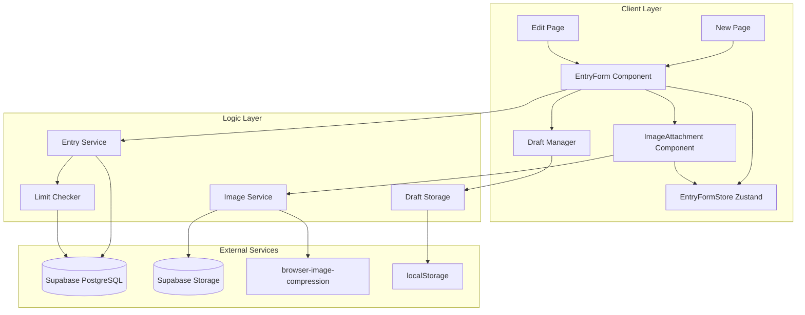
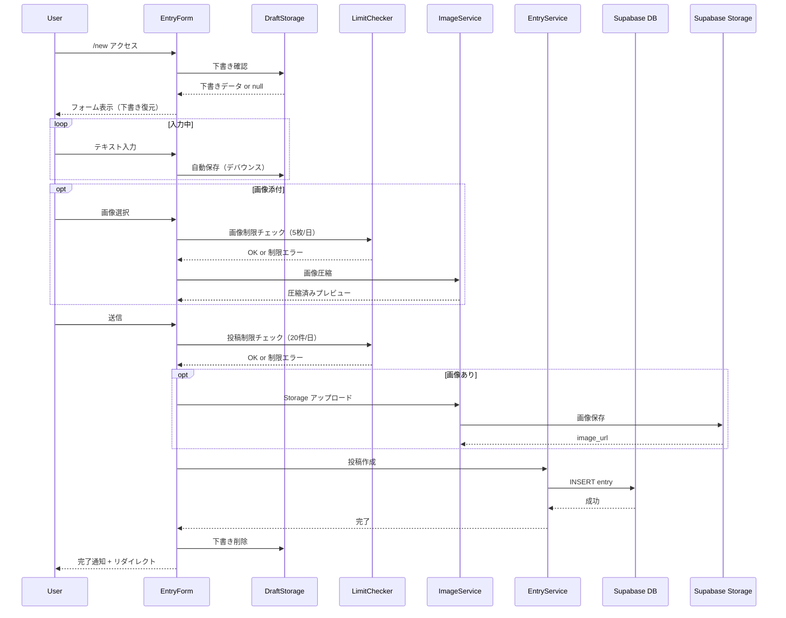
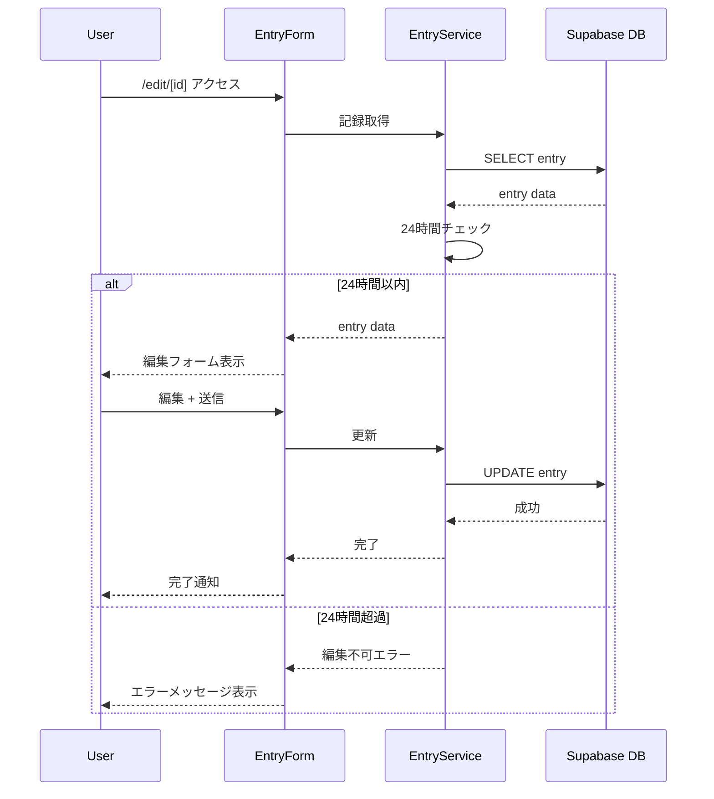
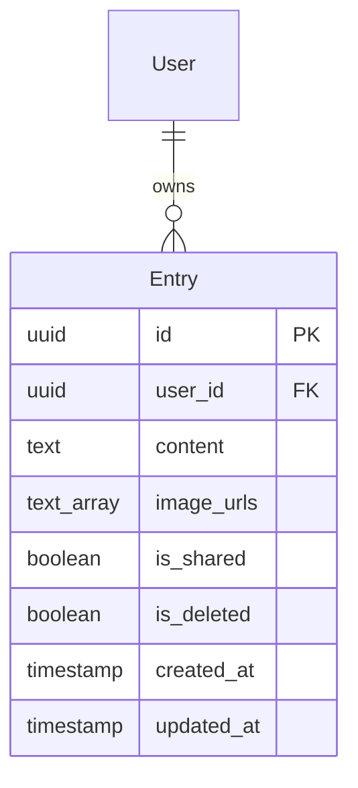

# Design Document

## Overview

**Purpose**: 本機能は「2タップで記録完了」「絵文字1つでもOK」というコンセプトに基づき、ADHD当事者が継続的に記録を残せる入力/編集インターフェースを提供する。

**Users**: ADHD当事者およびADHD傾向のあるユーザーが、瞬間的な記録の入力・編集・削除を行う。

**Impact**: 新規機能として、記録の作成・編集・削除フローを確立し、entriesテーブルおよびSupabase Storageへのデータ永続化パイプラインを構築する。

### Goals
- 入力のハードルを極限まで下げる（絵文字1文字でもOK、2タップ完了）
- 画像添付時のクライアント側圧縮による高速アップロード
- 下書き自動保存によるデータ消失防止
- 適切な制限（1日20投稿、画像5枚）によるベータ版リソース管理

### Non-Goals
- リッチテキストエディタ（Markdown、装飾機能）
- オフライン投稿キュー（PWA Phase 2以降）

> **設計変更メモ**:
> - ~~複数画像添付（1投稿1枚に限定）~~ → 最大2枚に拡張済み
> - ~~投稿の公開/非公開切り替えUI~~ → ソーシャル共有機能（isShared）として実装済み

## Architecture

### Architecture Pattern & Boundary Map



**Architecture Integration**:
- Selected pattern: Feature-First構成 + Client Component（インタラクティブUI）
- Domain/feature boundaries: 入力フォーム、画像処理、下書き管理を独立したモジュールとして分離
- Existing patterns preserved: Next.js App Router規約、Supabaseクライアントパターン
- New components rationale: EntryFormを新規入力/編集で共有し、UIの一貫性を維持
- Steering compliance: TypeScript厳格モード、any禁止、Supabase BaaSパターン

### Technology Stack

| Layer | Choice / Version | Role in Feature | Notes |
|-------|------------------|-----------------|-------|
| Frontend | Next.js 14+ (App Router) | ページルーティング、Server/Client Components | /new、/edit/[id]ルート |
| UI | React 18+ | インタラクティブ入力フォーム | Client Componentとして実装 |
| Styling | Tailwind CSS | 集中モードUI、レスポンシブデザイン | |
| Image Processing | browser-image-compression 2.0+ | クライアント側WebP変換・200KB圧縮 | TypeScript型定義内蔵 |
| Backend/DB | Supabase (PostgreSQL) | entries テーブル、RLS | |
| Storage | Supabase Storage | 画像ファイル保存 | バケット: entry-images |
| Local Storage | Web Storage API | 下書き自動保存 | |

## System Flows

### 新規投稿フロー



### 編集フロー



## Requirements Traceability

| Requirement | Summary | Components | Interfaces | Flows |
|-------------|---------|------------|------------|-------|
| 1.1 | 集中モード入力エリア表示 | EntryForm, NewPage | EntryFormProps | 新規投稿フロー |
| 1.2 | プレーンテキスト入力 | EntryForm | EntryFormProps | 新規投稿フロー |
| 1.3 | 絵文字1文字の有効性 | EntryService | createEntry | 新規投稿フロー |
| 1.4 | 2タップ完了 | EntryForm, NewPage | EntryFormProps | 新規投稿フロー |
| 1.5 | 文字数非表示 | EntryForm | - | - |
| 2.1 | 画像選択UI | ImageAttachment | ImageAttachmentProps | 新規投稿フロー |
| 2.2 | 200KB圧縮 | ImageService | compressImage | 新規投稿フロー |
| 2.3 | 圧縮プレビュー | ImageAttachment | ImageAttachmentProps | 新規投稿フロー |
| 2.4 | 1投稿1枚制限 | ImageAttachment | ImageAttachmentProps | - |
| 2.5 | 1日5枚制限 | LimitChecker, ImageAttachment | checkDailyImageLimit | 新規投稿フロー |
| 2.6 | Storage保存 | ImageService | uploadImage | 新規投稿フロー |
| 3.1 | 自動保存 | DraftStorage | saveDraft, loadDraft | 新規投稿フロー |
| 3.2 | 下書き復元 | EntryForm, DraftStorage | loadDraft | 新規投稿フロー |
| 3.3 | 投稿後削除 | DraftStorage | clearDraft | 新規投稿フロー |
| 3.4 | 画像含む保存 | DraftStorage | Draft型 | 新規投稿フロー |
| 4.1 | 編集画面表示 | EditPage, EntryForm | getEntry | 編集フロー |
| 4.2 | 共通UI | EntryForm | EntryFormProps | 編集フロー |
| 4.3 | 上書き更新 | EntryService | updateEntry | 編集フロー |
| 4.4 | 24時間制限 | EntryService | isEditable | 編集フロー |
| 4.5 | updated_at更新 | EntryService | updateEntry | 編集フロー |
| 5.1 | 20件/日制限 | LimitChecker | checkDailyEntryLimit | 新規投稿フロー |
| 5.2 | 制限メッセージ | EntryForm | - | 新規投稿フロー |
| 5.3 | 0:00リセット | LimitChecker | - | - |
| 6.1 | 削除確認 | EntryForm | deleteEntry | - |
| 6.2 | 論理削除 | EntryService | deleteEntry | - |
| 6.3 | 非表示 | EntryService | - | - |
| 7.1 | テーブル構造 | - | Entry型 | - |
| 7.2 | user_id設定 | EntryService | createEntry | 新規投稿フロー |
| 7.3 | created_at設定 | EntryService | createEntry | 新規投稿フロー |
| 7.4 | is_deleted default | - | - | - |
| 7.5 | is_public default | - | - | - |

## Components and Interfaces

### Component Summary

| Component | Domain/Layer | Intent | Req Coverage | Key Dependencies | Contracts |
|-----------|--------------|--------|--------------|------------------|-----------|
| NewPage | Pages | 新規入力ページ | 1.1, 1.4 | EntryForm (P0) | - |
| EditPage | Pages | 編集ページ | 4.1, 4.2 | EntryForm (P0), EntryService (P0) | - |
| EntryForm | UI | 入力/編集フォーム | 1.1-1.5, 5.2, 6.1 | EntryFormStore (P0), ImageAttachment (P1), EntryService (P0) | State |
| ImageAttachment | UI | 画像添付コンポーネント（最大2枚） | 2.1, 2.3, 2.4, 2.5 | ImageService (P0), EntryFormStore (P0), LimitChecker (P1) | - |
| EntryFormStore | Store | フォーム状態管理（Zustand） | 1.1-1.5, 2.1-2.4 | - | State |
| EntryService | Logic | エントリCRUD操作 | 1.3, 4.3-4.5, 6.2-6.3, 7.2-7.3 | Supabase (P0), ImageService (P1) | Service |
| ImageService | Logic | 画像圧縮・アップロード | 2.2, 2.6 | browser-image-compression (P0), Supabase Storage (P0) | Service |
| LimitChecker | Logic | 制限チェック | 2.5, 5.1, 5.3 | Supabase (P0) | Service |
| DraftStorage | Logic | 下書き管理 | 3.1-3.4 | localStorage (P0) | Service |

---

### Pages

#### NewPage

| Field | Detail |
|-------|--------|
| Intent | 新規記録入力ページ（/new） |
| Requirements | 1.1, 1.4 |

**Responsibilities & Constraints**
- Server Componentとしてレンダリング、EntryFormをClient Componentとして埋め込む
- 認証状態の確認とリダイレクト

**Dependencies**
- Outbound: EntryForm - フォームUI提供 (P0)

**Implementation Notes**
- 認証ミドルウェアで未ログイン時は/loginへリダイレクト

---

#### EditPage

| Field | Detail |
|-------|--------|
| Intent | 記録編集ページ（/edit/[id]） |
| Requirements | 4.1, 4.2 |

**Responsibilities & Constraints**
- Server Componentで既存記録をフェッチ
- 24時間チェックをサーバーサイドで実行し、超過時はエラー表示

**Dependencies**
- Outbound: EntryForm - フォームUI提供 (P0)
- Outbound: EntryService - 記録取得・編集可否チェック (P0)

**Implementation Notes**
- 存在しないIDまたは他ユーザーの記録は404表示

---

### UI Components

#### EntryForm

| Field | Detail |
|-------|--------|
| Intent | テキスト入力と送信を担う共通フォームコンポーネント |
| Requirements | 1.1, 1.2, 1.3, 1.4, 1.5, 5.2, 6.1 |

**Responsibilities & Constraints**
- Client Componentとして実装（'use client'）
- 集中モードUI（画面全体を使用）
- 文字数カウンター非表示（プレッシャー軽減）
- 新規/編集両モードに対応

**Dependencies**
- Inbound: NewPage, EditPage - ページからの埋め込み (P0)
- Outbound: EntryFormStore - 状態管理 (P0)
- Outbound: ImageAttachment - 画像添付UI (P1)
- Outbound: DraftStorage - 下書き自動保存 (P1)
- Outbound: EntryService - 投稿作成・更新 (P0)
- Outbound: LimitChecker - 投稿制限チェック (P0)

**Contracts**: State [x]

##### State Management

状態管理はEntryFormStore（Zustand）に委譲。詳細は「EntryFormStore」セクションを参照。

```typescript
// EntryFormStoreからの状態取得
const content = useEntryFormStore((s) => s.content)
const images = useEntryFormStore((s) => s.images)
const isShared = useEntryFormStore((s) => s.isShared)
const isSubmitting = useEntryFormStore((s) => s.isSubmitting)
const error = useEntryFormStore((s) => s.error)

// アクション
const setContent = useEntryFormStore((s) => s.setContent)
const setIsShared = useEntryFormStore((s) => s.setIsShared)
const submitStart = useEntryFormStore((s) => s.submitStart)
const submitSuccess = useEntryFormStore((s) => s.submitSuccess)
const submitError = useEntryFormStore((s) => s.submitError)

interface CompressedImage {
  file: File;
  previewUrl: string;
  originalSize: number;
  compressedSize: number;
}
```

- State model: EntryFormStore（Zustand）によるグローバル状態管理
- Persistence: DraftStorageへの自動保存（300msデバウンス）
- Concurrency: 送信中はボタン無効化で二重送信防止

##### Props Interface

```typescript
interface EntryFormProps {
  mode: 'create' | 'edit';
  initialEntry?: Entry;
  onSuccess: () => void;
}
```

**Implementation Notes**
- Integration: textareaのauto-resize実装
- Validation: 空文字チェックは不要（絵文字1文字OK）、空白のみは拒否
- Risks: 下書き復元時のUX考慮（既存データとの衝突）

---

#### ImageAttachment

| Field | Detail |
|-------|--------|
| Intent | 画像選択・圧縮・プレビュー表示（最大2枚） |
| Requirements | 2.1, 2.3, 2.4, 2.5 |

**Responsibilities & Constraints**
- 1投稿最大2枚の制限をUIレベルで強制（`MAX_IMAGES = 2`）
- EntryFormStoreと連携して画像の追加・削除を管理
- 圧縮進捗の表示
- プレビュー表示と削除機能
- 編集時は既存画像（existingImageUrls）と新規画像（images）を区別

**Dependencies**
- Outbound: ImageService - 画像圧縮 (P0)
- Outbound: EntryFormStore - 画像状態管理 (P0)
- Outbound: LimitChecker - 1日5枚制限チェック (P1)

**Contracts**: State [x]

##### Props Interface

```typescript
interface ImageAttachmentProps {
  disabled?: boolean;
}

// EntryFormStoreから画像状態を取得
const images = useEntryFormStore((s) => s.images)
const existingImageUrls = useEntryFormStore((s) => s.existingImageUrls)
const removedImageUrls = useEntryFormStore((s) => s.removedImageUrls)
const canAddImage = useEntryFormStore(selectCanAddImage)

// EntryFormStoreのアクションで画像を操作
const addImage = useEntryFormStore((s) => s.addImage)
const removeImage = useEntryFormStore((s) => s.removeImage)
const toggleExistingImageRemoval = useEntryFormStore((s) => s.toggleExistingImageRemoval)
```

**Implementation Notes**
- inputタイプfileでaccept="image/*"、multiple属性対応
- 圧縮中はスピナー表示
- 既存画像の削除は`toggleExistingImageRemoval`で削除予定マーク（送信時に反映）

---

### State Management (Zustand Store)

#### EntryFormStore

| Field | Detail |
|-------|--------|
| Intent | フォーム状態を一元管理するZustandストア |
| Requirements | 1.1-1.5, 2.1-2.4 |

**Responsibilities & Constraints**
- フォームのコンテンツ、画像、ソーシャル共有設定を管理
- 送信・削除中のUI状態を管理
- エラー状態を管理
- 編集時の既存画像と削除予定画像を区別

**Contracts**: State [x]

##### Store Interface

```typescript
// 定数
export const MAX_IMAGES = 2

// 状態
interface EntryFormState {
  // フォーム内容
  content: string;
  images: CompressedImage[];      // 新規追加する画像（最大2枚）
  existingImageUrls: string[];    // 編集時の既存画像URL
  removedImageUrls: string[];     // 削除予定としてマークされた既存画像URL
  isShared: boolean;              // ソーシャルタイムラインに共有するか

  // UI状態
  isSubmitting: boolean;
  isDeleting: boolean;
  showDeleteConfirm: boolean;
  isSuccess: boolean;
  isFocused: boolean;

  // エラー
  error: string | null;
}

// アクション
interface EntryFormActions {
  // フォーム操作
  setContent: (content: string) => void;
  setIsShared: (isShared: boolean) => void;
  addImage: (image: CompressedImage) => void;
  removeImage: (index: number) => void;
  toggleExistingImageRemoval: (url: string) => void;

  // UI状態
  setSubmitting: (value: boolean) => void;
  setDeleting: (value: boolean) => void;
  setShowDeleteConfirm: (value: boolean) => void;
  setSuccess: (value: boolean) => void;
  setFocused: (value: boolean) => void;
  setError: (error: string | null) => void;

  // 複合アクション
  submitStart: () => void;
  submitSuccess: () => void;
  submitError: (msg: string) => void;
  deleteStart: () => void;
  deleteError: (msg: string) => void;

  // 初期化/リセット
  initialize: (initialContent?: string, existingImageUrls?: string[] | null, initialIsShared?: boolean) => void;
  reset: () => void;
}

export type EntryFormStore = EntryFormState & EntryFormActions;
```

##### セレクター

```typescript
// 送信可能かどうか判定
export const selectCanSubmit = (state: EntryFormState): boolean =>
  !state.isSubmitting && !state.isDeleting && !state.isSuccess && state.content.trim().length > 0;

// 現在の合計画像数を計算
export const selectTotalImageCount = (state: EntryFormState): number => {
  const existingCount = state.existingImageUrls.filter(
    (url) => !state.removedImageUrls.includes(url)
  ).length;
  return state.images.length + existingCount;
};

// 画像追加可能かどうか判定
export const selectCanAddImage = (state: EntryFormState): boolean => {
  return selectTotalImageCount(state) < MAX_IMAGES;
};
```

**Implementation Notes**
- `initialize`は新規作成時は引数なし、編集時は既存データを渡す
- `reset`はページ離脱時に呼び出してメモリリーク防止
- 画像のプレビューURLは`removeImage`時に`URL.revokeObjectURL`で解放

---

### Logic Layer

#### EntryService

| Field | Detail |
|-------|--------|
| Intent | エントリのCRUD操作を提供 |
| Requirements | 1.3, 4.3, 4.4, 4.5, 6.2, 6.3, 7.2, 7.3 |

**Responsibilities & Constraints**
- Supabaseへの全てのentriesテーブル操作を担当
- RLSによるuser_idの自動設定を前提
- 24時間編集制限のビジネスルール実装

**Dependencies**
- External: Supabase Client - DB操作 (P0)
- Outbound: ImageService - 画像URL取得 (P1)

**Contracts**: Service [x]

##### Service Interface

```typescript
interface EntryServiceInterface {
  createEntry(input: CreateEntryInput): Promise<Result<Entry, EntryError>>;
  updateEntry(id: string, input: UpdateEntryInput): Promise<Result<Entry, EntryError>>;
  deleteEntry(id: string): Promise<Result<void, EntryError>>;
  getEntry(id: string): Promise<Result<Entry, EntryError>>;
  isEditable(entry: Entry): boolean;
}

interface CreateEntryInput {
  content: string;
  imageUrls: string[] | null;  // 複数画像URL（最大2枚）
  isShared?: boolean;          // ソーシャルタイムラインに共有するか（デフォルト: false）
}

interface UpdateEntryInput {
  content: string;
  imageUrls: string[] | null;  // 複数画像URL（最大2枚）
  isShared?: boolean;          // ソーシャルタイムラインに共有するか
}

type EntryError =
  | { code: 'NOT_FOUND'; message: string }
  | { code: 'EDIT_EXPIRED'; message: string }
  | { code: 'UNAUTHORIZED'; message: string }
  | { code: 'DB_ERROR'; message: string };
```

- Preconditions: 認証済みユーザーセッションが存在すること
- Postconditions: 成功時はentriesテーブルに反映
- Invariants: user_idは現在のセッションユーザーと一致

**Implementation Notes**
- Validation: contentが空白のみの場合は拒否
- Risks: RLS設定漏れによるデータ漏洩

---

#### ImageService

| Field | Detail |
|-------|--------|
| Intent | 画像圧縮とSupabase Storageアップロード |
| Requirements | 2.2, 2.6 |

**Responsibilities & Constraints**
- browser-image-compressionによる200KB以下への圧縮
- WebP形式への変換
- 一意なファイル名生成（user_id + timestamp）

**Dependencies**
- External: browser-image-compression - 画像圧縮 (P0)
- External: Supabase Storage - ファイル保存 (P0)

**Contracts**: Service [x]

##### Service Interface

```typescript
interface ImageServiceInterface {
  compressImage(
    file: File,
    onProgress?: (progress: number) => void
  ): Promise<Result<CompressedImage, ImageError>>;

  uploadImage(
    file: File,
    userId: string
  ): Promise<Result<string, ImageError>>;
}

interface CompressionOptions {
  maxSizeMB: number;           // 0.2 (200KB)
  maxWidthOrHeight: number;    // 1920
  fileType: 'image/webp';
  useWebWorker: boolean;
}

type ImageError =
  | { code: 'COMPRESSION_FAILED'; message: string }
  | { code: 'UPLOAD_FAILED'; message: string }
  | { code: 'INVALID_TYPE'; message: string };
```

- Preconditions: 有効な画像ファイル（image/*）
- Postconditions: 圧縮後200KB以下、アップロード後URLを返却
- Invariants: 元ファイルは変更しない

**Implementation Notes**
- Integration: useWebWorker: trueでメインスレッドブロック回避
- Validation: 画像形式チェック（JPEG, PNG, WebP, GIF）

---

#### LimitChecker

| Field | Detail |
|-------|--------|
| Intent | 投稿・画像制限のチェック |
| Requirements | 2.5, 5.1, 5.3 |

**Responsibilities & Constraints**
- JST 0:00基準での日次カウント
- 投稿20件/日、画像5枚/日の制限

**Dependencies**
- External: Supabase Client - 件数取得クエリ (P0)

**Contracts**: Service [x]

##### Service Interface

```typescript
interface LimitCheckerInterface {
  checkDailyEntryLimit(userId: string): Promise<Result<LimitStatus, LimitError>>;
  checkDailyImageLimit(userId: string): Promise<Result<LimitStatus, LimitError>>;
}

interface LimitStatus {
  allowed: boolean;
  current: number;
  limit: number;
  remaining: number;
}

type LimitError =
  | { code: 'DB_ERROR'; message: string };
```

- Preconditions: 有効なユーザーID
- Postconditions: 現在の使用状況と残数を返却
- Invariants: JST 0:00でリセット

**Implementation Notes**
- Integration: Supabaseのcount()クエリでcreated_atをJSTでフィルタ

---

#### DraftStorage

| Field | Detail |
|-------|--------|
| Intent | 下書きのローカルストレージ管理 |
| Requirements | 3.1, 3.2, 3.3, 3.4 |

**Responsibilities & Constraints**
- localStorageへの保存・読み込み・削除
- 画像プレビュー情報の保存（Base64）

**Dependencies**
- External: Web Storage API (localStorage) - ブラウザストレージ (P0)

**Contracts**: Service [x]

##### Service Interface

```typescript
interface DraftStorageInterface {
  saveDraft(draft: Draft): void;
  loadDraft(): Draft | null;
  clearDraft(): void;
}

interface Draft {
  content: string;
  imagePreview: string | null;  // Base64 data URL
  savedAt: string;              // ISO 8601
}

const DRAFT_STORAGE_KEY = 'hibioru_entry_draft';
```

- Preconditions: ブラウザ環境であること
- Postconditions: 保存後は即座に復元可能
- Invariants: クライアントサイドのみで動作

**Implementation Notes**
- Integration: SSR時はnoop、useEffect内で実行
- Validation: localStorage容量超過時のエラーハンドリング
- Risks: 大きな画像のBase64保存は容量を圧迫

---

## Data Models

### Domain Model



**Aggregates and Boundaries**:
- Entry: 単独のアグリゲートルート、User集約との関連はuser_idで表現

**Business Rules & Invariants**:
- contentは空白のみ不可（絵文字1文字は許可）
- image_urlsはSupabase Storage URL配列（最大2枚）またはnull
- is_sharedがtrueの場合、ソーシャルタイムラインに表示される
- created_atから24時間以内のみ編集可能
- is_deleted=trueの記録は表示されない

### Physical Data Model

#### entriesテーブル

```sql
CREATE TABLE entries (
  id UUID PRIMARY KEY DEFAULT gen_random_uuid(),
  user_id UUID NOT NULL REFERENCES auth.users(id) ON DELETE CASCADE,
  content TEXT NOT NULL,
  image_urls TEXT[],              -- 複数画像URL（最大2枚）
  is_shared BOOLEAN NOT NULL DEFAULT false,  -- ソーシャルタイムラインに共有
  is_deleted BOOLEAN NOT NULL DEFAULT false,
  created_at TIMESTAMP WITH TIME ZONE NOT NULL DEFAULT now(),
  updated_at TIMESTAMP WITH TIME ZONE NOT NULL DEFAULT now()
);

-- インデックス
CREATE INDEX idx_entries_user_id_created_at
  ON entries(user_id, created_at DESC)
  WHERE is_deleted = false;

CREATE INDEX idx_entries_user_id_date
  ON entries(user_id, (created_at AT TIME ZONE 'Asia/Tokyo')::date);

-- ソーシャル共有投稿用インデックス
CREATE INDEX idx_entries_is_shared_created_at
  ON entries(created_at DESC)
  WHERE is_shared = true AND is_deleted = false;

-- RLSポリシー
ALTER TABLE entries ENABLE ROW LEVEL SECURITY;

CREATE POLICY "Users can view own entries" ON entries
  FOR SELECT USING (auth.uid() = user_id AND is_deleted = false);

CREATE POLICY "Users can view shared entries" ON entries
  FOR SELECT USING (is_shared = true AND is_deleted = false);

CREATE POLICY "Users can insert own entries" ON entries
  FOR INSERT WITH CHECK (auth.uid() = user_id);

CREATE POLICY "Users can update own entries" ON entries
  FOR UPDATE USING (auth.uid() = user_id);
```

#### Supabase Storage バケット

```
バケット名: entry-images
アクセス: private（RLSで制御）
パス構造: {user_id}/{timestamp}_{random}.webp
```

### Data Contracts & Integration

#### Entry型定義

```typescript
interface Entry {
  id: string;
  userId: string;
  content: string;
  imageUrls: string[] | null;  // 複数画像URL（最大2枚）
  isShared: boolean;           // ソーシャルタイムラインに共有するか
  isDeleted: boolean;
  createdAt: Date;
  updatedAt: Date;
}
```

## Error Handling

### Error Strategy

ユーザー向けエラーはすべて日本語メッセージで表示し、アクション可能なガイダンスを提供する。

### Error Categories and Responses

**User Errors (4xx)**:
| Error | Message | Action |
|-------|---------|--------|
| DAILY_LIMIT_EXCEEDED | 本日の投稿上限（20件）に達しました | 翌日0:00以降に再試行 |
| IMAGE_LIMIT_EXCEEDED | 本日の画像アップロード上限（5枚）に達しました | 翌日0:00以降に再試行 |
| EDIT_EXPIRED | 編集可能期間（24時間）を過ぎています | 新規投稿として作成 |
| CONTENT_EMPTY | 内容を入力してください | テキストまたは画像を追加 |

**System Errors (5xx)**:
| Error | Message | Recovery |
|-------|---------|----------|
| SUBMISSION_FAILED | 投稿に失敗しました | 再試行ボタン表示 |
| UPLOAD_FAILED | 画像のアップロードに失敗しました | 再試行または画像なしで投稿 |

### Monitoring

- 投稿失敗ログ: console.errorでエラー詳細を出力
- 将来: Sentry等のエラートラッキング導入検討

## Testing Strategy

### Unit Tests
- EntryService: createEntry, updateEntry, deleteEntry, isEditable
- ImageService: compressImage（モック使用）
- LimitChecker: checkDailyEntryLimit, checkDailyImageLimit
- DraftStorage: saveDraft, loadDraft, clearDraft

### Integration Tests
- 投稿フロー: フォーム入力 → 送信 → DB保存確認
- 画像添付フロー: 選択 → 圧縮 → アップロード → URL取得
- 下書き復元: 保存 → ページ離脱 → 再訪問 → 復元確認

### E2E Tests
- 新規投稿: /new → テキスト入力 → 送信 → タイムライン表示
- 画像付き投稿: /new → 画像添付 → 送信 → 画像表示確認
- 編集フロー: タイムライン → 編集 → 保存 → 内容反映確認
- 制限テスト: 20件投稿 → 21件目でエラー表示

## Security Considerations

### 認証・認可
- Supabase RLSによるuser_id検証
- 全てのentriesテーブル操作にRLSポリシー適用
- Storage: ユーザー専用ディレクトリ（user_id prefix）

### データ保護
- 下書きはローカルのみ保存（サーバーに送信しない）
- 画像URLは推測困難なUUID + timestampを使用

## Performance & Scalability

### Target Metrics
| Metric | Target |
|--------|--------|
| 投稿完了時間（画像なし） | < 500ms |
| 投稿完了時間（画像あり） | < 2s |
| 画像圧縮時間 | < 1s |
| 下書き保存遅延 | 300ms（デバウンス） |

### Optimization Techniques
- browser-image-compressionのWeb Worker使用でメインスレッド非ブロック
- 下書き保存のデバウンスで書き込み頻度抑制
- Supabase Storage CDNによる画像配信
