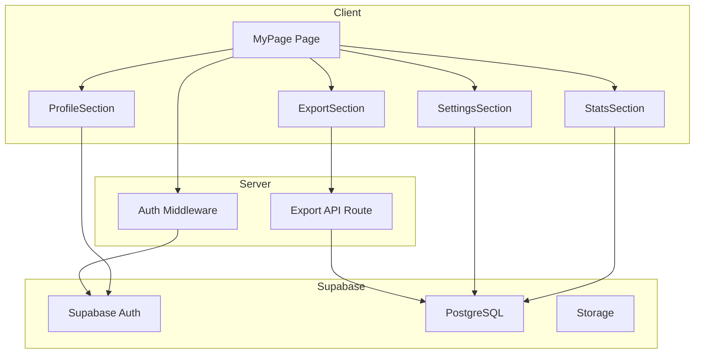
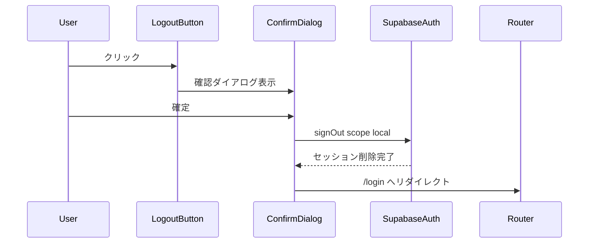
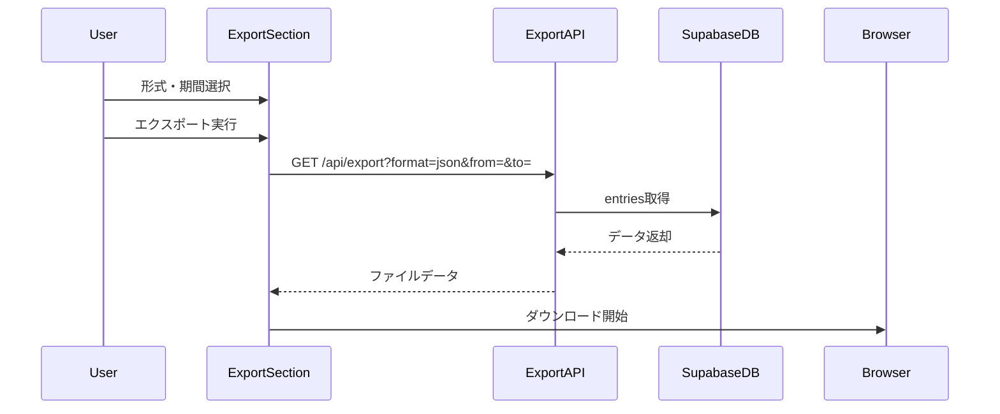
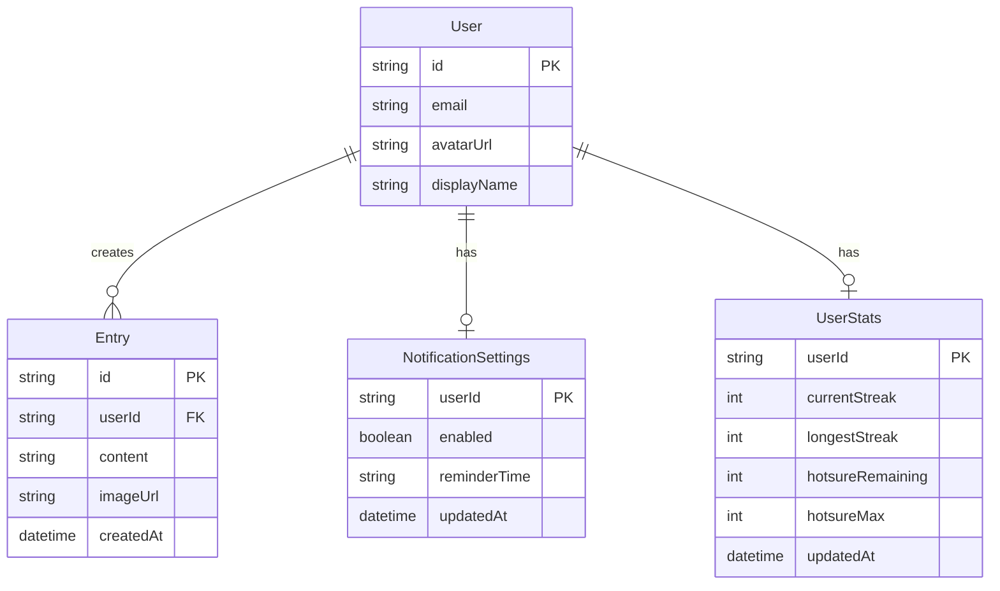

# Design Document: マイページ

> **⚠️ 非推奨通知**
>
> この仕様は`/social`ページに統合されました。新しい実装は`.kiro/specs/social/`を参照してください。

## Overview

**Purpose**: マイページ機能は、ユーザーが自身のアカウント情報と継続記録を一元的に確認し、アプリケーション設定を管理するための中央ハブを提供する。

**Users**: ADHD当事者を含む全登録ユーザーが、プロフィール確認、継続記録の可視化、通知設定、データエクスポート、ログアウトの各ワークフローで利用する。

**Impact**: 継続記録を「失いたくない資産」として視覚的に強調し、Duolingo式の損失回避効果によるモチベーション維持を実現する。

### Goals

- ユーザープロフィールと継続記録の直感的な可視化
- 通知設定によるカスタマイズ可能なリマインド体験
- AI連携を見据えたデータエクスポート機能の提供
- セキュアなセッション管理とログアウト機能

### Non-Goals

- プロフィール編集機能（Phase 2以降で検討）
- 他ユーザーのプロフィール閲覧
- アカウント削除機能
- 課金設定・サブスクリプション管理

## Architecture

### Architecture Pattern & Boundary Map

**Architecture Integration**:
- Selected pattern: Next.js App Router + Server Components優先パターン
- Domain/feature boundaries: マイページはプロフィール表示、ストリーク表示、ほつれ表示、設定管理、エクスポート、認証の6ドメインで構成
- Existing patterns preserved: Supabase Auth、クライアント/サーバー分離、Tailwind CSS
- New components rationale: マイページ専用のUI/ロジックコンポーネント群を新設
- Steering compliance: ADHD当事者向け設計原則、損失回避の可視化を維持



### Technology Stack

| Layer | Choice / Version | Role in Feature | Notes |
|-------|------------------|-----------------|-------|
| Frontend | Next.js 14+ App Router | ページ・コンポーネントレンダリング | Server Components優先 |
| Styling | Tailwind CSS 3.x | レスポンシブUI構築 | モバイルファースト |
| Auth | Supabase Auth + @supabase/ssr | 認証・セッション管理 | Cookie-based auth |
| Data | Supabase PostgreSQL | ユーザーデータ・設定永続化 | RLS適用 |
| API | Next.js Route Handlers | データエクスポートエンドポイント | /api/export |

## System Flows

### ログアウトフロー



### データエクスポートフロー



### 通知許可フロー

```mermaid
stateDiagram-v2
    [*] --> CheckSupport: ページ読み込み
    CheckSupport --> NotSupported: 非対応ブラウザ
    CheckSupport --> CheckPermission: 対応ブラウザ
    CheckPermission --> Granted: permission granted
    CheckPermission --> Denied: permission denied
    CheckPermission --> Default: permission default
    Default --> RequestPermission: ユーザー操作
    RequestPermission --> Granted: 許可
    RequestPermission --> Denied: 拒否
    Granted --> [*]
    Denied --> [*]
    NotSupported --> [*]
```

## Requirements Traceability

| Requirement | Summary | Components | Interfaces | Flows |
|-------------|---------|------------|------------|-------|
| 1.1, 1.2, 1.3, 1.4 | プロフィール表示 | ProfileSection | ProfileService | - |
| 2.1, 2.2, 2.3, 2.4, 2.5 | ストリーク表示 | StatsSection, StreakDisplay | StatsService | - |
| 3.1, 3.2, 3.3, 3.4 | ほつれ残り表示 | StatsSection, HotsureDisplay | StatsService | - |
| 4.1, 4.2, 4.3, 4.4, 4.5, 4.6 | 通知設定 | NotificationSettings | NotificationService | 通知許可フロー |
| 5.1-5.8 | データエクスポート | ExportSection | ExportAPI | エクスポートフロー |
| 6.1, 6.2, 6.3, 6.4, 6.5 | ログアウト | LogoutButton, ConfirmDialog | AuthService | ログアウトフロー |
| 7.1, 7.2, 7.3 | アクセス制御 | Middleware, MyPage | AuthMiddleware | - |
| 8.1, 8.2, 8.3 | レスポンシブ対応 | 全UIコンポーネント | - | - |

## Components and Interfaces

### Component Summary

| Component | Domain/Layer | Intent | Req Coverage | Key Dependencies | Contracts |
|-----------|--------------|--------|--------------|------------------|-----------|
| MyPage | Page | マイページのルートコンポーネント | 7.1, 7.2, 8.1-8.3 | Supabase Auth (P0) | - |
| ProfileSection | UI | プロフィール情報表示 | 1.1-1.4 | Supabase Auth (P0) | State |
| StatsSection | UI | ストリーク・ほつれ表示 | 2.1-2.5, 3.1-3.4 | SupabaseDB (P0) | State |
| StreakDisplay | UI | ストリーク専用表示 | 2.1-2.5 | StatsSection (P0) | - |
| HotsureDisplay | UI | ほつれ残り専用表示 | 3.1-3.4 | StatsSection (P0) | - |
| NotificationSettings | UI | 通知設定管理 | 4.1-4.6 | Web Push API (P0), SupabaseDB (P1) | State |
| ExportSection | UI | エクスポート機能 | 5.1-5.8 | ExportAPI (P0) | API |
| LogoutButton | UI | ログアウト機能 | 6.1-6.5 | Supabase Auth (P0) | Service |
| ConfirmDialog | UI | 確認ダイアログ汎用 | 6.1 | - | - |
| ExportAPI | API | エクスポートエンドポイント | 5.2, 5.3, 5.4, 5.7, 5.8 | SupabaseDB (P0) | API |

---

### Page Layer

#### MyPage

| Field | Detail |
|-------|--------|
| Intent | マイページのルートページコンポーネント。認証済みユーザーのみアクセス可能 |
| Requirements | 7.1, 7.2, 8.1, 8.2, 8.3 |

**Responsibilities & Constraints**
- Server Componentとしてレンダリング、認証状態のサーバーサイド検証
- 未認証ユーザーを/loginへリダイレクト
- 各セクションコンポーネントのレイアウト管理

**Dependencies**
- External: Supabase Auth - ユーザー認証状態取得 (P0)
- Outbound: ProfileSection, StatsSection, SettingsSection, ExportSection - UI構成 (P0)

**Contracts**: State [ ]

##### State Management
- State model: サーバーサイドでユーザー情報取得後、propsとして子コンポーネントへ伝播
- Persistence: セッションはSupabase Authのcookieで管理

**Implementation Notes**
- Integration: `@supabase/ssr`の`createServerClient`を使用
- Validation: `supabase.auth.getUser()`でセッション有効性を検証（`getSession()`は使用禁止）
- Risks: セッション切れ時の適切なリダイレクト処理が必要

---

### UI Components

#### ProfileSection

| Field | Detail |
|-------|--------|
| Intent | ユーザーのアバターとユーザー名を表示するプロフィールセクション |
| Requirements | 1.1, 1.2, 1.3, 1.4 |

**Responsibilities & Constraints**
- Supabase Authから取得したユーザーメタデータを表示
- アバター未設定時はデフォルト画像を表示
- レスポンシブレイアウト対応

**Dependencies**
- Inbound: MyPage - ユーザー情報props (P0)

**Contracts**: State [ ]

##### State Management
- State model: `UserProfile`型をpropsで受け取り、表示のみ
- Persistence: なし（読み取り専用）

```typescript
interface UserProfile {
  id: string;
  email: string;
  avatarUrl: string | null;
  displayName: string | null;
}

interface ProfileSectionProps {
  profile: UserProfile;
}
```

**Implementation Notes**
- Integration: Google OAuthのアバターURLを`user_metadata.avatar_url`から取得
- Validation: avatarUrlがnull/空の場合はデフォルトアバターを表示

---

#### StatsSection

| Field | Detail |
|-------|--------|
| Intent | ストリーク（継続記録）とほつれ残りを統合表示するセクション |
| Requirements | 2.1, 2.2, 2.3, 2.4, 2.5, 3.1, 3.2, 3.3, 3.4 |

**Responsibilities & Constraints**
- ストリーク情報とほつれ情報を視覚的に強調表示
- 現在のストリークが最長記録と一致する場合の特別表示
- ほつれ残り0の警告表示

**Dependencies**
- Inbound: MyPage - 統計情報props (P0)
- Outbound: StreakDisplay, HotsureDisplay - 表示委譲 (P0)

**Contracts**: State [ ]

##### State Management

```typescript
interface UserStats {
  currentStreak: number;
  longestStreak: number;
  hotsureRemaining: number;
  hotsureMax: number;
}

interface StatsSectionProps {
  stats: UserStats;
}
```

---

#### StreakDisplay

| Field | Detail |
|-------|--------|
| Intent | 現在のストリークと最長記録を表示する専用コンポーネント |
| Requirements | 2.1, 2.2, 2.3, 2.4, 2.5 |

**Responsibilities & Constraints**
- 現在のストリークを「🔥」アイコンと共に表示
- 最長記録を「🏆」アイコンと共に表示
- ストリーク0日時の励ましメッセージ表示
- 現在が最高記録の場合の視覚的強調

```typescript
interface StreakDisplayProps {
  currentStreak: number;
  longestStreak: number;
}
```

**Implementation Notes**
- Integration: Tailwind CSSでストリークを「失いたくない資産」として視覚的に強調
- Validation: currentStreak === longestStreak && currentStreak > 0 で最高記録表示

---

#### HotsureDisplay

| Field | Detail |
|-------|--------|
| Intent | ほつれ残り回数を表示する専用コンポーネント |
| Requirements | 3.1, 3.2, 3.3, 3.4 |

**Responsibilities & Constraints**
- 残りほつれを「🧵」アイコンと共に表示
- 最大値（週2回）に対する残り回数を表示
- 残り0の警告表示、残り1の注意喚起表示

```typescript
interface HotsureDisplayProps {
  remaining: number;
  max: number;
}
```

**Implementation Notes**
- Validation: remaining === 0 で警告スタイル、remaining === 1 で注意スタイル適用

---

#### NotificationSettings

| Field | Detail |
|-------|--------|
| Intent | プッシュ通知の設定を管理するクライアントコンポーネント |
| Requirements | 4.1, 4.2, 4.3, 4.4, 4.5, 4.6 |

**Responsibilities & Constraints**
- ブラウザの通知サポート状況を検出
- 通知許可状態（granted/denied/default）に応じたUI表示
- 通知オン/オフ切り替えと時刻設定

**Dependencies**
- External: Web Push API - 通知許可管理 (P0)
- External: Supabase DB - 通知設定永続化 (P1)

**Contracts**: State [ ]

##### State Management
- State model: ローカルstate + DB永続化
- Persistence: `notification_settings`テーブルに保存
- Concurrency: 楽観的更新、失敗時はロールバック

```typescript
interface NotificationState {
  isSupported: boolean;
  permission: NotificationPermission | null;
  enabled: boolean;
  reminderTime: string | null;
  isLoading: boolean;
}

interface NotificationSettingsRecord {
  userId: string;
  enabled: boolean;
  reminderTime: string | null;
  updatedAt: string;
}
```

**Implementation Notes**
- Integration: `Notification.requestPermission()`はユーザー操作時のみ呼び出し
- Validation: ブラウザ非対応時・permission denied時は適切なガイダンス表示
- Risks: iOS Safari PWAでの通知制限を考慮

---

#### ExportSection

| Field | Detail |
|-------|--------|
| Intent | データエクスポート機能を提供するクライアントコンポーネント |
| Requirements | 5.1, 5.2, 5.3, 5.4, 5.5, 5.6, 5.7, 5.8 |

**Responsibilities & Constraints**
- エクスポート形式（JSON/Markdown）の選択UI
- 期間指定（開始日・終了日）のUI
- ローディング状態の表示
- ダウンロード処理の実行

**Dependencies**
- External: ExportAPI - データ取得 (P0)

**Contracts**: API [ ]

##### API Contract

| Method | Endpoint | Request | Response | Errors |
|--------|----------|---------|----------|--------|
| GET | /api/export | ExportRequest (query) | Blob (file) | 400, 401, 404, 500 |

```typescript
interface ExportRequest {
  format: 'json' | 'markdown';
  from?: string;
  to?: string;
}

interface ExportState {
  format: 'json' | 'markdown';
  fromDate: string | null;
  toDate: string | null;
  isLoading: boolean;
  error: string | null;
}
```

**Implementation Notes**
- Integration: fetch APIでBlobとして受信、URL.createObjectURLでダウンロード
- Validation: 日付範囲の妥当性チェック（from <= to）
- Risks: 大量データ時のメモリ使用量

---

#### LogoutButton

| Field | Detail |
|-------|--------|
| Intent | ログアウト機能を提供するボタンコンポーネント |
| Requirements | 6.1, 6.2, 6.3, 6.4, 6.5 |

**Responsibilities & Constraints**
- 確認ダイアログの表示制御
- Supabase Authのサインアウト処理実行
- ログインページへのリダイレクト

**Dependencies**
- External: Supabase Auth - signOut (P0)
- Outbound: ConfirmDialog - 確認UI (P1)

**Contracts**: Service [ ]

##### Service Interface

```typescript
interface LogoutService {
  signOut(): Promise<Result<void, LogoutError>>;
}

type LogoutError =
  | { type: 'network_error'; message: string }
  | { type: 'auth_error'; message: string };
```

- Preconditions: ユーザーが認証済みであること
- Postconditions: セッションが削除され、/loginへリダイレクト
- Invariants: ローカルストレージのセッション情報もクリア

**Implementation Notes**
- Integration: `supabase.auth.signOut({ scope: 'local' })`を使用
- Validation: 処理中は重複クリック防止
- Risks: signOut失敗時のエラーハンドリング必須

---

#### ConfirmDialog

| Field | Detail |
|-------|--------|
| Intent | 汎用確認ダイアログコンポーネント |
| Requirements | 6.1 |

**Responsibilities & Constraints**
- モーダルとして表示
- 確定/キャンセルアクションの提供
- アクセシビリティ対応（フォーカス管理、Escキー）

```typescript
interface ConfirmDialogProps {
  isOpen: boolean;
  title: string;
  message: string;
  confirmLabel?: string;
  cancelLabel?: string;
  onConfirm: () => void;
  onCancel: () => void;
  isLoading?: boolean;
}
```

---

### API Layer

#### ExportAPI

| Field | Detail |
|-------|--------|
| Intent | データエクスポート用のAPI Routeハンドラー |
| Requirements | 5.2, 5.3, 5.4, 5.7, 5.8 |

**Responsibilities & Constraints**
- 認証済みユーザーのデータのみ返却
- JSON/Markdown形式でのシリアライズ
- 適切なContent-Dispositionヘッダー設定

**Dependencies**
- External: Supabase DB - entries取得 (P0)
- External: Supabase Auth - ユーザー認証 (P0)

**Contracts**: API [ ]

##### API Contract

| Method | Endpoint | Request | Response | Errors |
|--------|----------|---------|----------|--------|
| GET | /api/export | format, from, to (query) | File (JSON/MD) | 400, 401, 404, 500 |

```typescript
// Request Query Parameters
interface ExportQueryParams {
  format: 'json' | 'markdown';
  from?: string;  // YYYY-MM-DD
  to?: string;    // YYYY-MM-DD
}

// Response Headers
// Content-Type: application/json or text/markdown
// Content-Disposition: attachment; filename="hibioru-export-YYYYMMDD.json"

// Entry Data Structure
interface ExportEntry {
  id: string;
  content: string;
  imageUrl: string | null;
  createdAt: string;
}

// JSON Export Format
interface JsonExportData {
  exportedAt: string;
  userId: string;
  period: {
    from: string | null;
    to: string | null;
  };
  entries: ExportEntry[];
}

// Markdown Export Format
// # ヒビオル エクスポート
// エクスポート日時: {date}
// 期間: {from} - {to}
// ---
// ## {date}
// {content}
// 
```

**Implementation Notes**
- Integration: Route Handlerとして`app/api/export/route.ts`に配置
- Validation: format必須、日付形式バリデーション、RLSによるデータアクセス制御
- Risks: 大量エントリー時のレスポンスサイズ（将来的にはストリーミング検討）

---

## Data Models

### Domain Model



### Logical Data Model

**Structure Definition**:
- `User`: Supabase Authの`auth.users`テーブルで管理。`user_metadata`にアバターURL、表示名を格納
- `Entry`: ユーザーの投稿記録。user_idで所有者を紐付け
- `NotificationSettings`: ユーザーごとの通知設定。1:1関係
- `UserStats`: ストリーク・ほつれの集計値をキャッシュ（リアルタイム計算も可能だが、パフォーマンス考慮）

**Consistency & Integrity**:
- RLS (Row Level Security) でユーザー固有データのみアクセス可能
- `user_id`は`auth.users.id`への外部キー制約

### Physical Data Model

**notification_settings テーブル**:

```sql
CREATE TABLE notification_settings (
  user_id UUID PRIMARY KEY REFERENCES auth.users(id) ON DELETE CASCADE,
  enabled BOOLEAN NOT NULL DEFAULT false,
  reminder_time TIME,
  updated_at TIMESTAMPTZ NOT NULL DEFAULT NOW()
);

-- RLS Policy
ALTER TABLE notification_settings ENABLE ROW LEVEL SECURITY;

CREATE POLICY "Users can view own settings"
  ON notification_settings FOR SELECT
  USING (auth.uid() = user_id);

CREATE POLICY "Users can update own settings"
  ON notification_settings FOR UPDATE
  USING (auth.uid() = user_id);

CREATE POLICY "Users can insert own settings"
  ON notification_settings FOR INSERT
  WITH CHECK (auth.uid() = user_id);
```

**user_stats テーブル** (既存想定、またはリアルタイム計算):

```sql
-- ストリーク・ほつれは既存のstreakロジックで計算される想定
-- キャッシュテーブルを使用する場合:
CREATE TABLE user_stats (
  user_id UUID PRIMARY KEY REFERENCES auth.users(id) ON DELETE CASCADE,
  current_streak INTEGER NOT NULL DEFAULT 0,
  longest_streak INTEGER NOT NULL DEFAULT 0,
  hotsure_remaining INTEGER NOT NULL DEFAULT 2,
  hotsure_max INTEGER NOT NULL DEFAULT 2,
  updated_at TIMESTAMPTZ NOT NULL DEFAULT NOW()
);
```

## Error Handling

### Error Strategy

本機能では、ユーザーフレンドリーなエラーメッセージとグレースフルデグラデーションを重視する。

### Error Categories and Responses

**User Errors (4xx)**:
- 401 Unauthorized: 未認証アクセス → ログインページへリダイレクト
- 400 Bad Request: 無効なエクスポートパラメータ → フィールド別バリデーションメッセージ

**System Errors (5xx)**:
- 500 Internal Server Error: DB接続失敗等 → 「しばらく経ってから再試行してください」
- ネットワークエラー: オフライン検出 → 「インターネット接続を確認してください」

**Business Logic Errors (422)**:
- エクスポート対象データなし: 「指定期間にエクスポート対象のデータがありません」
- 通知許可拒否: ブラウザ設定からの許可が必要である旨を案内

### Monitoring

- エラー発生時はconsole.errorでログ出力（本番環境では外部サービス連携を検討）
- ログアウト失敗、エクスポート失敗は特に監視対象

## Testing Strategy

### Unit Tests
- `StreakDisplay`: ストリーク0日時の励ましメッセージ表示
- `StreakDisplay`: 現在が最高記録時の特別表示
- `HotsureDisplay`: 残り0/1時の警告・注意スタイル適用
- `ExportAPI`: JSON/Markdown形式の正しいシリアライズ
- `ExportAPI`: 日付範囲フィルタリング

### Integration Tests
- 認証済みユーザーのマイページアクセス成功
- 未認証ユーザーのリダイレクト動作
- エクスポートAPIの認証・データ返却
- ログアウト後のセッションクリア

### E2E Tests
- マイページ表示 → プロフィール・統計情報の確認
- 通知設定のオン/オフ切り替え
- データエクスポートのダウンロード完了
- ログアウトフロー完遂

## Security Considerations

**認証・認可**:
- `supabase.auth.getUser()`でサーバーサイド認証（JWTローカル検証のみの`getSession()`は使用禁止）
- RLSによりユーザー固有データのみアクセス可能
- Cookie-based authでHTTPOnly、Secure、SameSite=Lax属性を使用

**データ保護**:
- エクスポートデータは認証済みユーザー本人のデータのみ
- セッション情報はログアウト時に完全削除

## Performance & Scalability

**Target Metrics**:
- マイページ初期表示: 1秒以内（LCP）
- エクスポート処理: 1000エントリーで3秒以内

**Optimization**:
- Server Componentsで初期データをサーバーサイドレンダリング
- ストリーク・ほつれ情報のキャッシュまたは効率的なクエリ設計
- エクスポートは将来的に大量データ対応としてストリーミングを検討
