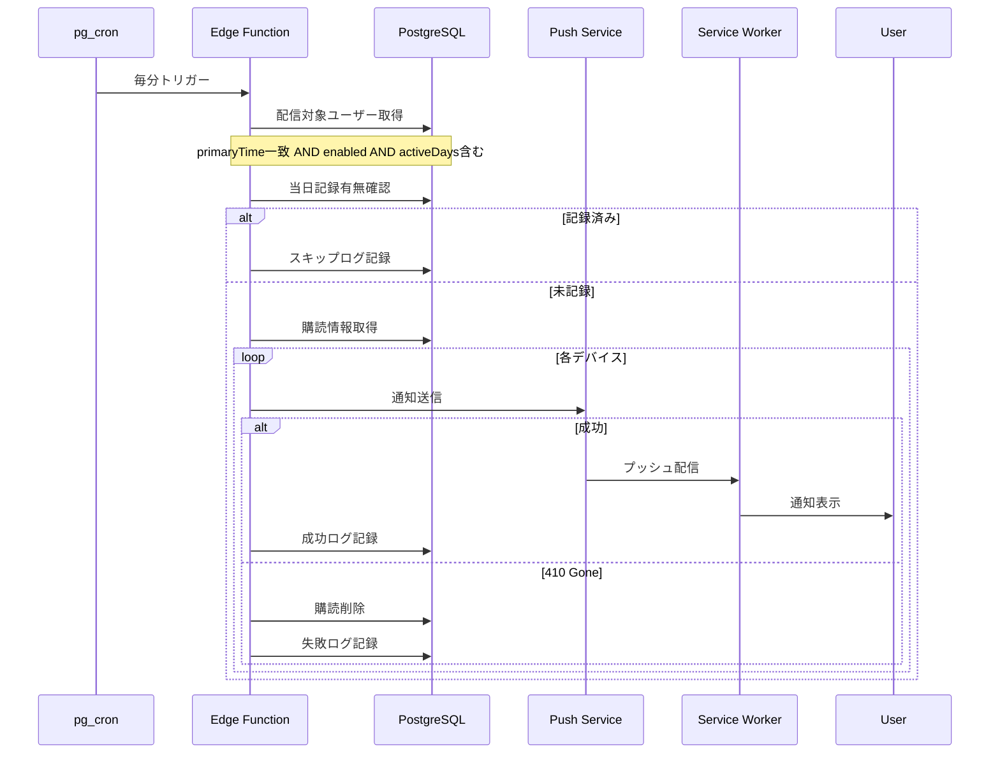
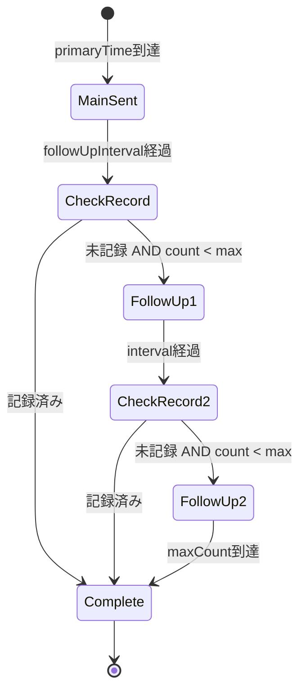

# Design Document: プッシュ通知機能

## Overview

**Purpose**: この機能は、ADHD当事者の「忘れる」「自分から動けない」という課題に対応するため、Web Push APIを使用したリマインド通知システムを提供する。ユーザーが設定した時刻に記録を促す通知を送信し、記録がない場合は追いリマインドで継続をサポートする。

**Users**: ヒビオルの全ユーザーが、毎日の記録継続のためにこの機能を利用する。通知は記録を促すツールであり、ユーザーにストレスを与えない設計を最優先とする。

**Impact**: 新規のpush_subscriptions、notification_settings、notification_logsテーブルを追加し、Service Workerによるプッシュ通知受信機能をPWAに統合する。Supabase Edge FunctionsとCronによるバックグラウンドジョブで通知配信を実現する。

> **設計変更メモ**: 当初は単一の`primaryTime`設計だったが、実装では複数リマインド対応（最大5スロット）に変更。`reminders`配列でユーザーごとに複数の通知時刻を設定可能。また、追いリマインドは`chase_reminder`命名に統一。

### Goals

- Web Push APIによるクロスプラットフォームのプッシュ通知配信
- ユーザーごとのタイムゾーンに対応した通知スケジューリング
- 記録状況に応じた段階的な追いリマインド
- 複数デバイスへの同時通知配信
- 通知効果の追跡と分析基盤

### Non-Goals

- ネイティブアプリ固有のプッシュ通知（FCM/APNs直接利用）
- リアルタイム通知（即時性の高いアラート）
- 通知内容のパーソナライゼーション（AI連携）
- ソーシャル機能に関連する通知（フォロー、リアクション等）

## Architecture

### Architecture Pattern & Boundary Map

```mermaid
graph TB
    subgraph Client
        PWA[PWA App]
        SW[Service Worker]
    end

    subgraph NextjsServer[Next.js Server]
        API_Subscribe[/api/push/subscribe]
        API_Unsubscribe[/api/push/unsubscribe]
        API_Settings[/api/notification/settings]
    end

    subgraph Supabase
        DB[(PostgreSQL)]
        EdgeFn[Edge Functions]
        Cron[pg_cron Scheduler]
    end

    subgraph External
        PushService[Push Service - FCM/Mozilla]
    end

    PWA -->|購読登録| API_Subscribe
    PWA -->|購読解除| API_Unsubscribe
    PWA -->|設定更新| API_Settings
    API_Subscribe -->|保存| DB
    API_Unsubscribe -->|削除| DB
    API_Settings -->|保存| DB

    Cron -->|毎分実行| EdgeFn
    EdgeFn -->|配信対象取得| DB
    EdgeFn -->|通知送信| PushService
    EdgeFn -->|ログ記録| DB
    PushService -->|プッシュ配信| SW
    SW -->|通知表示| PWA
```

**Architecture Integration**:
- 選択パターン: イベント駆動 + バックグラウンドジョブ。通知配信のスケジューリングにはSupabase pg_cronを使用し、Edge Functionsで通知処理を実行する
- ドメイン境界: 通知ドメインは独立したモジュールとして`/lib/notification/`に配置。エントリードメインとは通知スキップ判定でのみ連携
- 既存パターン維持: Next.js API Routes、Supabaseクライアント、TypeScript strict mode
- 新規コンポーネント理由: Service Worker（PWA通知受信）、Edge Functions（サーバーレス通知送信）、pg_cron（スケジューリング）
- Steering準拠: PWA採用、Supabase BaaS活用、Web Push API使用

### Technology Stack

| Layer | Choice / Version | Role in Feature | Notes |
|-------|------------------|-----------------|-------|
| Frontend | Next.js App Router | 通知設定UI、購読管理 | 既存スタック |
| PWA | Service Worker API | プッシュ通知受信、クリックハンドリング | next-pwa統合 |
| Backend | Next.js API Routes | 購読・設定API | 既存スタック |
| Push Library | web-push ^3.6.7 | VAPID署名、通知送信 | Node.js用Web Push実装 |
| Serverless | Supabase Edge Functions | 通知配信処理 | Deno runtime |
| Scheduler | pg_cron + pg_net | 定期実行トリガー | Supabase拡張 |
| Data | Supabase PostgreSQL | 購読・設定・ログ保存 | 既存スタック |

## System Flows

### メインリマインド通知フロー



### 追いリマインドフロー



## Requirements Traceability

| Requirement | Summary | Components | Interfaces | Flows |
|-------------|---------|------------|------------|-------|
| 1.1 | 購読情報保存 | PushSubscriptionService, SubscribeAPI | POST /api/push/subscribe | - |
| 1.2 | 複数デバイス対応 | PushSubscriptionService | - | - |
| 1.3 | 購読解除 | PushSubscriptionService, UnsubscribeAPI | DELETE /api/push/unsubscribe | - |
| 1.4 | ブラウザ非対応表示 | NotificationSettingsUI | - | - |
| 1.5 | 登録失敗リトライ | SubscribeAPI | - | - |
| 2.1 | 設定テーブル管理 | NotificationSettingsService | - | - |
| 2.2 | 設定変更反映 | NotificationSettingsService, SettingsAPI | PUT /api/notification/settings | - |
| 2.3 | デフォルト設定適用 | NotificationSettingsService | - | - |
| 2.4-2.7 | 設定値制限 | NotificationSettingsService | - | - |
| 3.1 | メインリマインド送信 | NotificationDispatcher | - | メインリマインド |
| 3.2 | メイン通知文言 | NotificationMessageService | - | - |
| 3.3 | 送信ログ記録 | NotificationLogService | - | - |
| 3.4 | 記録済みスキップ | NotificationDispatcher | - | メインリマインド |
| 3.5 | 失敗ログ記録 | NotificationLogService | - | - |
| 4.1 | 追いリマインド送信 | FollowUpScheduler | - | 追いリマインド |
| 4.2-4.3 | 追いリマインド文言 | NotificationMessageService | - | - |
| 4.4 | 記録時キャンセル | FollowUpScheduler | - | - |
| 4.5 | 追いリマインドログ | NotificationLogService | - | - |
| 4.6 | maxCount終了 | FollowUpScheduler | - | 追いリマインド |
| 5.1 | timezone計算 | NotificationDispatcher | - | - |
| 5.2 | 全デバイス送信 | NotificationDispatcher | - | メインリマインド |
| 5.3 | 無効購読削除 | PushSubscriptionService | - | - |
| 5.4 | 非同期実行 | Edge Functions + pg_cron | - | - |
| 5.5 | 通知クリック処理 | ServiceWorker | - | - |
| 6.1 | 記録時間追跡 | NotificationLogService | - | - |
| 6.2 | 応答時間保存 | NotificationLogService | - | - |
| 6.3 | 90日保持 | pg_cron cleanup job | - | - |

## Components and Interfaces

| Component | Domain/Layer | Intent | Req Coverage | Key Dependencies | Contracts |
|-----------|--------------|--------|--------------|------------------|-----------|
| PushSubscriptionService | Notification/Service | 購読情報のCRUD管理 | 1.1-1.5, 5.3 | Supabase (P0) | Service |
| NotificationSettingsService | Notification/Service | 通知設定のCRUD管理 | 2.1-2.7 | Supabase (P0) | Service |
| NotificationDispatcher | Notification/Service | 通知送信の実行 | 3.1, 3.4, 5.1-5.2 | web-push (P0), Supabase (P0) | Service |
| NotificationMessageService | Notification/Service | 通知文言の生成 | 3.2, 4.2-4.3 | - | Service |
| NotificationLogService | Notification/Service | 通知ログの記録・管理 | 3.3, 3.5, 4.5, 6.1-6.3 | Supabase (P0) | Service |
| FollowUpScheduler | Notification/Service | 追いリマインドのスケジュール管理 | 4.1, 4.4, 4.6 | Supabase (P0) | Service |
| SubscribeAPI | Notification/API | 購読登録エンドポイント | 1.1-1.2, 1.5 | PushSubscriptionService (P0) | API |
| UnsubscribeAPI | Notification/API | 購読解除エンドポイント | 1.3 | PushSubscriptionService (P0) | API |
| SettingsAPI | Notification/API | 設定管理エンドポイント | 2.1-2.2 | NotificationSettingsService (P0) | API |
| ServiceWorker | PWA/Client | プッシュ受信・クリック処理 | 5.5 | - | Event |
| NotificationSettingsUI | UI/Client | 通知設定画面 | 1.4, 2.1-2.7 | SettingsAPI (P0) | State |
| SendNotificationEdgeFn | Edge Functions | 通知配信ジョブ | 3.1, 4.1, 5.1-5.4 | NotificationDispatcher (P0) | Batch |

### Notification Domain

#### PushSubscriptionService

| Field | Detail |
|-------|--------|
| Intent | Web Push購読情報の登録・取得・削除を管理する |
| Requirements | 1.1, 1.2, 1.3, 1.5, 5.3 |

**Responsibilities & Constraints**
- push_subscriptionsテーブルのCRUD操作
- ユーザーごとの複数デバイス購読情報を管理
- 無効なエンドポイント（410 Gone）の自動削除

**Dependencies**
- Outbound: Supabase Client - データベース操作 (P0)

**Contracts**: Service [x]

##### Service Interface
```typescript
interface PushSubscriptionService {
  subscribe(
    userId: string,
    subscription: PushSubscriptionInput
  ): Promise<Result<PushSubscription, SubscriptionError>>;

  unsubscribe(
    userId: string,
    endpoint: string
  ): Promise<Result<void, SubscriptionError>>;

  getSubscriptions(
    userId: string
  ): Promise<Result<PushSubscription[], SubscriptionError>>;

  removeInvalidSubscription(
    subscriptionId: string
  ): Promise<Result<void, SubscriptionError>>;
}

interface PushSubscriptionInput {
  endpoint: string;
  keys: {
    p256dh: string;
    auth: string;
  };
  userAgent?: string;
}

interface PushSubscription {
  id: string;
  userId: string;
  endpoint: string;
  p256dhKey: string;
  authKey: string;
  userAgent: string | null;
  createdAt: Date;
}

type SubscriptionError =
  | { type: 'DUPLICATE_ENDPOINT' }
  | { type: 'USER_NOT_FOUND' }
  | { type: 'DATABASE_ERROR'; message: string };
```

- Preconditions: userIdは認証済みユーザーのID
- Postconditions: 購読情報がpush_subscriptionsテーブルに永続化される
- Invariants: 同一ユーザーの同一endpointは重複登録されない

#### NotificationSettingsService

| Field | Detail |
|-------|--------|
| Intent | ユーザーの通知設定を管理する |
| Requirements | 2.1, 2.2, 2.3, 2.4, 2.5, 2.6, 2.7 |

**Responsibilities & Constraints**
- notification_settingsテーブルのCRUD操作
- 設定値のバリデーション（primaryTime: 00:00-23:59、followUpIntervalMinutes: 15-180、followUpMaxCount: 1-3）
- 新規ユーザーへのデフォルト設定適用

**Dependencies**
- Outbound: Supabase Client - データベース操作 (P0)

**Contracts**: Service [x]

##### Service Interface
```typescript
interface NotificationSettingsService {
  getSettings(
    userId: string
  ): Promise<Result<NotificationSettings, SettingsError>>;

  updateSettings(
    userId: string,
    settings: NotificationSettingsUpdate
  ): Promise<Result<NotificationSettings, SettingsError>>;

  createDefaultSettings(
    userId: string
  ): Promise<Result<NotificationSettings, SettingsError>>;
}

/**
 * 個別リマインド設定（最大5スロット）
 */
interface Reminder {
  time: string | null;  // HH:mm形式、未設定時はnull
  enabled: boolean;
}

const DEFAULT_REMINDERS: Reminder[] = [
  { time: null, enabled: false },
  { time: null, enabled: false },
  { time: null, enabled: false },
  { time: null, enabled: false },
  { time: null, enabled: false },
];

interface NotificationSettings {
  userId: string;
  enabled: boolean;                        // 全体のマスタースイッチ
  reminders: Reminder[];                   // リマインド設定配列（最大5つ）
  chaseReminderEnabled: boolean;           // 追いリマインドの有効/無効
  chaseReminderDelayMinutes: number;       // 追いリマインド遅延時間（分）
  followUpMaxCount: number;                // 追いリマインドの最大回数（1-5）
  socialNotificationsEnabled: boolean;     // ソーシャル通知の有効/無効
  createdAt: Date;
  updatedAt: Date;
}

interface NotificationSettingsUpdate {
  enabled?: boolean;
  reminders?: Reminder[];
  chaseReminderEnabled?: boolean;
  chaseReminderDelayMinutes?: number;
  followUpMaxCount?: number;
  socialNotificationsEnabled?: boolean;
}

type SettingsError =
  | { type: 'USER_NOT_FOUND' }
  | { type: 'VALIDATION_ERROR'; field: string; message: string }
  | { type: 'DATABASE_ERROR'; message: string };
```

- Preconditions: userIdは認証済みユーザーのID
- Postconditions: 設定がバリデーション後に永続化される
- Invariants: remindersは最大5つ、各reminders[i].timeはHH:mm形式またはnull、followUpMaxCountは1-5

#### NotificationDispatcher

| Field | Detail |
|-------|--------|
| Intent | 通知の送信処理を実行する |
| Requirements | 3.1, 3.4, 5.1, 5.2 |

**Responsibilities & Constraints**
- web-pushライブラリを使用した通知送信
- ユーザーのtimezoneに基づく配信時刻計算
- 全登録デバイスへの一斉送信
- 記録済みユーザーのスキップ判定

**Dependencies**
- Outbound: web-push - 通知送信 (P0)
- Outbound: PushSubscriptionService - 購読情報取得 (P0)
- Outbound: NotificationLogService - ログ記録 (P1)
- Outbound: EntryService - 記録状況確認 (P1)

**Contracts**: Service [x]

##### Service Interface
```typescript
interface NotificationDispatcher {
  sendNotification(
    userId: string,
    notification: NotificationPayload
  ): Promise<Result<SendResult, DispatchError>>;

  sendToAllDevices(
    userId: string,
    notification: NotificationPayload
  ): Promise<Result<SendResult[], DispatchError>>;

  shouldSkipNotification(
    userId: string,
    date: Date
  ): Promise<boolean>;
}

interface NotificationPayload {
  title: string;
  body: string;
  icon?: string;
  badge?: string;
  data?: {
    url: string;
    type: NotificationType;
    notificationId: string;
  };
}

type NotificationType = 'main_reminder' | 'chase_reminder';

interface SendResult {
  subscriptionId: string;
  success: boolean;
  statusCode?: number;
  error?: string;
}

type DispatchError =
  | { type: 'NO_SUBSCRIPTIONS' }
  | { type: 'ALL_FAILED'; results: SendResult[] }
  | { type: 'VAPID_ERROR'; message: string };
```

#### NotificationMessageService

| Field | Detail |
|-------|--------|
| Intent | 通知文言のバリエーションを管理・生成する |
| Requirements | 3.2, 4.2, 4.3 |

**Responsibilities & Constraints**
- 通知タイプに応じた文言のランダム選択
- ADHD当事者にストレスを与えない文言設計

**Dependencies**
- なし（純粋な関数）

**Contracts**: Service [x]

##### Service Interface
```typescript
interface NotificationMessageService {
  getMainMessage(): NotificationMessage;
  getFollowUpMessage(count: number): NotificationMessage;
}

interface NotificationMessage {
  title: string;
  body: string;
}

const MAIN_MESSAGES: NotificationMessage[] = [
  { title: 'ヒビオル', body: '今考えてること、記録しよう！' },
  { title: 'ヒビオル', body: '残しておきたいこと、ある？' },
  { title: 'ヒビオル', body: '今の頭の中、書いておこう' },
  { title: 'ヒビオル', body: 'ふと思ったこと、メモしておく？' },
  { title: 'ヒビオル', body: '今日のひとこと、残しておこう' },
];

// 追いリマインド（chase_reminder）は最大5回まで、各回で異なる文言バリエーション
const CHASE_REMINDER_MESSAGES: NotificationMessage[][] = [
  // 1回目
  [
    { title: 'ヒビオル', body: '今日のこと、メモしておく？' },
    { title: 'ヒビオル', body: 'ひとこと残しておこう' },
  ],
  // 2回目以降も同様に5段階まで定義
];
```

#### NotificationLogService

| Field | Detail |
|-------|--------|
| Intent | 通知送信ログの記録・管理を行う |
| Requirements | 3.3, 3.5, 4.5, 6.1, 6.2, 6.3 |

**Responsibilities & Constraints**
- notification_logsテーブルへのログ記録
- 記録作成時のentry_recorded_at更新
- 90日経過したログの自動削除

**Dependencies**
- Outbound: Supabase Client - データベース操作 (P0)

**Contracts**: Service [x]

##### Service Interface
```typescript
interface NotificationLogService {
  logNotification(
    log: NotificationLogInput
  ): Promise<Result<NotificationLog, LogError>>;

  updateEntryRecorded(
    userId: string,
    entryCreatedAt: Date
  ): Promise<Result<void, LogError>>;

  cleanupOldLogs(
    retentionDays: number
  ): Promise<Result<number, LogError>>;
}

interface NotificationLogInput {
  userId: string;
  type: NotificationType;
  result: 'success' | 'failed' | 'skipped';
  subscriptionId?: string;
  errorMessage?: string;
}

interface NotificationLog {
  id: string;
  userId: string;
  type: NotificationType;
  sentAt: Date;
  result: 'success' | 'failed' | 'skipped';
  subscriptionId: string | null;
  errorMessage: string | null;
  entryRecordedAt: Date | null;
}

type LogError =
  | { type: 'DATABASE_ERROR'; message: string };
```

#### FollowUpScheduler

| Field | Detail |
|-------|--------|
| Intent | 追いリマインドのスケジュール管理を行う |
| Requirements | 4.1, 4.4, 4.6 |

**Responsibilities & Constraints**
- メインリマインド後の追いリマインドスケジュール計算
- 記録完了時の追いリマインドキャンセル
- followUpMaxCountに基づく送信制限

**Dependencies**
- Outbound: NotificationSettingsService - 設定取得 (P0)
- Outbound: NotificationLogService - 送信履歴確認 (P0)
- Outbound: NotificationDispatcher - 通知送信 (P0)

**Contracts**: Service [x]

##### Service Interface
```typescript
interface FollowUpScheduler {
  getNextFollowUpTime(
    userId: string,
    currentTime: Date
  ): Promise<Result<Date | null, SchedulerError>>;

  shouldSendFollowUp(
    userId: string,
    currentTime: Date
  ): Promise<Result<FollowUpDecision, SchedulerError>>;

  cancelFollowUps(
    userId: string
  ): Promise<Result<void, SchedulerError>>;
}

interface FollowUpDecision {
  shouldSend: boolean;
  followUpCount: number; // 1 or 2
  reason?: 'already_recorded' | 'max_count_reached' | 'not_time_yet';
}

type SchedulerError =
  | { type: 'USER_NOT_FOUND' }
  | { type: 'SETTINGS_NOT_FOUND' }
  | { type: 'DATABASE_ERROR'; message: string };
```

### API Layer

#### SubscribeAPI

| Field | Detail |
|-------|--------|
| Intent | プッシュ通知購読登録エンドポイント |
| Requirements | 1.1, 1.2, 1.5 |

**Contracts**: API [x]

##### API Contract
| Method | Endpoint | Request | Response | Errors |
|--------|----------|---------|----------|--------|
| POST | /api/push/subscribe | SubscribeRequest | SubscribeResponse | 400, 401, 409, 500 |

```typescript
interface SubscribeRequest {
  subscription: {
    endpoint: string;
    keys: {
      p256dh: string;
      auth: string;
    };
  };
  userAgent?: string;
}

interface SubscribeResponse {
  success: boolean;
  subscriptionId: string;
}
```

#### UnsubscribeAPI

| Field | Detail |
|-------|--------|
| Intent | プッシュ通知購読解除エンドポイント |
| Requirements | 1.3 |

**Contracts**: API [x]

##### API Contract
| Method | Endpoint | Request | Response | Errors |
|--------|----------|---------|----------|--------|
| DELETE | /api/push/unsubscribe | UnsubscribeRequest | UnsubscribeResponse | 400, 401, 404, 500 |

```typescript
interface UnsubscribeRequest {
  endpoint: string;
}

interface UnsubscribeResponse {
  success: boolean;
}
```

#### SettingsAPI

| Field | Detail |
|-------|--------|
| Intent | 通知設定管理エンドポイント |
| Requirements | 2.1, 2.2 |

**Contracts**: API [x]

##### API Contract
| Method | Endpoint | Request | Response | Errors |
|--------|----------|---------|----------|--------|
| GET | /api/notification/settings | - | NotificationSettings | 401, 404, 500 |
| PUT | /api/notification/settings | NotificationSettingsUpdate | NotificationSettings | 400, 401, 422, 500 |

### PWA Layer

#### ServiceWorker

| Field | Detail |
|-------|--------|
| Intent | プッシュ通知の受信とクリック処理 |
| Requirements | 5.5 |

**Responsibilities & Constraints**
- pushイベントでの通知表示
- notificationclickイベントでのアプリ遷移
- 既存ウィンドウへのフォーカス処理

**Contracts**: Event [x]

##### Event Contract
- Subscribed events:
  - `push`: プッシュサーバーからの通知受信
  - `notificationclick`: ユーザーの通知クリック
- Ordering / delivery guarantees: pushイベントはブラウザのPush APIにより配信保証される

```typescript
// Service Worker Event Handlers
self.addEventListener('push', (event: PushEvent) => {
  const payload = event.data?.json() as NotificationPayload;
  event.waitUntil(
    self.registration.showNotification(payload.title, {
      body: payload.body,
      icon: payload.icon ?? '/icons/icon-192x192.png',
      badge: payload.badge ?? '/icons/badge-72x72.png',
      data: payload.data,
    })
  );
});

self.addEventListener('notificationclick', (event: NotificationEvent) => {
  event.notification.close();
  const url = event.notification.data?.url ?? '/';
  event.waitUntil(
    clients.matchAll({ type: 'window' }).then((windowClients) => {
      for (const client of windowClients) {
        if (client.url === url && 'focus' in client) {
          return client.focus();
        }
      }
      return clients.openWindow(url);
    })
  );
});
```

### Edge Functions Layer

#### SendNotificationEdgeFn

| Field | Detail |
|-------|--------|
| Intent | pg_cronからトリガーされる通知配信ジョブ |
| Requirements | 3.1, 4.1, 5.1, 5.2, 5.3, 5.4 |

**Responsibilities & Constraints**
- 毎分実行で配信対象ユーザーを特定
- timezone考慮したprimaryTime判定
- 追いリマインドのタイミング計算

**Contracts**: Batch [x]

##### Batch / Job Contract
- Trigger: pg_cron、毎分実行（`* * * * *`）
- Input / validation: 現在時刻（UTC）からユーザーごとのローカル時刻を計算
- Output / destination: Push Service経由で通知配信、notification_logsにログ記録
- Idempotency & recovery: 同一分内の重複実行は送信済みログで判定してスキップ

```sql
-- pg_cron job registration
SELECT cron.schedule(
  'send-notifications',
  '* * * * *', -- every minute
  $$
  SELECT net.http_post(
    url := 'https://<project-ref>.supabase.co/functions/v1/send-notifications',
    headers := '{"Authorization": "Bearer <service_role_key>"}',
    body := '{}'
  );
  $$
);
```

### UI Layer

#### NotificationSettingsUI

| Field | Detail |
|-------|--------|
| Intent | 通知設定画面のUIコンポーネント |
| Requirements | 1.4, 2.1, 2.2, 2.3, 2.4, 2.5, 2.6, 2.7 |

**Responsibilities & Constraints**
- ブラウザの通知サポート判定
- 通知許可のリクエスト
- 設定フォームのバリデーション

**Dependencies**
- Outbound: SettingsAPI - 設定取得・更新 (P0)
- Outbound: SubscribeAPI - 購読登録 (P0)
- External: Notification API - ブラウザ通知許可 (P0)

**Contracts**: State [x]

##### State Management
- State model: React useState + useEffect for async operations
- Persistence & consistency: SettingsAPIを通じてサーバーに永続化
- Concurrency strategy: オプティミスティック更新 with ロールバック

**Implementation Notes**
- Integration: ソーシャルページ（/social）に統合、通知設定セクションとして配置
- Validation: フォーム入力時のリアルタイムバリデーション
- Risks: ブラウザ非対応時のUI degradation

## Data Models

### Domain Model

```mermaid
erDiagram
    User ||--o{ PushSubscription : has
    User ||--|| NotificationSettings : has
    User ||--o{ NotificationLog : has
    NotificationLog }o--|| Entry : "may link to"

    PushSubscription {
        string id PK
        string userId FK
        string endpoint UK
        string p256dhKey
        string authKey
        string userAgent
        datetime createdAt
    }

    NotificationSettings {
        string userId PK FK
        boolean enabled
        jsonb reminders
        boolean chaseReminderEnabled
        int chaseReminderDelayMinutes
        int followUpMaxCount
        boolean socialNotificationsEnabled
        datetime createdAt
        datetime updatedAt
    }

    NotificationLog {
        string id PK
        string userId FK
        string type
        datetime sentAt
        string result
        string subscriptionId FK
        string errorMessage
        datetime entryRecordedAt
    }
```

**Aggregates and Transactional Boundaries**
- PushSubscription: ユーザーごとに独立、個別削除可能
- NotificationSettings: ユーザーと1:1、原子的更新
- NotificationLog: 追記専用、バッチ削除対象

**Business Rules & Invariants**
- 同一ユーザーの同一エンドポイントは重複不可
- remindersは最大5スロット
- reminders[i].timeはHH:mm形式で00:00-23:59の範囲またはnull
- reminders[i].enabledがtrueの場合、timeは必須
- chaseReminderDelayMinutesは1以上
- followUpMaxCountは1-5の範囲

### Physical Data Model

#### push_subscriptions テーブル

```sql
CREATE TABLE push_subscriptions (
  id UUID PRIMARY KEY DEFAULT gen_random_uuid(),
  user_id UUID NOT NULL REFERENCES auth.users(id) ON DELETE CASCADE,
  endpoint TEXT NOT NULL,
  p256dh_key TEXT NOT NULL,
  auth_key TEXT NOT NULL,
  user_agent TEXT,
  created_at TIMESTAMPTZ NOT NULL DEFAULT NOW(),

  UNIQUE(user_id, endpoint)
);

CREATE INDEX idx_push_subscriptions_user_id ON push_subscriptions(user_id);
```

#### notification_settings テーブル

```sql
CREATE TABLE notification_settings (
  user_id UUID PRIMARY KEY REFERENCES auth.users(id) ON DELETE CASCADE,
  enabled BOOLEAN NOT NULL DEFAULT false,
  -- reminders: JSONB配列（最大5スロット）
  -- 各要素: { "time": "HH:mm" | null, "enabled": boolean }
  reminders JSONB NOT NULL DEFAULT '[
    {"time": null, "enabled": false},
    {"time": null, "enabled": false},
    {"time": null, "enabled": false},
    {"time": null, "enabled": false},
    {"time": null, "enabled": false}
  ]'::jsonb,
  chase_reminder_enabled BOOLEAN NOT NULL DEFAULT true,
  chase_reminder_delay_minutes INTEGER NOT NULL DEFAULT 60,
  follow_up_max_count INTEGER NOT NULL DEFAULT 2
    CHECK (follow_up_max_count >= 1 AND follow_up_max_count <= 5),
  social_notifications_enabled BOOLEAN NOT NULL DEFAULT true,
  created_at TIMESTAMPTZ NOT NULL DEFAULT NOW(),
  updated_at TIMESTAMPTZ NOT NULL DEFAULT NOW()
);

-- Trigger for updated_at
CREATE TRIGGER update_notification_settings_updated_at
  BEFORE UPDATE ON notification_settings
  FOR EACH ROW
  EXECUTE FUNCTION update_updated_at_column();
```

#### notification_logs テーブル

```sql
CREATE TABLE notification_logs (
  id UUID PRIMARY KEY DEFAULT gen_random_uuid(),
  user_id UUID NOT NULL REFERENCES auth.users(id) ON DELETE CASCADE,
  type TEXT NOT NULL CHECK (type IN ('main_reminder', 'chase_reminder')),
  sent_at TIMESTAMPTZ NOT NULL DEFAULT NOW(),
  result TEXT NOT NULL CHECK (result IN ('success', 'failed', 'skipped')),
  subscription_id UUID REFERENCES push_subscriptions(id) ON DELETE SET NULL,
  error_message TEXT,
  entry_recorded_at TIMESTAMPTZ,

  created_at TIMESTAMPTZ NOT NULL DEFAULT NOW()
);

CREATE INDEX idx_notification_logs_user_id_sent_at ON notification_logs(user_id, sent_at DESC);
CREATE INDEX idx_notification_logs_cleanup ON notification_logs(created_at);
```

### Data Contracts & Integration

**API Data Transfer**
- Request/response schemas: 前述のAPI Contract参照
- Validation rules: Zod schemaによるサーバーサイドバリデーション
- Serialization format: JSON

**Cross-Service Data Management**
- Supabase RLSによるユーザーデータアクセス制御
- Edge FunctionsはService Role Keyで全データアクセス

## Error Handling

### Error Strategy

通知機能のエラーは「ユーザー操作」と「バックグラウンドジョブ」で戦略を分ける。

### Error Categories and Responses

**User Errors (4xx)**
- 400 Bad Request: 不正なリクエスト形式 -> フィールドレベルのエラーメッセージ
- 401 Unauthorized: 未認証 -> ログイン画面へ誘導
- 409 Conflict: 重複登録 -> 既存の購読情報を返却
- 422 Unprocessable Entity: バリデーションエラー -> 具体的な制約違反を表示

**System Errors (5xx)**
- Push Service障害: ログ記録して次回リトライに委ねる
- Database障害: エラーログ記録、ユーザーには一般的なエラーメッセージ

**Business Logic Errors**
- 通知非対応ブラウザ: 機能無効化と説明メッセージの表示
- 通知許可拒否: 許可方法のガイダンス表示

### Monitoring

- notification_logsテーブルで送信成功率を追跡
- result: 'failed'の増加をアラート条件に設定
- Edge Functionsのログで実行時間とエラーを監視

## Testing Strategy

### Unit Tests
- NotificationMessageService: 文言バリエーションの正しい選択
- NotificationSettingsService: バリデーションロジック（範囲チェック）
- FollowUpScheduler: 次回送信時刻の計算、maxCount判定
- timezone計算: 各タイムゾーンでのprimaryTime判定

### Integration Tests
- SubscribeAPI: 購読登録から通知受信までのフロー
- SettingsAPI: 設定変更の即時反映
- SendNotificationEdgeFn: 配信対象抽出とログ記録
- 無効エンドポイント処理: 410 Gone時の自動削除

### E2E Tests
- 通知許可フロー: ブラウザ許可ダイアログからの購読完了
- 設定変更フロー: ソーシャルページでの設定変更と保存
- 通知クリック: Service Workerからのアプリ遷移

### Performance
- Edge Function実行時間: 1000ユーザー配信で60秒以内
- 大量購読時のバッチ処理: 並列送信の制御

## Security Considerations

### VAPID Keys Management
- VAPID秘密鍵は環境変数（VAPID_PRIVATE_KEY）として管理
- VAPID公開鍵はクライアント用環境変数（NEXT_PUBLIC_VAPID_PUBLIC_KEY）
- 本番環境ではVercel/Supabaseのシークレット管理を使用

### Data Protection
- push_subscriptionsのendpoint/keysは機密データとして扱う
- RLSにより他ユーザーの購読情報へのアクセスを防止
- Edge FunctionsのみService Role Keyで全アクセス可能

### Subscription Security
- HTTPS必須（Web Push APIの要件）
- エンドポイントの有効性はPush Service側で保証

## Supporting References

### VAPID Keys生成スクリプト

```javascript
// scripts/generate-vapid-keys.js
const webpush = require('web-push');
const vapidKeys = webpush.generateVAPIDKeys();

console.log('NEXT_PUBLIC_VAPID_PUBLIC_KEY=' + vapidKeys.publicKey);
console.log('VAPID_PRIVATE_KEY=' + vapidKeys.privateKey);
```

### pg_cron ログクリーンアップジョブ

```sql
-- 90日経過したログを毎日削除
SELECT cron.schedule(
  'cleanup-notification-logs',
  '0 3 * * *', -- daily at 3:00 AM
  $$
  DELETE FROM notification_logs
  WHERE created_at < NOW() - INTERVAL '90 days';
  $$
);
```

### 参考資料

- [web-push npm package](https://www.npmjs.com/package/web-push) - Node.js用Web Pushライブラリ
- [Supabase Scheduling Edge Functions](https://supabase.com/docs/guides/functions/schedule-functions) - pg_cronによるEdge Functions呼び出し
- [Supabase Cron](https://supabase.com/docs/guides/cron) - Supabase Cronモジュール
