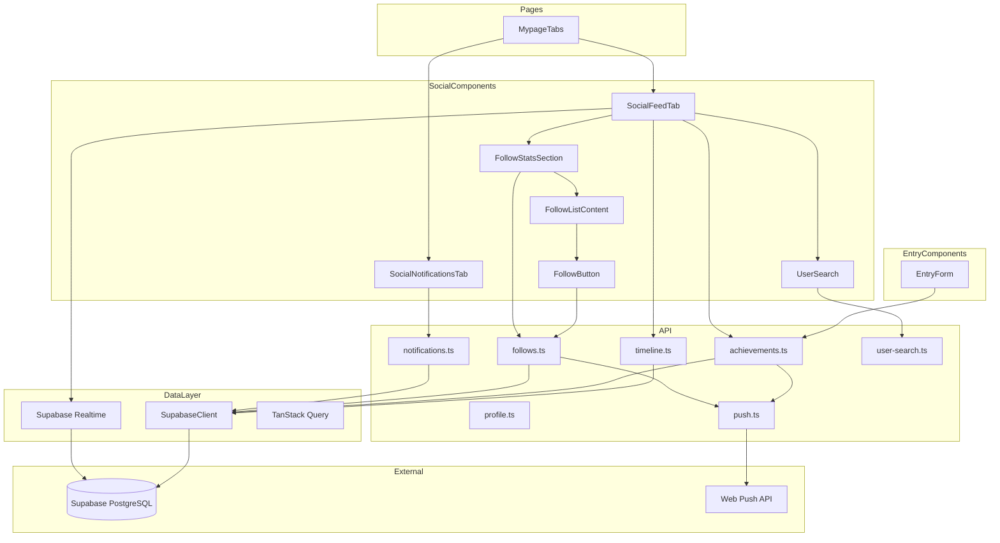
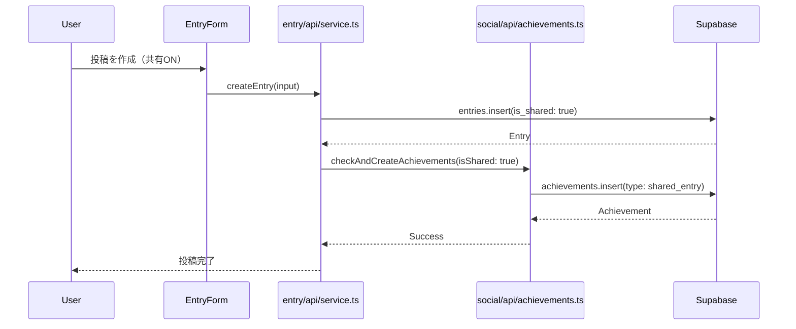
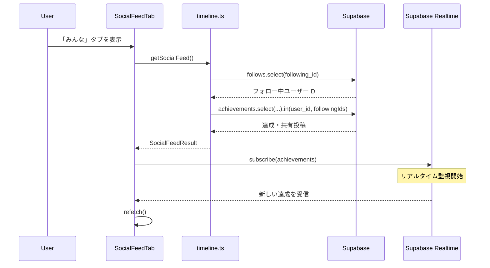
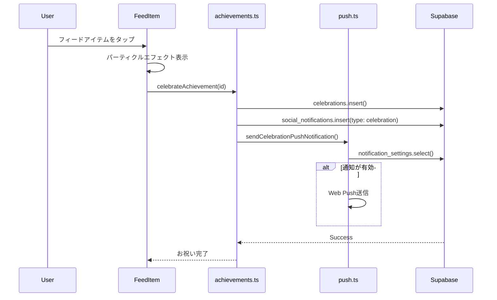

# 技術設計書: ソーシャル機能

## Overview

**Purpose**: ソーシャル機能は、ユーザー同士が互いの継続を称え合う軽量なソーシャル要素を提供する。SNS化を避け、過剰な中毒性を持たせない設計とする。

**Users**: ヒビオルのユーザーが、フォロー中のユーザーの達成や共有投稿を閲覧し、お祝いを送るために使用する。

**Impact**: `/social`ページ（旧マイページ機能を統合）として、「みんな」「通知」タブを提供し、エントリーフォームに共有トグルを統合する。

> **設計変更メモ**: 当初は`/mypage`と`/social`を分離して設計していたが、実装では`/social`に統合。プロフィール表示・編集機能も`/social`で提供する。

### Goals

- フォロー中ユーザーの達成・共有投稿をリアルタイムで表示
- お祝い機能によるポジティブなリアクション
- ソーシャル通知（お祝い・フォロー）のプッシュ通知連携
- プライバシー保護（お祝い数・フォロー数の非表示）

### Non-Goals

- いいね数やフォロワー数のランキング・比較機能
- 公開プロフィールページ
- ダイレクトメッセージ機能
- コメント機能

## Architecture

### Architecture Pattern & Boundary Map



**Architecture Integration**:
- **Selected pattern**: Feature-First構成 + Server Actions。ソーシャル機能を`features/social/`に集約
- **Domain boundaries**: フィード表示、フォロー管理、通知管理、プロフィール管理を独立したAPI・コンポーネント群として分離
- **Existing patterns preserved**: Next.js App Router規約、Server/Client Component分離、Result型によるエラーハンドリング
- **New components rationale**: リアルタイム更新・お祝いエフェクト・無限スクロールという複雑なUI要件に対応
- **Steering compliance**: TypeScript厳格モード、any型禁止、プライバシー保護（RLSポリシー）

### Technology Stack

| Layer | Choice / Version | Role in Feature | Notes |
|-------|------------------|-----------------|-------|
| Frontend | Next.js 16 (App Router) | ページルーティング、Server Actions | RSCでのSSR |
| UI Framework | React 19 | コンポーネント構築 | Server/Client Component分離 |
| State/Data | TanStack Query v5 | 無限スクロール、キャッシュ管理 | `useInfiniteQuery`使用 |
| Animation | framer-motion v11 | パーティクルエフェクト | お祝いアニメーション |
| Realtime | Supabase Realtime | 達成のリアルタイム受信 | `postgres_changes`チャンネル |
| Push | Web Push API | ブラウザ通知 | VAPID認証 |
| Backend | Supabase | データベース、認証、RLS | PostgreSQL |

## System Flows

### 共有投稿フロー



### ソーシャルフィード取得フロー



### お祝いフロー



## Components and Interfaces

### UIコンポーネント

| Component | Domain | Intent | Responsibilities & Constraints |
|-----------|--------|--------|-------------------------------|
| SocialFeedTab | UI/Feed | ソーシャルフィード表示 | フォロー中ユーザーの達成・共有投稿を表示、無限スクロール、Realtime更新 |
| FeedItem | UI/Feed | フィードアイテム表示 | 達成/共有投稿の表示、お祝いボタン、パーティクルエフェクト |
| SocialNotificationsTab | UI/Notifications | 通知一覧表示 | お祝い・フォロー通知の表示、既読管理、フォロー通知からのフォローバック |
| UserSearch | UI/Search | ユーザー検索 | ユーザー名での検索、検索結果表示 |
| FollowButton | UI/Action | フォローボタン | フォロー/アンフォロー切替 |
| FollowStatsSection | UI/Stats | フォロー統計表示 | 自分のフォロー数・フォロワー数表示、Drawerでリスト表示 |
| FollowListContent | UI/List | フォロー/フォロワー一覧 | タブ切替、ユーザーリスト表示 |

### API Layer

| File | Function | Purpose | Input/Output |
|------|----------|---------|--------------|
| achievements.ts | checkAndCreateAchievements | 達成チェック・作成 | (userId, entryId, isShared) → void |
| achievements.ts | celebrateAchievement | お祝い送信 | (achievementId) → SocialResult |
| achievements.ts | uncelebrateAchievement | お祝い取消 | (achievementId) → SocialResult |
| follows.ts | followUser | フォロー | (userId) → SocialResult |
| follows.ts | unfollowUser | アンフォロー | (userId) → SocialResult |
| follows.ts | getFollowCounts | フォロー数取得 | () → FollowCounts |
| follows.ts | getFollowingList | フォロー中一覧 | (cursor?) → PaginatedResult |
| follows.ts | getFollowerList | フォロワー一覧 | (cursor?) → PaginatedResult |
| notifications.ts | getSocialNotifications | 通知一覧取得 | (cursor?) → SocialNotificationsResult |
| notifications.ts | markAsRead | 既読マーク | (id) → SocialResult |
| notifications.ts | markAllAsRead | 全既読 | () → SocialResult |
| timeline.ts | getSocialFeed | フィード取得 | (cursor?) → SocialFeedResult |
| profile.ts | getMyProfile | プロフィール取得 | () → PublicUserInfo |
| profile.ts | updateProfile | プロフィール更新 | (input) → SocialResult |
| user-search.ts | searchUsers | ユーザー検索 | (query) → UserSearchResult |
| push.ts | sendCelebrationPushNotification | お祝い通知送信 | (fromUserId, toUserId, achievement) → void |
| push.ts | sendFollowPushNotification | フォロー通知送信 | (fromUserId, toUserId) → void |

## Data Models

### Database Schema

```sql
-- フォロー関係
CREATE TABLE follows (
  id UUID PRIMARY KEY DEFAULT gen_random_uuid(),
  follower_id UUID NOT NULL REFERENCES auth.users(id) ON DELETE CASCADE,
  following_id UUID NOT NULL REFERENCES auth.users(id) ON DELETE CASCADE,
  created_at TIMESTAMPTZ NOT NULL DEFAULT NOW(),
  UNIQUE(follower_id, following_id),
  CHECK(follower_id <> following_id)
);

-- 達成イベント
CREATE TABLE achievements (
  id UUID PRIMARY KEY DEFAULT gen_random_uuid(),
  user_id UUID NOT NULL REFERENCES auth.users(id) ON DELETE CASCADE,
  type TEXT NOT NULL CHECK(type IN ('daily_posts', 'total_posts', 'streak_days', 'shared_entry')),
  threshold INTEGER NOT NULL DEFAULT 0,
  value INTEGER NOT NULL DEFAULT 0,
  entry_id UUID REFERENCES entries(id) ON DELETE SET NULL,
  is_shared BOOLEAN NOT NULL DEFAULT FALSE,
  created_at TIMESTAMPTZ NOT NULL DEFAULT NOW()
);

-- お祝い
CREATE TABLE celebrations (
  id UUID PRIMARY KEY DEFAULT gen_random_uuid(),
  achievement_id UUID NOT NULL REFERENCES achievements(id) ON DELETE CASCADE,
  from_user_id UUID NOT NULL REFERENCES auth.users(id) ON DELETE CASCADE,
  created_at TIMESTAMPTZ NOT NULL DEFAULT NOW(),
  UNIQUE(achievement_id, from_user_id)
);

-- ソーシャル通知
CREATE TABLE social_notifications (
  id UUID PRIMARY KEY DEFAULT gen_random_uuid(),
  user_id UUID NOT NULL REFERENCES auth.users(id) ON DELETE CASCADE,
  type TEXT NOT NULL CHECK(type IN ('celebration', 'follow')),
  from_user_id UUID NOT NULL REFERENCES auth.users(id) ON DELETE CASCADE,
  achievement_id UUID REFERENCES achievements(id) ON DELETE CASCADE,
  is_read BOOLEAN NOT NULL DEFAULT FALSE,
  created_at TIMESTAMPTZ NOT NULL DEFAULT NOW()
);

-- 既存テーブル拡張
ALTER TABLE entries ADD COLUMN is_shared BOOLEAN NOT NULL DEFAULT FALSE;
ALTER TABLE notification_settings ADD COLUMN social_notifications_enabled BOOLEAN NOT NULL DEFAULT TRUE;
```

### TypeScript Types

```typescript
// 達成種別
type AchievementType = 'daily_posts' | 'total_posts' | 'streak_days' | 'shared_entry'

// ソーシャル通知種別
type SocialNotificationType = 'celebration' | 'follow'

// ユーザー公開情報
interface PublicUserInfo {
  id: string
  username: string
  displayName: string
  avatarUrl: string | null
}

// ソーシャルフィードアイテム
interface SocialFeedItem {
  id: string
  type: 'achievement' | 'shared_entry'
  user: PublicUserInfo
  achievement?: { type: AchievementType; threshold: number; value: number }
  entry?: { id: string; content: string; imageUrls: string[] | null }
  celebrationCount: number  // 内部使用のみ（UIには表示しない）
  isCelebrated: boolean     // 自分がお祝い済みか
  createdAt: string
}
```

## Constants

### 達成閾値（ACHIEVEMENT_THRESHOLDS）

```typescript
export const ACHIEVEMENT_THRESHOLDS: Record<Exclude<AchievementType, 'shared_entry'>, readonly number[]> = {
  // 1日の投稿数: 20から50まで10刻み
  daily_posts: [20, 30, 40, 50],
  // 総投稿数: 10, 30, 50, 100, 150, 200, 250, 300, 400, 500, 以降100刻みで10000まで
  total_posts: [
    10, 30, 50, 100, 150, 200, 250, 300, 400, 500,
    ...Array.from({ length: 95 }, (_, i) => 600 + i * 100),
  ],
  // 継続日数: 3, 7, 14, 30, 60, 90, 120, 150, 180, 240, 365, 以降60刻みで3650日まで
  streak_days: [
    3, 7, 14, 30, 60, 90, 120, 150, 180, 240, 365,
    ...Array.from({ length: 55 }, (_, i) => 425 + i * 60),
  ],
} as const
```

### その他の定数

```typescript
// ページネーション設定
export const SOCIAL_PAGINATION = {
  FEED_PAGE_SIZE: 20,
  NOTIFICATIONS_PAGE_SIZE: 20,
  USER_SEARCH_PAGE_SIZE: 10,
} as const

// ユーザー名のバリデーション
export const USERNAME_RULES = {
  MIN_LENGTH: 3,
  MAX_LENGTH: 20,
  PATTERN: /^[a-zA-Z0-9_]+$/,  // 英数字とアンダースコアのみ
} as const
```

## Error Handling

### SocialError Codes

| Code | Description | User Message |
|------|-------------|--------------|
| DB_ERROR | データベースエラー | エラーが発生しました。しばらくしてからお試しください |
| NOT_FOUND | リソースが見つからない | 指定されたリソースが見つかりません |
| UNAUTHORIZED | 未認証 | ログインが必要です |
| FORBIDDEN | 権限なし | この操作を行う権限がありません |
| ALREADY_FOLLOWING | 既にフォロー中 | 既にフォローしています |
| NOT_FOLLOWING | フォローしていない | フォローしていません |
| SELF_FOLLOW | 自己フォロー | 自分をフォローすることはできません |
| ALREADY_CELEBRATED | 既にお祝い済み | 既にお祝いしています |
| NOT_CELEBRATED | お祝いしていない | お祝いしていません |
| USERNAME_TAKEN | ユーザー名が使用中 | このユーザーIDは既に使用されています |
| INVALID_USERNAME | 無効なユーザー名 | ユーザーIDの形式が正しくありません |

## RLS Policies

```sql
-- フォロー中ユーザーの達成のみ閲覧可能
CREATE POLICY "Users can view following users achievements"
  ON achievements FOR SELECT
  USING (
    EXISTS (
      SELECT 1 FROM follows
      WHERE follower_id = auth.uid()
        AND following_id = achievements.user_id
    )
  );

-- フォロー中ユーザーの共有投稿のみ閲覧可能
CREATE POLICY "Users can view following users shared entries"
  ON entries FOR SELECT
  USING (
    is_shared = TRUE
    AND is_deleted = FALSE
    AND EXISTS (
      SELECT 1 FROM follows
      WHERE follower_id = auth.uid()
        AND following_id = entries.user_id
    )
  );
```

## Testing Strategy

### Unit Tests
- 達成閾値チェックロジック
- ユーザー名バリデーション
- 相対時間表示関数

### Integration Tests
- フォロー/アンフォロー API
- お祝い送信/取消 API
- 通知作成・既読管理

### E2E Tests
- フィード表示・お祝いフロー
- ユーザー検索・フォローフロー
- 通知表示・既読フロー
