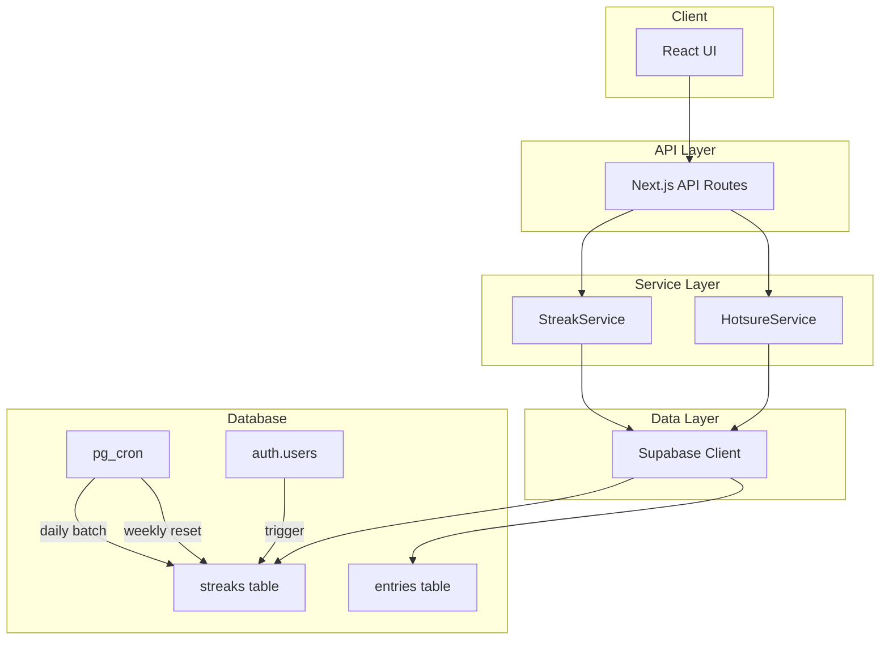
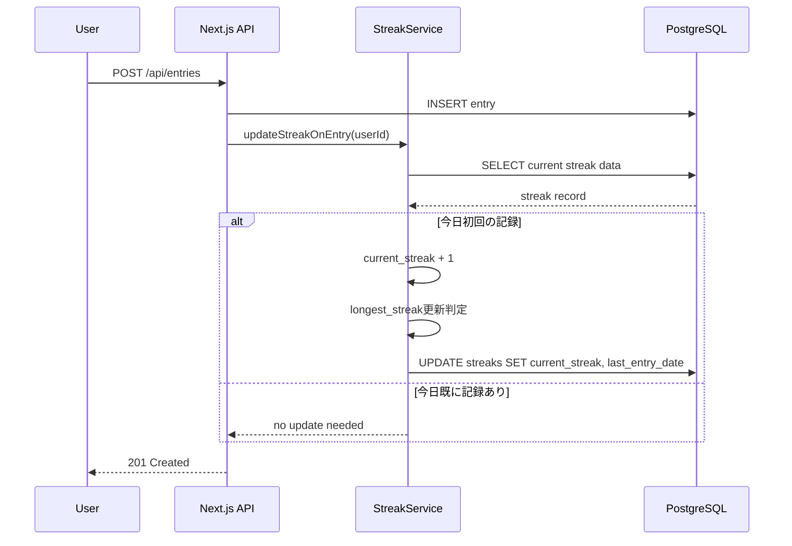
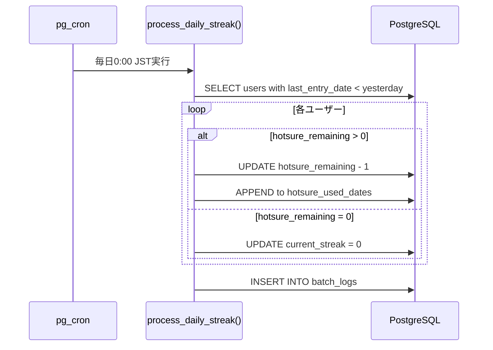
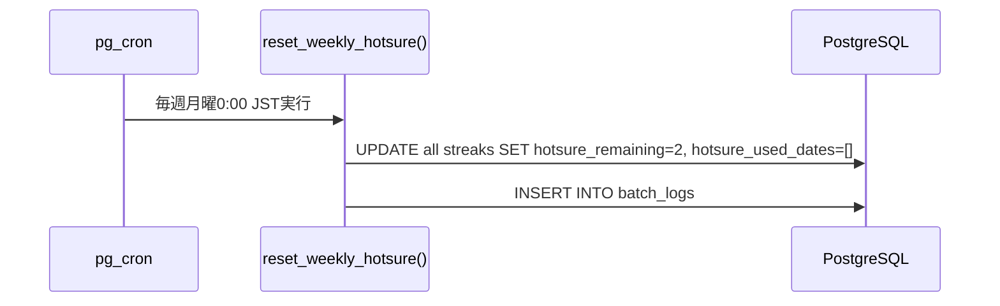
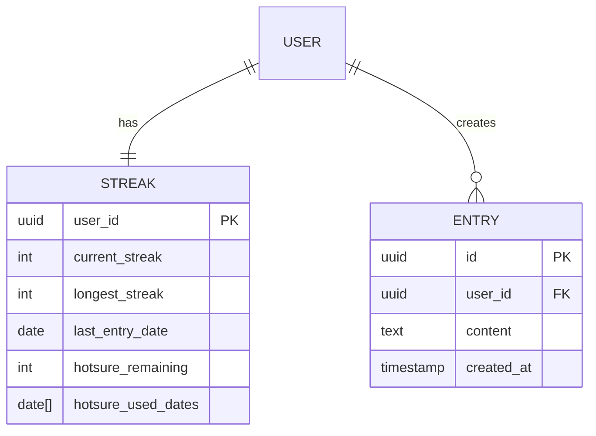

# Design Document: ストリーク/ほつれロジック

## Overview

**目的**: 本機能は、ヒビオルアプリにおける継続記録（ストリーク）とセーフティネット（ほつれ）のロジックを提供する。Duolingo式ゲーミフィケーションにより、ADHD当事者の「継続することが最大の目的」という設計思想を実現する。

**ユーザー**: ヒビオルの全ユーザーがこの機能を利用する。ストリークは「失いたくない資産」として損失回避の心理効果を生み、ほつれは「途切れても大したことない」というセーフティネットを提供する。

**影響**: 新規テーブル（streaks）の追加、新規ユーザー登録時のデータ初期化トリガー、日次バッチ処理によるストリーク状態の自動更新を行う。

### Goals

- 記録作成時にストリーク（current_streak, longest_streak）を自動計算・更新
- 記録なし日にほつれを自動消費し、ストリーク継続を維持
- 週次でほつれを2個にリセット（月曜0:00 JST）
- 日次バッチ処理で全ユーザーのストリーク状態を一括更新

### Non-Goals

- UI/UXの実装（別仕様で対応）
- プッシュ通知との連携（通知機能実装後に対応）
- ストリーク履歴の可視化（Phase 2以降で検討）
- ほつれの手動消費機能（自動消費のみ対応）

## Architecture

### Architecture Pattern & Boundary Map

**選択パターン**: サービス層パターン + PostgreSQL中心のバッチ処理

ストリークロジックはビジネスクリティカルな計算を含むため、サービス層で明確に分離する。日次・週次バッチ処理はSupabase pg_cronを使用し、PostgreSQL内部で完結させることでネットワークレイテンシを排除する。



**アーキテクチャ統合**:
- 選択パターン: サービス層パターン（ビジネスロジックの明確な分離）
- ドメイン境界: ストリーク管理とほつれ管理を別サービスとして分離
- 既存パターン: structure.mdの`/lib`配下ドメイン分離に準拠
- 新規コンポーネント: pg_cronによるデータベース内バッチ処理
- ステアリング準拠: tech.mdのSupabase活用方針に従う

### Technology Stack

| レイヤー | 技術 / バージョン | 役割 | 備考 |
|----------|-------------------|------|------|
| Frontend | Next.js App Router | ストリーク情報表示 | Server Componentsで取得 |
| Backend | Next.js API Routes | ストリーク更新API | 記録作成時にトリガー |
| Service | TypeScript | ビジネスロジック | `/lib/streak/`, `/lib/hotsure/` |
| Data | Supabase (PostgreSQL) | データ永続化 | streaksテーブル |
| Scheduling | pg_cron + pg_net | バッチ処理 | Supabase標準拡張 |
| Timezone | Asia/Tokyo (JST) | 日付判定基準 | UTC+9 |

## System Flows

### 記録作成時のストリーク更新フロー



### 日次バッチ処理フロー（0:00 JST）



### 週次ほつれリセットフロー（月曜0:00 JST）



## Requirements Traceability

| Requirement | Summary | Components | Interfaces | Flows |
|-------------|---------|------------|------------|-------|
| 1.1-1.5 | ストリーク計算 | StreakService | updateStreakOnEntry | 記録作成時フロー |
| 2.1-2.3 | ストリーク途切れ | StreakService, DailyBatch | breakStreak | 日次バッチフロー |
| 3.1-3.5 | ほつれ自動消費 | HotsureService, DailyBatch | consumeHotsure | 日次バッチフロー |
| 4.1-4.5 | 週次リセット | HotsureService, WeeklyBatch | resetHotsure | 週次リセットフロー |
| 5.1-5.5 | データ初期化 | InitTrigger | handle_new_user | DBトリガー |
| 6.1-6.4 | 情報取得 | StreakService | getStreakInfo | API取得 |
| 7.1-7.6 | 日次バッチ | DailyBatch | process_daily_streak | 日次バッチフロー |

## Components and Interfaces

| Component | Domain/Layer | Intent | Req Coverage | Key Dependencies | Contracts |
|-----------|--------------|--------|--------------|------------------|-----------|
| StreakService | lib/streak | ストリーク計算・更新 | 1.1-1.5, 2.1-2.3, 6.1-6.4 | SupabaseClient (P0) | Service |
| HotsureService | lib/hotsure | ほつれ消費・リセット | 3.1-3.5, 4.1-4.5 | SupabaseClient (P0) | Service |
| DailyBatchJob | database | 日次ストリーク処理 | 7.1-7.6, 2.1-2.3, 3.1-3.5 | pg_cron (P0) | Batch |
| WeeklyBatchJob | database | 週次ほつれリセット | 4.1-4.5 | pg_cron (P0) | Batch |
| InitTrigger | database | 新規ユーザー初期化 | 5.1-5.5 | auth.users (P0) | Event |
| StreakAPI | app/api | REST API エンドポイント | 1.1-1.5, 6.1-6.4 | StreakService (P0) | API |

### Service Layer

#### StreakService

| Field | Detail |
|-------|--------|
| Intent | ストリークの計算、更新、取得を行うサービス |
| Requirements | 1.1, 1.2, 1.3, 1.4, 1.5, 2.1, 2.2, 2.3, 6.1, 6.2, 6.3, 6.4 |

**Responsibilities & Constraints**
- 記録作成時のストリーク増加計算
- longest_streakの更新判定
- ストリーク途切れ処理（バッチから呼び出し）
- 認証済みユーザーのみアクセス可能

**Dependencies**
- Outbound: SupabaseClient - データ永続化 (P0)
- Outbound: EntriesTable - 記録存在確認 (P0)

**Contracts**: Service [x]

##### Service Interface

```typescript
interface StreakData {
  userId: string;
  currentStreak: number;
  longestStreak: number;
  lastEntryDate: string | null; // ISO 8601 date (YYYY-MM-DD)
  hotsureRemaining: number;
  hotsureUsedCount: number;
}

interface StreakUpdateResult {
  success: boolean;
  currentStreak: number;
  longestStreak: number;
  isNewRecord: boolean;
}

interface StreakService {
  /**
   * 記録作成時にストリークを更新する
   * @precondition userId は有効な認証済みユーザーID
   * @precondition entryDate は JST での日付文字列 (YYYY-MM-DD)
   * @postcondition 今日初回の記録の場合、current_streak が1増加
   * @postcondition longest_streak < current_streak の場合、longest_streak も更新
   */
  updateStreakOnEntry(userId: string, entryDate: string): Promise<StreakUpdateResult>;

  /**
   * ストリークを途切れさせる（current_streak = 0）
   * @precondition userId は有効なユーザーID
   * @postcondition current_streak = 0
   * @postcondition longest_streak は維持
   */
  breakStreak(userId: string): Promise<void>;

  /**
   * ユーザーのストリーク情報を取得する
   * @precondition userId は認証済みユーザーIDと一致
   * @postcondition レコードが存在しない場合は初期化して返却
   */
  getStreakInfo(userId: string): Promise<StreakData>;

  /**
   * 前日に記録があるかチェックする
   * @param userId ユーザーID
   * @param targetDate 確認対象日 (JST, YYYY-MM-DD)
   */
  hasEntryOnDate(userId: string, targetDate: string): Promise<boolean>;
}
```

**Implementation Notes**
- Integration: Supabase Clientを使用し、RLSで認可制御
- Validation: 日付はJST基準で判定、タイムゾーン変換に注意
- Risks: 日付境界でのレースコンディション（トランザクションで保護）

---

#### HotsureService

| Field | Detail |
|-------|--------|
| Intent | ほつれの消費とリセットを管理するサービス |
| Requirements | 3.1, 3.2, 3.3, 3.4, 3.5, 4.1, 4.2, 4.3, 4.4, 4.5 |

**Responsibilities & Constraints**
- ほつれの自動消費処理
- 消費日の記録（hotsure_used_dates配列への追加）
- 週次リセット処理（月曜0:00 JST）
- ほつれ最大数は2個固定

**Dependencies**
- Outbound: SupabaseClient - データ永続化 (P0)
- Outbound: StreakService - ストリーク途切れ処理 (P1)

**Contracts**: Service [x]

##### Service Interface

```typescript
interface HotsureConsumeResult {
  consumed: boolean;
  hotsureRemaining: number;
  streakMaintained: boolean;
}

interface HotsureService {
  /**
   * ほつれを自動消費する
   * @precondition hotsure_remaining >= 1
   * @postcondition hotsure_remaining が1減少
   * @postcondition targetDate が hotsure_used_dates に追加
   * @postcondition current_streak は維持
   */
  consumeHotsure(userId: string, targetDate: string): Promise<HotsureConsumeResult>;

  /**
   * ほつれをリセットする（週次処理）
   * @postcondition hotsure_remaining = 2
   * @postcondition hotsure_used_dates = []
   */
  resetHotsure(userId: string): Promise<void>;

  /**
   * ほつれが利用可能かチェックする
   */
  canUseHotsure(userId: string): Promise<boolean>;
}
```

**Implementation Notes**
- Integration: 日次バッチから呼び出される想定
- Validation: hotsure_remaining の範囲チェック (0-2)
- Risks: 同時実行による二重消費（PostgreSQLのFOR UPDATE で保護）

### Database Layer

#### DailyBatchJob

| Field | Detail |
|-------|--------|
| Intent | 毎日0:00 JSTに全ユーザーのストリーク状態を更新 |
| Requirements | 7.1, 7.2, 7.3, 7.4, 7.5, 7.6 |

**Responsibilities & Constraints**
- 前日の記録有無を確認
- ほつれ自動消費またはストリーク途切れ処理
- 処理結果のログ記録
- 個別ユーザーエラー時は継続処理

**Dependencies**
- Inbound: pg_cron - スケジュール実行 (P0)
- External: entries table - 記録確認 (P0)

**Contracts**: Batch [x]

##### Batch / Job Contract

- Trigger: 毎日0:00 JST (`0 15 * * *` UTC = 0:00 JST)
- Input: なし（全アクティブユーザーを対象）
- Validation: last_entry_date < 前日の日付（JST）
- Output: batch_logs テーブルへ処理結果を記録
- Idempotency: 処理日付をログに記録し、二重実行を防止
- Recovery: エラー発生ユーザーはスキップして継続、エラーログ記録

```sql
-- pg_cron ジョブ登録
SELECT cron.schedule(
  'daily-streak-check',
  '0 15 * * *',  -- UTC 15:00 = JST 0:00
  $$SELECT process_daily_streak()$$
);
```

---

#### WeeklyBatchJob

| Field | Detail |
|-------|--------|
| Intent | 毎週月曜0:00 JSTにほつれをリセット |
| Requirements | 4.1, 4.2, 4.3, 4.4, 4.5 |

**Responsibilities & Constraints**
- 全ユーザーのhotsure_remaining を2にリセット
- hotsure_used_dates をクリア
- 処理結果のログ記録

**Dependencies**
- Inbound: pg_cron - スケジュール実行 (P0)

**Contracts**: Batch [x]

##### Batch / Job Contract

- Trigger: 毎週月曜0:00 JST (`0 15 * * 1` UTC)
- Input: なし（全ユーザー対象）
- Output: batch_logs テーブルへ処理結果を記録
- Idempotency: 処理週をログに記録、UPDATE文は冪等
- Recovery: エラー時はリトライスケジュール

```sql
-- pg_cron ジョブ登録
SELECT cron.schedule(
  'weekly-hotsure-reset',
  '0 15 * * 1',  -- UTC 15:00 Monday = JST 月曜0:00
  $$SELECT reset_weekly_hotsure()$$
);
```

---

#### InitTrigger

| Field | Detail |
|-------|--------|
| Intent | 新規ユーザー登録時にstreaksレコードを初期化 |
| Requirements | 5.1, 5.2, 5.3, 5.4, 5.5 |

**Responsibilities & Constraints**
- auth.usersへのINSERT時に自動実行
- 初期値でstreaksレコードを作成
- SECURITY DEFINER で権限問題を回避

**Dependencies**
- Inbound: auth.users - トリガー元 (P0)

**Contracts**: Event [x]

##### Event Contract

- Published events: なし
- Subscribed events: auth.users INSERT
- Ordering: auth.users INSERT 完了後に実行

```sql
-- トリガー関数
CREATE OR REPLACE FUNCTION public.handle_new_user()
RETURNS trigger AS $$
BEGIN
  INSERT INTO public.streaks (
    user_id,
    current_streak,
    longest_streak,
    last_entry_date,
    hotsure_remaining,
    hotsure_used_dates
  ) VALUES (
    NEW.id,
    0,
    0,
    NULL,
    2,
    '{}'::date[]
  );
  RETURN NEW;
END;
$$ LANGUAGE plpgsql SECURITY DEFINER;

-- トリガー登録
CREATE TRIGGER on_auth_user_created
  AFTER INSERT ON auth.users
  FOR EACH ROW EXECUTE FUNCTION public.handle_new_user();
```

### API Layer

#### StreakAPI

| Field | Detail |
|-------|--------|
| Intent | ストリーク情報のREST APIエンドポイント |
| Requirements | 1.1, 1.2, 1.3, 6.1, 6.2, 6.3 |

**Dependencies**
- Inbound: Client UI - API呼び出し (P0)
- Outbound: StreakService - ビジネスロジック (P0)

**Contracts**: API [x]

##### API Contract

| Method | Endpoint | Request | Response | Errors |
|--------|----------|---------|----------|--------|
| GET | /api/streak | - | StreakData | 401, 500 |
| POST | /api/streak/update | { entryDate: string } | StreakUpdateResult | 400, 401, 500 |

**Request/Response Examples**:

```typescript
// GET /api/streak Response
{
  "userId": "uuid",
  "currentStreak": 5,
  "longestStreak": 10,
  "lastEntryDate": "2025-12-16",
  "hotsureRemaining": 1,
  "hotsureUsedCount": 1
}

// POST /api/streak/update Request
{
  "entryDate": "2025-12-17"
}

// POST /api/streak/update Response
{
  "success": true,
  "currentStreak": 6,
  "longestStreak": 10,
  "isNewRecord": false
}
```

## Data Models

### Domain Model



**Aggregates and Boundaries**:
- Streak: ユーザーごとに1レコード、ストリーク状態を管理
- Entry: 記録エンティティ（既存テーブル参照）

**Business Rules & Invariants**:
- `current_streak >= 0`
- `longest_streak >= current_streak` の関係は維持
- `hotsure_remaining` の範囲は 0-2
- `hotsure_used_dates` の要素数は最大2（週次リセット前）

### Physical Data Model

#### streaks テーブル

```sql
CREATE TABLE public.streaks (
  user_id UUID PRIMARY KEY REFERENCES auth.users(id) ON DELETE CASCADE,
  current_streak INTEGER NOT NULL DEFAULT 0 CHECK (current_streak >= 0),
  longest_streak INTEGER NOT NULL DEFAULT 0 CHECK (longest_streak >= 0),
  last_entry_date DATE,
  hotsure_remaining INTEGER NOT NULL DEFAULT 2 CHECK (hotsure_remaining >= 0 AND hotsure_remaining <= 2),
  hotsure_used_dates DATE[] NOT NULL DEFAULT '{}',
  created_at TIMESTAMP WITH TIME ZONE DEFAULT TIMEZONE('utc', NOW()),
  updated_at TIMESTAMP WITH TIME ZONE DEFAULT TIMEZONE('utc', NOW())
);

-- インデックス
CREATE INDEX idx_streaks_last_entry_date ON public.streaks(last_entry_date);

-- RLS ポリシー
ALTER TABLE public.streaks ENABLE ROW LEVEL SECURITY;

CREATE POLICY "Users can view own streak" ON public.streaks
  FOR SELECT USING (auth.uid() = user_id);

CREATE POLICY "Users can update own streak" ON public.streaks
  FOR UPDATE USING (auth.uid() = user_id);

-- Service role for batch operations
CREATE POLICY "Service role full access" ON public.streaks
  FOR ALL USING (auth.role() = 'service_role');
```

#### batch_logs テーブル

```sql
CREATE TABLE public.batch_logs (
  id UUID PRIMARY KEY DEFAULT gen_random_uuid(),
  job_name TEXT NOT NULL,
  executed_at TIMESTAMP WITH TIME ZONE DEFAULT TIMEZONE('utc', NOW()),
  processed_count INTEGER NOT NULL DEFAULT 0,
  error_count INTEGER NOT NULL DEFAULT 0,
  details JSONB
);

CREATE INDEX idx_batch_logs_job_name ON public.batch_logs(job_name);
CREATE INDEX idx_batch_logs_executed_at ON public.batch_logs(executed_at);
```

### Data Contracts & Integration

**Timezone Handling**:
- 日付判定はすべてJST (Asia/Tokyo) 基準
- データベースへの保存はUTC
- 日付変換: `CURRENT_DATE AT TIME ZONE 'Asia/Tokyo'`

## Error Handling

### Error Strategy

ストリーク処理は継続性が重要なため、部分的な失敗を許容しつつログを記録する方針を採用。

### Error Categories and Responses

**User Errors (4xx)**:
- 401 Unauthorized: 未認証アクセス -> ログイン画面へリダイレクト
- 400 Bad Request: 不正な日付形式 -> エラーメッセージ表示

**System Errors (5xx)**:
- 500 Internal Server Error: データベース接続エラー -> リトライまたはフォールバック
- 503 Service Unavailable: 一時的な障害 -> 自動リトライ

**Batch Processing Errors**:
- 個別ユーザーエラー: スキップして継続、エラーログ記録
- 全体エラー: リトライスケジュール、アラート通知

### Monitoring

- batch_logs テーブルで処理履歴を追跡
- error_count > 0 の場合はアラート設定推奨
- Supabase Dashboard でジョブ実行状況を監視

## Testing Strategy

### Unit Tests

- StreakService.updateStreakOnEntry: 初回記録、2回目記録、longest_streak更新
- StreakService.breakStreak: current_streak=0、longest_streak維持
- HotsureService.consumeHotsure: 消費成功、残数0時の失敗
- HotsureService.resetHotsure: 値リセット確認
- 日付計算ロジック: JSTタイムゾーン境界テスト

### Integration Tests

- 記録作成 -> ストリーク更新の一連フロー
- 日次バッチ処理: ほつれ消費、ストリーク途切れ
- 週次バッチ処理: ほつれリセット
- 新規ユーザー登録 -> streaksレコード自動作成

### Performance

- 日次バッチ: 1000ユーザー処理を5秒以内
- 週次バッチ: 全ユーザー更新を10秒以内
- ストリーク取得API: 100ms以内のレスポンス

## Security Considerations

**認証・認可**:
- Supabase Auth による認証必須
- RLSポリシーで自身のデータのみアクセス可能
- バッチ処理は service_role キーを使用

**データ保護**:
- ストリークデータは個人情報に該当しないが、ユーザー活動パターンを含む
- HTTPS通信必須
- user_id は外部に公開しない
