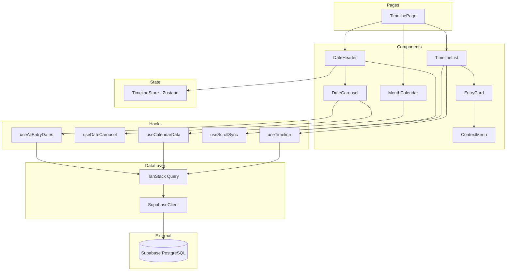
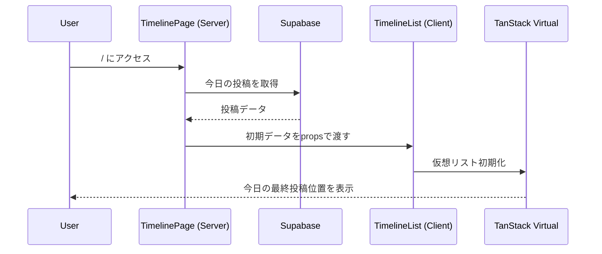
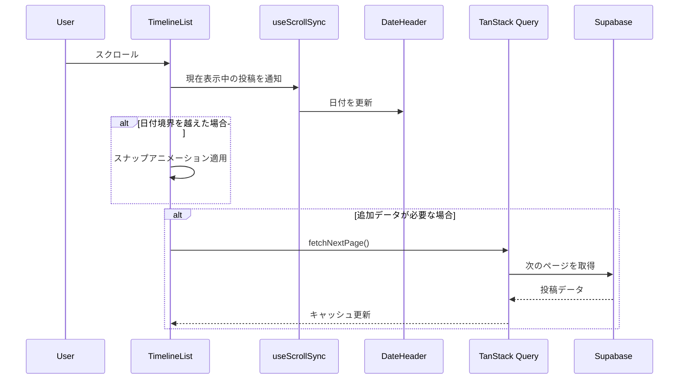
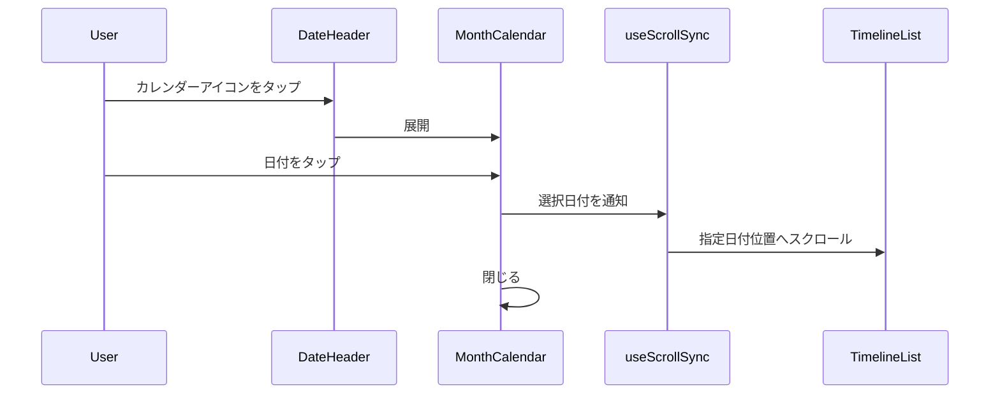
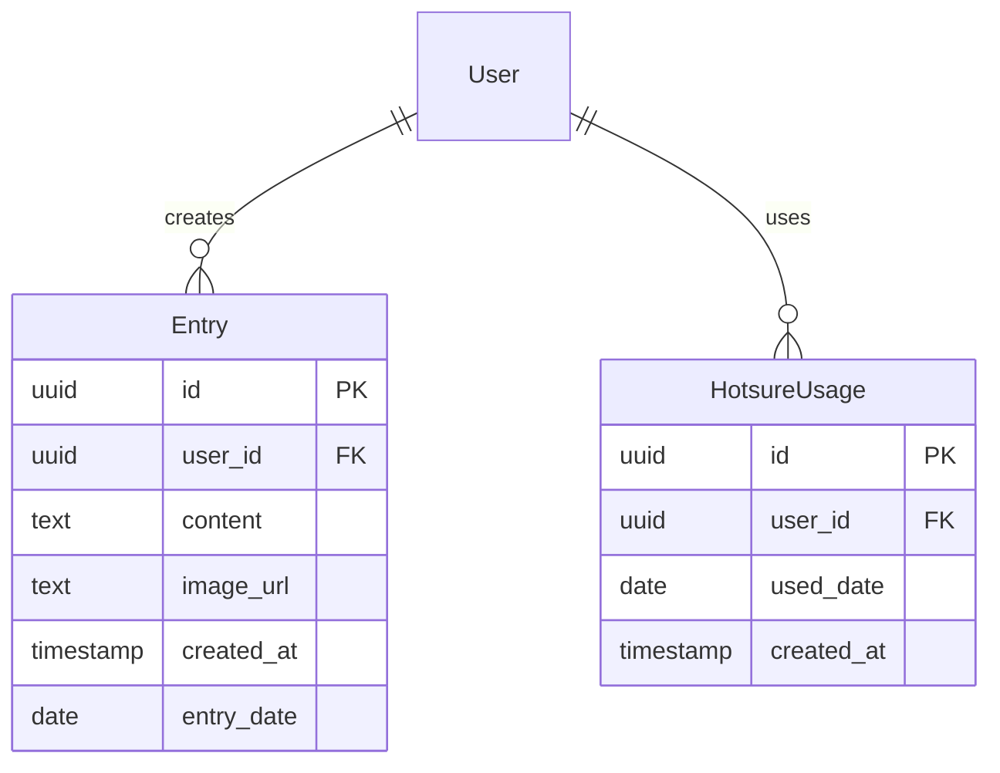

# 技術設計書: タイムライン/カレンダーページ

## Overview

**Purpose**: タイムライン/カレンダーページは、ヒビオル（hibioru）のメイン画面（`/`）として、ユーザーの日々の記録を時系列で表示し、継続を可視化する価値を提供する。

**Users**: ADHD当事者およびADHD傾向のあるユーザーが、日々の記録を振り返り、継続パターンを確認するために使用する。

**Impact**: アプリケーションの中心的なエントリーポイントとして、投稿閲覧・ナビゲーション・カレンダー表示・編集への導線を統合する。

### Goals

- 日付ベースのナビゲーション（カルーセル・カレンダー選択）による直感的な操作
- 仮想スクロールによる大量投稿の効率的な表示
- 日付とスクロール位置の双方向同期による一貫したUX
- 継続記録の視覚化（●記録、━━継続線、🧵ほつれ、◎今日）

### Non-Goals

- 投稿の新規作成機能（`/new`ページで提供）
- 投稿の編集機能（`/edit/[id]`ページで提供）
- ストリーク計算ロジック（`/lib/streak/`で別途実装）
- ほつれ消費ロジック（`/lib/hotsure/`で別途実装）
- ソーシャル機能（フォロー、リアクション等）

## Architecture

### Architecture Pattern & Boundary Map



> **設計変更メモ**: 当初の`useSwipeNavigation`は`useDateCarousel`および`useAllEntryDates`に置き換え。また、状態管理にTimelineStore（Zustand）を追加し、カレンダー開閉状態やアクティブ日付の管理を集中化。

**Architecture Integration**:
- **Selected pattern**: Feature-First構成 + Hooks分離。UIコンポーネントとビジネスロジックを明確に分離し、再利用性とテスト容易性を確保
- **Domain boundaries**: タイムライン表示、カレンダー表示、ナビゲーションを独立したコンポーネント群として分離
- **Existing patterns preserved**: Next.js App Router規約、Server/Client Component分離、パスエイリアス（`@/`）
- **New components rationale**: 仮想スクロール・スワイプジェスチャー・スクロール同期という複雑なUI要件に対応するため、専用のカスタムフックを導入
- **Steering compliance**: TypeScript厳格モード、any型禁止、Server Componentsでのデータフェッチ

### Technology Stack

| Layer | Choice / Version | Role in Feature | Notes |
|-------|------------------|-----------------|-------|
| Frontend | Next.js 15 (App Router) | ページルーティング、Server Components | RSCでの初期データフェッチ |
| UI Framework | React 19 | コンポーネント構築 | Server/Client Component分離 |
| State/Data | TanStack Query v5 | 無限スクロール、キャッシュ管理 | `useInfiniteQuery`使用 |
| Virtualization | TanStack Virtual v3 | 仮想スクロール | `useVirtualizer`使用 |
| Gesture | react-swipeable v7 | スワイプジェスチャー検出 | タッチ・マウス両対応 |
| Calendar | react-day-picker v9 | 月カレンダー表示 | shadcn/uiベース |
| Styling | Tailwind CSS v3 | スタイリング | レスポンシブ対応 |
| Backend | Supabase | データベース、認証 | PostgreSQL |

## System Flows

### 初期ロードフロー



### スクロール・日付同期フロー



### カレンダー日付選択フロー



## Requirements Traceability

| Requirement | Summary | Components | Interfaces | Flows |
|-------------|---------|------------|------------|-------|
| 1.1 | 左スワイプで前日へ移動 | DateHeader | useSwipeNavigation | - |
| 1.2 | 右スワイプで翌日へ移動 | DateHeader | useSwipeNavigation | - |
| 1.3 | カレンダーアイコンで月カレンダー展開 | DateHeader, MonthCalendar | - | カレンダー日付選択フロー |
| 1.4 | カレンダーで日付選択時スクロール | MonthCalendar | useScrollSync | カレンダー日付選択フロー |
| 2.1 | 新しい順で投稿表示 | TimelineList | useTimeline | 初期ロードフロー |
| 2.2 | 日付をまたいで連続スクロール | TimelineList | useTimeline, useVirtualizer | スクロール・日付同期フロー |
| 2.3 | 日付境界でスナップアニメーション | TimelineList | useScrollSync | スクロール・日付同期フロー |
| 2.4 | 初期表示で今日の最終投稿位置 | TimelinePage | useTimeline | 初期ロードフロー |
| 3.1 | スクロール中に日付ヘッダー同期 | DateHeader, TimelineList | useScrollSync | スクロール・日付同期フロー |
| 3.2 | 日付変更時に即座に反映 | DateHeader | useScrollSync | スクロール・日付同期フロー |
| 4.1 | 投稿なし日をスキップ | TimelineList | useTimeline | - |
| 4.2 | ほつれ使用日に🧵マーク表示 | DateHeader, MonthCalendar | useCalendarData | - |
| 5.1 | タップで編集ページへ遷移 | EntryCard | - | - |
| 5.2 | 長押しでコンテキストメニュー表示 | EntryCard, ContextMenu | - | - |
| 6.1 | 記録日に●マーク表示 | MonthCalendar | useCalendarData | - |
| 6.2 | 連続記録日に━━継続線表示 | MonthCalendar | useCalendarData | - |
| 6.3 | ほつれ使用日に🧵マーク表示 | MonthCalendar | useCalendarData | - |
| 6.4 | 今日を◎マークで強調 | MonthCalendar | - | - |
| 6.5 | カレンダー外タップで閉じる | MonthCalendar | - | - |
| 7.1 | レスポンシブ対応 | 全コンポーネント | - | - |
| 7.2 | 仮想スクロールでパフォーマンス維持 | TimelineList | useVirtualizer | - |
| 7.3 | エラー時リトライオプション表示 | TimelineList | useTimeline | - |

## Components and Interfaces

| Component | Domain/Layer | Intent | Req Coverage | Key Dependencies | Contracts |
|-----------|--------------|--------|--------------|------------------|-----------|
| TimelinePage | Pages | メインページのエントリーポイント | 2.4 | useTimeline (P0) | - |
| DateHeader | UI/Navigation | 日付表示とナビゲーション | 1.1, 1.2, 1.3, 3.1, 3.2, 4.2 | useSwipeNavigation (P0), useScrollSync (P0) | State |
| MonthCalendar | UI/Calendar | 月カレンダー表示 | 1.4, 6.1, 6.2, 6.3, 6.4, 6.5 | useCalendarData (P0) | State |
| TimelineList | UI/List | 投稿一覧の仮想スクロール表示 | 2.1, 2.2, 2.3, 4.1, 7.2, 7.3 | useTimeline (P0), useScrollSync (P0) | State |
| EntryCard | UI/Card | 個別投稿の表示 | 5.1, 5.2 | - | - |
| ContextMenu | UI/Overlay | 長押しメニュー | 5.2 | - | - |
| useTimeline | Hooks/Data | 投稿データの取得・ページネーション | 2.1, 2.2, 2.4, 4.1, 7.3 | TanStack Query (P0), Supabase (P0) | Service |
| useSwipeNavigation | Hooks/Gesture | スワイプジェスチャー検出 | 1.1, 1.2 | react-swipeable (P0) | Service |
| useScrollSync | Hooks/Sync | スクロール位置と日付の同期 | 2.3, 3.1, 3.2 | - | Service, State |
| useCalendarData | Hooks/Data | カレンダー表示用データ取得 | 4.2, 6.1, 6.2, 6.3 | TanStack Query (P0), Supabase (P0) | Service |

### Hooks Layer

#### useTimeline

| Field | Detail |
|-------|--------|
| Intent | 投稿データの無限スクロール取得とキャッシュ管理 |
| Requirements | 2.1, 2.2, 2.4, 4.1, 7.3 |

**Responsibilities & Constraints**
- TanStack Queryの`useInfiniteQuery`を使用した投稿データのページネーション取得
- カーソルベースのページネーション（created_atを基準）
- 投稿のない日を自動スキップするクエリ構築
- エラー状態とリトライ機能の提供

**Dependencies**
- Outbound: TanStack Query — 無限スクロールクエリ管理 (P0)
- External: Supabase Client — データベースアクセス (P0)

**Contracts**: Service [x] / State [x]

##### Service Interface
```typescript
interface UseTimelineOptions {
  initialDate?: Date;
  pageSize?: number;
}

interface TimelineEntry {
  id: string;
  userId: string;
  content: string;
  imageUrls: string[] | null;  // 複数画像対応（配列）
  createdAt: Date;
  date: string; // YYYY-MM-DD形式
}

interface TimelinePage {
  entries: TimelineEntry[];
  nextCursor: string | null;
  prevCursor: string | null;
}

interface UseTimelineReturn {
  pages: TimelinePage[];
  entries: TimelineEntry[];
  isLoading: boolean;
  isError: boolean;
  error: Error | null;
  hasNextPage: boolean;
  hasPreviousPage: boolean;
  fetchNextPage: () => Promise<void>;
  fetchPreviousPage: () => Promise<void>;
  refetch: () => Promise<void>;
}

function useTimeline(options?: UseTimelineOptions): UseTimelineReturn;
```

- Preconditions: ユーザーが認証済みであること
- Postconditions: 指定された日付範囲の投稿データがキャッシュに格納される
- Invariants: 投稿は常にcreatedAtの降順でソートされる

##### State Management
- State model: TanStack Queryのキャッシュを使用
- Persistence: ブラウザセッション中のみ保持
- Concurrency: TanStack Queryの楽観的更新パターンを使用

**Implementation Notes**
- Integration: Supabaseの`.range()`メソッドでページネーション実装
- Validation: createdAtの存在チェック、ページサイズの上限チェック（最大50件）
- Risks: 大量データ時のメモリ使用量増加 → `gcTime`設定で古いページを解放

---

#### useDateCarousel

| Field | Detail |
|-------|--------|
| Intent | 日付カルーセルのスクロール制御と日付選択 |
| Requirements | 1.1, 1.2 |

**Responsibilities & Constraints**
- カルーセル内の日付アイテムのスクロール位置管理
- 選択された日付の中央寄せアニメーション
- スクロールイベントのデバウンス処理

**Dependencies**
- Inbound: DateCarousel — UIコンポーネント (P0)
- Outbound: TimelineStore — アクティブ日付の更新 (P0)

**Contracts**: Service [x] / State [x]

##### Service Interface
```typescript
interface UseDateCarouselOptions {
  containerRef: React.RefObject<HTMLElement>;
  dates: string[];  // YYYY-MM-DD[]
  activeDate: string;
  onDateSelect: (date: string) => void;
}

interface UseDateCarouselReturn {
  scrollToDate: (date: string) => void;
  handleScroll: () => void;
  getVisibleDateIndex: () => number;
}

function useDateCarousel(options: UseDateCarouselOptions): UseDateCarouselReturn;
```

- Preconditions: containerRefが有効なDOM要素を参照していること
- Postconditions: 選択された日付がカルーセル中央に表示される
- Invariants: スクロール位置と表示日付の整合性を維持

**Implementation Notes**
- Integration: `scrollIntoView`でスムースなスクロールアニメーション
- Validation: 日付が配列内に存在するか確認
- Risks: 高頻度スクロールイベント → `requestAnimationFrame`でデバウンス

---

#### useAllEntryDates

| Field | Detail |
|-------|--------|
| Intent | 全期間の記録日付を軽量に取得（カルーセル表示用） |
| Requirements | 1.1 |

**Responsibilities & Constraints**
- ユーザーの全記録日付（重複なし）を取得
- カルーセル表示に必要な最小限のデータのみ取得
- キャッシュによる効率的なデータ管理

**Dependencies**
- Outbound: TanStack Query — クエリ管理 (P0)
- External: Supabase Client — データベースアクセス (P0)

**Contracts**: Service [x]

##### Service Interface
```typescript
interface UseAllEntryDatesReturn {
  dates: string[];  // YYYY-MM-DD[] (降順)
  isLoading: boolean;
  isError: boolean;
  refetch: () => Promise<void>;
}

function useAllEntryDates(userId: string): UseAllEntryDatesReturn;
```

- Preconditions: ユーザーが認証済みであること
- Postconditions: 全期間の記録日付が取得される
- Invariants: 日付は降順（新しい順）でソートされる

**Implementation Notes**
- Integration: `SELECT DISTINCT DATE(created_at AT TIME ZONE 'Asia/Tokyo') FROM entries`
- Validation: 日付形式の妥当性チェック
- Performance: 日付のみ取得することでペイロードを最小化

---

#### useScrollSync

| Field | Detail |
|-------|--------|
| Intent | スクロール位置と日付ヘッダーの双方向同期 |
| Requirements | 2.3, 3.1, 3.2 |

**Responsibilities & Constraints**
- 現在表示中の投稿から日付を算出
- 日付境界でのスナップスクロール実行
- 外部からの日付指定によるスクロール位置移動

**Dependencies**
- Inbound: TimelineList — スクロールイベント通知 (P0)
- Inbound: MonthCalendar — 日付選択通知 (P1)
- Outbound: DateHeader — 日付更新 (P0)

**Contracts**: Service [x] / State [x]

##### Service Interface
```typescript
interface ScrollSyncState {
  currentDate: Date;
  isSnapping: boolean;
}

interface UseScrollSyncOptions {
  containerRef: React.RefObject<HTMLElement>;
  entries: TimelineEntry[];
  onDateChange?: (date: Date) => void;
}

interface UseScrollSyncReturn {
  state: ScrollSyncState;
  scrollToDate: (date: Date) => void;
  handleScroll: () => void;
  getDateAtPosition: (scrollTop: number) => Date;
}

function useScrollSync(options: UseScrollSyncOptions): UseScrollSyncReturn;
```

- Preconditions: containerRefが有効なDOM要素を参照していること
- Postconditions: スクロール位置と日付が同期されている
- Invariants: スナップアニメーション中は追加のスクロール処理を無視

##### State Management
- State model: `currentDate`と`isSnapping`をReact stateで管理
- Persistence: なし（コンポーネントのライフサイクルに依存）
- Concurrency: `requestAnimationFrame`でスクロールイベントをデバウンス

**Implementation Notes**
- Integration: Intersection Observerで日付境界を検出
- Validation: スクロール位置が有効範囲内か確認
- Risks: 高頻度スクロールイベントによるパフォーマンス低下 → デバウンス処理

---

#### useCalendarData

| Field | Detail |
|-------|--------|
| Intent | 月カレンダー表示用の記録状況データ取得 |
| Requirements | 4.2, 6.1, 6.2, 6.3 |

**Responsibilities & Constraints**
- 指定月の記録日一覧を取得
- 連続記録日の算出
- ほつれ使用日の取得

**Dependencies**
- Outbound: TanStack Query — クエリ管理 (P0)
- External: Supabase Client — データベースアクセス (P0)

**Contracts**: Service [x]

##### Service Interface
```typescript
interface CalendarDayData {
  date: string; // YYYY-MM-DD
  hasEntry: boolean;
  isStreakDay: boolean;
  hasHotsure: boolean;
  isToday: boolean;
}

interface UseCalendarDataOptions {
  year: number;
  month: number; // 1-12
}

interface UseCalendarDataReturn {
  days: CalendarDayData[];
  isLoading: boolean;
  isError: boolean;
  error: Error | null;
  refetch: () => Promise<void>;
}

function useCalendarData(options: UseCalendarDataOptions): UseCalendarDataReturn;
```

- Preconditions: ユーザーが認証済み、year/monthが有効な値
- Postconditions: 指定月の全日について記録状況が取得される
- Invariants: 日付データは昇順でソートされる

**Implementation Notes**
- Integration: Supabaseで月単位のデータ取得クエリを構築
- Validation: 年月の有効性チェック
- Risks: 月をまたぐ連続記録の判定 → 前月最終日も含めて取得

### Store Layer

#### TimelineStore (Zustand)

| Field | Detail |
|-------|--------|
| Intent | タイムライン画面の状態を集中管理し、Props Drillingを回避する |
| Requirements | 1.3, 3.1, 3.2 |

**Responsibilities & Constraints**
- カレンダー開閉状態（isCalendarOpen）の管理
- アクティブ日付（activeDates）の管理
- 同期ソース（syncSource: 'scroll' | 'carousel' | 'calendar'）の追跡
- コンポーネント間の状態共有

**Dependencies**
- Inbound: DateHeader, DateCarousel, MonthCalendar, TimelineList
- External: zustand (P0)

**Contracts**: State [x]

##### State Management

```typescript
interface TimelineStoreState {
  isCalendarOpen: boolean;
  activeDates: string[];  // 現在表示中の日付（複数可）
  syncSource: 'scroll' | 'carousel' | 'calendar' | null;
}

interface TimelineStoreActions {
  setCalendarOpen: (open: boolean) => void;
  setActiveDates: (dates: string[], source: 'scroll' | 'carousel' | 'calendar') => void;
  reset: () => void;
}

type TimelineStore = TimelineStoreState & TimelineStoreActions;
```

- State model: Zustandによるグローバル状態管理
- Persistence: なし（コンポーネントのライフサイクルに依存）
- Location: `/features/timeline/stores/timeline-store.ts`

**Implementation Notes**
- Integration: useTimelineStore()で任意のコンポーネントから状態にアクセス
- Validation: activeDatesは空配列を許容しない（最低1つの日付が必要）
- Benefits: カレンダー、カルーセル、スクロールの状態を一元管理

---

### UI Layer

#### DateHeader

| Field | Detail |
|-------|--------|
| Intent | 現在日付の表示とナビゲーション操作 |
| Requirements | 1.1, 1.2, 1.3, 3.1, 3.2, 4.2 |

**Responsibilities & Constraints**
- DateCarouselを内包し、日付カルーセルを表示
- カレンダーアイコンタップで月カレンダー展開
- ほつれ使用日に🧵マーク表示

**Dependencies**
- Inbound: useScrollSync — 現在日付通知 (P0)
- Outbound: DateCarousel — 日付カルーセル (P0)
- Outbound: TimelineStore — カレンダー開閉状態 (P0)
- Outbound: MonthCalendar — 展開制御 (P1)

**Contracts**: State [x]

##### State Management
- State model: `isCalendarOpen: boolean`をローカルstateで管理
- UI State: 日付表示、🧵マーク表示はpropsから派生

**Implementation Notes**
- Integration: `'use client'`ディレクティブが必要
- Validation: 日付の表示形式変換

---

#### DateCarousel

| Field | Detail |
|-------|--------|
| Intent | 記録がある日付を横スクロール可能なカルーセルで表示 |
| Requirements | 1.1, 1.2 |

**Responsibilities & Constraints**
- 全期間の記録日付を横並びで表示
- 選択された日付を中央に配置
- スクロールに応じてアクティブ日付を更新
- 記録がある日にドットインジケーター表示

**Dependencies**
- Inbound: DateHeader — 親コンポーネント (P0)
- Outbound: useDateCarousel — スクロール制御 (P0)
- Outbound: useAllEntryDates — 日付データ取得 (P0)
- Outbound: TimelineStore — アクティブ日付更新 (P0)

**Contracts**: State [x]

##### State Management
- State model: カルーセル内のスクロール位置はDOM状態として管理
- UI State: アクティブ日付はTimelineStoreから取得

**Implementation Notes**
- Integration: `overflow-x: auto`で横スクロール、`scroll-snap-type`でスナップ
- Validation: 日付が空の場合は「記録がありません」を表示
- Performance: 大量の日付でも軽量表示（日付文字列のみ）

---

#### MonthCalendar

| Field | Detail |
|-------|--------|
| Intent | 月単位のカレンダー表示と記録状況の可視化 |
| Requirements | 1.4, 6.1, 6.2, 6.3, 6.4, 6.5 |

**Responsibilities & Constraints**
- 月カレンダーグリッドの表示
- 記録日に●マーク、連続記録日に━━継続線表示
- ほつれ使用日に🧵マーク、今日を◎で強調
- 日付タップで該当位置へスクロール
- カレンダー外タップで閉じる

**Dependencies**
- Inbound: DateHeader — 展開制御 (P0)
- Outbound: useCalendarData — カレンダーデータ (P0)
- Outbound: useScrollSync — 日付選択時スクロール (P1)
- External: react-day-picker — カレンダーUI (P0)

**Contracts**: State [x]

##### State Management
- State model: `selectedMonth: Date`をローカルstateで管理
- UI State: 日付マーカーはuseCalendarDataから取得

**Implementation Notes**
- Integration: react-day-pickerのカスタムレンダラーで記録マーカー表示
- Validation: クリック位置がカレンダー外かを判定
- Risks: 月移動時のデータ取得遅延 → ローディング状態表示

---

#### TimelineList

| Field | Detail |
|-------|--------|
| Intent | 投稿一覧の仮想スクロール表示 |
| Requirements | 2.1, 2.2, 2.3, 4.1, 7.2, 7.3 |

**Responsibilities & Constraints**
- TanStack Virtualを使用した仮想スクロール実装
- 日付境界でのスナップアニメーション
- 投稿のない日を自動スキップ
- エラー時のリトライUI表示

**Dependencies**
- Inbound: TimelinePage — 初期データ (P0)
- Outbound: useTimeline — 投稿データ取得 (P0)
- Outbound: useScrollSync — スクロール同期 (P0)
- External: TanStack Virtual — 仮想スクロール (P0)

**Contracts**: State [x]

##### State Management
- State model: TanStack Virtualの内部状態を使用
- UI State: ローディング、エラー、空状態をuseTimelineから派生

**Implementation Notes**
- Integration: `useVirtualizer`で動的行高さに対応
- Validation: コンテナサイズの有効性チェック
- Risks: 画像読み込みによる行高さ変動 → `measureElement`で動的計測

---

#### EntryCard

| Field | Detail |
|-------|--------|
| Intent | 個別投稿の表示とインタラクション |
| Requirements | 5.1, 5.2 |

**Responsibilities & Constraints**
- 投稿内容（テキスト、画像）の表示
- タップで編集ページ（`/edit/[id]`）へ遷移
- 長押しでコンテキストメニュー表示

**Dependencies**
- Outbound: Next.js Router — ページ遷移 (P0)
- Outbound: ContextMenu — メニュー表示 (P1)

**Contracts**: なし（プレゼンテーショナルコンポーネント）

**Implementation Notes**
- Integration: `next/link`または`useRouter`で遷移
- Validation: 長押し時間の閾値（500ms）
- Risks: タップと長押しの誤認識 → タイマーベースの判定

---

#### ContextMenu

| Field | Detail |
|-------|--------|
| Intent | 長押し時のアクションメニュー表示 |
| Requirements | 5.2 |

**Responsibilities & Constraints**
- メニューオプション（編集、削除、共有等）の表示
- 背景タップで閉じる
- アクセシビリティ対応（キーボードナビゲーション）

**Dependencies**
- Inbound: EntryCard — 表示制御 (P0)

**Contracts**: なし（プレゼンテーショナルコンポーネント）

**Implementation Notes**
- Integration: Radix UIまたはHeadless UIのMenuコンポーネント使用推奨
- Validation: メニュー位置がビューポート内に収まるか確認
- Risks: モバイルでの位置調整 → ポータルで描画位置制御

## Data Models

### Domain Model



**Aggregates**:
- Entry: 投稿エンティティ。ユーザーの記録単位
- HotsureUsage: ほつれ使用記録。継続判定に使用

**Business Rules**:
- 1投稿は1ユーザーに属する
- entry_dateはcreated_atから派生（日本時間0:00基準）
- 1日に複数投稿可能

### Logical Data Model

**Supabase Table: entries**

| Column | Type | Constraints | Description |
|--------|------|-------------|-------------|
| id | uuid | PK, default gen_random_uuid() | 投稿ID |
| user_id | uuid | FK -> auth.users(id), NOT NULL | ユーザーID |
| content | text | NOT NULL, max 1000 chars | 投稿内容 |
| image_url | text | NULL | 画像URL（Supabase Storage） |
| created_at | timestamptz | NOT NULL, default now() | 作成日時 |
| entry_date | date | NOT NULL, generated | 投稿日（日本時間） |

**Indexes**:
- `idx_entries_user_date`: (user_id, entry_date DESC) - 日付順の投稿取得用
- `idx_entries_user_created`: (user_id, created_at DESC) - カーソルページネーション用

**Supabase Table: hotsure_usages**

| Column | Type | Constraints | Description |
|--------|------|-------------|-------------|
| id | uuid | PK, default gen_random_uuid() | 使用記録ID |
| user_id | uuid | FK -> auth.users(id), NOT NULL | ユーザーID |
| used_date | date | NOT NULL | 使用日 |
| created_at | timestamptz | NOT NULL, default now() | 記録日時 |

**Indexes**:
- `idx_hotsure_user_date`: (user_id, used_date) - 月単位の使用状況取得用

### Data Contracts & Integration

**API Data Transfer**

Timeline取得クエリ:
```typescript
interface FetchEntriesParams {
  userId: string;
  cursor?: string; // created_atのISO文字列
  limit: number;
  direction: 'before' | 'after';
}

interface FetchEntriesResponse {
  data: TimelineEntry[];
  nextCursor: string | null;
  prevCursor: string | null;
}
```

カレンダーデータ取得クエリ:
```typescript
interface FetchCalendarDataParams {
  userId: string;
  year: number;
  month: number;
}

interface FetchCalendarDataResponse {
  entryDates: string[]; // YYYY-MM-DD[]
  hotsureDates: string[]; // YYYY-MM-DD[]
  streakDates: string[]; // YYYY-MM-DD[]（計算済み）
}
```

## Error Handling

### Error Strategy

| Error Type | Detection | Response | Recovery |
|------------|-----------|----------|----------|
| Network Error | fetch失敗 | リトライボタン表示 | 手動リトライ |
| Auth Error | 401レスポンス | ログインページへリダイレクト | 再認証 |
| Empty Data | 投稿0件 | 空状態UI表示 | 新規投稿ガイダンス |
| Scroll Error | スクロール位置不正 | 今日へリセット | 自動復帰 |

### Monitoring

- TanStack Queryの`onError`コールバックでエラーログ出力
- コンソールへの詳細エラー出力（開発環境）
- Supabaseダッシュボードでのクエリエラー監視

## Testing Strategy

### Unit Tests
- `useTimeline`: ページネーションロジック、カーソル計算
- `useScrollSync`: 日付算出、スナップ判定
- `useCalendarData`: 連続記録日の算出ロジック
- `useSwipeNavigation`: スワイプ方向判定

### Integration Tests
- Timeline初期ロード → 今日の最終投稿表示確認
- スクロール → 日付ヘッダー同期確認
- カレンダー日付選択 → スクロール位置移動確認
- 無限スクロール → 追加データ取得確認

### E2E Tests
- ページアクセス → 投稿一覧表示
- スワイプジェスチャー → 日付移動
- 投稿カードタップ → 編集ページ遷移
- 長押し → コンテキストメニュー表示

### Performance Tests
- 1000件投稿での仮想スクロール性能
- 連続スクロール時のメモリ使用量
- 初期ロード時間（3秒以内目標）

## Performance & Scalability

### Target Metrics

| Metric | Target | Measurement |
|--------|--------|-------------|
| 初期ロード | < 3秒 | Lighthouse |
| スクロールFPS | > 55fps | Chrome DevTools |
| メモリ使用量 | < 100MB | Chrome DevTools |
| Largest Contentful Paint | < 2.5秒 | Core Web Vitals |

### Optimization Techniques

- **仮想スクロール**: TanStack Virtualで表示領域外のDOM削除
- **画像遅延読み込み**: `loading="lazy"`属性使用
- **データプリフェッチ**: Server Componentで初期データ取得
- **キャッシュ活用**: TanStack Queryで投稿データキャッシュ
- **デバウンス**: スクロールイベントの処理頻度制限
